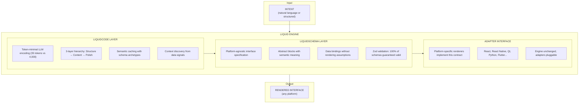
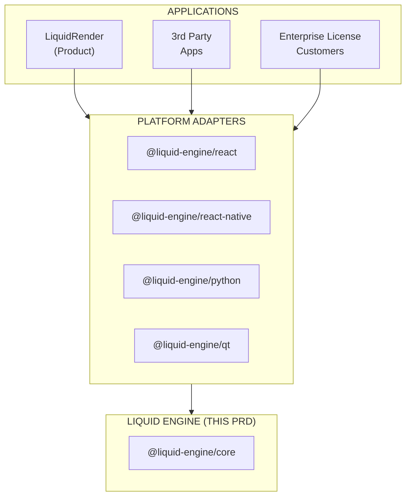
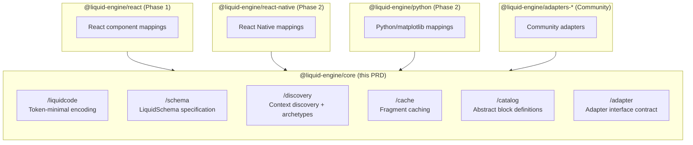
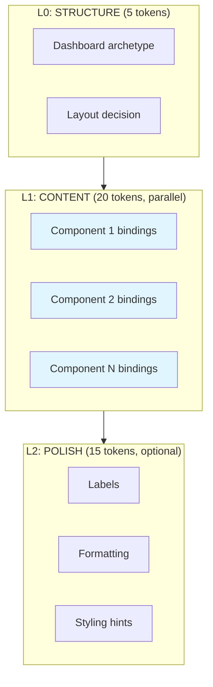
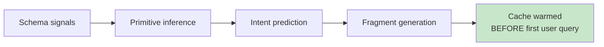
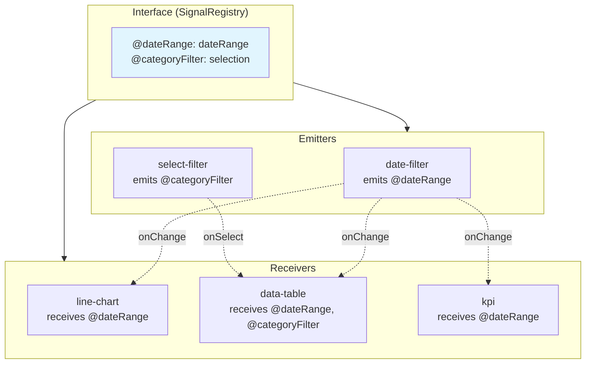
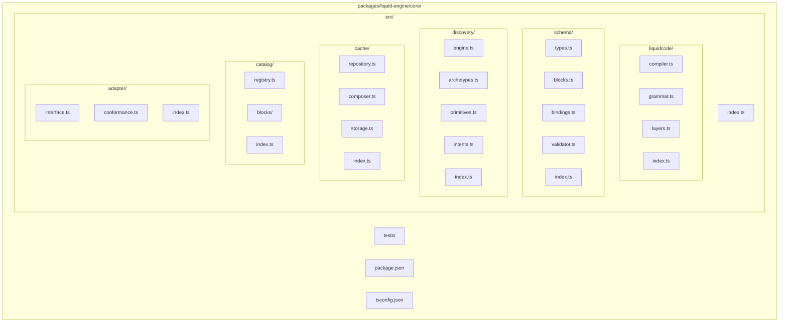

# Product Requirements Document - Liquid Engine

**Author:** Agutierrez
**Date:** 2025-12-21
**Status:** Ready for Implementation

---

## Executive Summary

Liquid Engine is a **platform-agnostic runtime** that transforms natural language intent into validated, renderable interface schemas. It is the core technology that powers LiquidRender and can be licensed to power any intent-to-interface application.

**Core Promise:** Any intent, any platform, instant interface. The engine that makes AI-generated UIs reliable.

### The Paradigm



**The innovation:** AI generates validated DATA (schemas), not fragile CODE. The schema is the contract. The renderer is a pure function. Interfaces never break.

### What Makes This Special

1. **114x token reduction** — LiquidCode encoding reduces LLM output from 4,000 tokens to 35, cutting latency by 97% and cost by 99.7%
2. **Zero-latency cold start** — Schema Archetype System predicts 90%+ of queries before the first user interaction
3. **Never broken guarantee** — 100% of validated schemas render successfully; no runtime UI errors
4. **Platform agnostic** — Same engine powers web, mobile, desktop, Python, or any future platform
5. **Patentable IP** — Novel hierarchical decomposition and decision-centric encoding
6. **Universal data understanding** — UOM-based primitive inference works across all industries without sector libraries

---

## Project Classification

**Technical Type:** Developer Tool (npm packages)
**Secondary Type:** Runtime Engine / SDK
**Domain:** General (horizontal platform)
**Complexity:** High
**Project Context:** Greenfield, extracted from LiquidRender product architecture

### Architecture Position



---

## Success Criteria

### User Success

**The "It Just Works" Moment:**
A developer integrates Liquid Engine, passes user intent and data context, and receives a validated schema that renders perfectly on the first try. No error handling for malformed AI output. No debugging broken layouts. It just works.

**User Success Indicators:**

| Indicator | Metric | Target |
|-----------|--------|--------|
| Integration speed | Time to first working render | <1 hour |
| Reliability confidence | Schemas requiring manual fixes | 0% |
| Performance satisfaction | End-to-end latency (cached) | <50ms |
| Coverage satisfaction | Queries answered from cache | >85% |
| Developer NPS | Would recommend to colleague | >50 |

**What "Success" Means:**

| Persona | Success Statement | Observable Behavior |
|---------|-------------------|---------------------|
| **Application Developer** | "I never debug AI-generated UI anymore" | Ships features without UI error handling |
| **Platform Team** | "We added Flutter support in a week" | Writes adapter, engine unchanged |
| **Enterprise Architect** | "Same engine across all our products" | Licenses engine, standardizes on LiquidSchema |

### Business Success

**12-Month Targets (Post-LiquidRender Launch):**

| Metric | Target | Why It Matters |
|--------|--------|----------------|
| npm downloads (weekly) | 10,000+ | Developer adoption |
| GitHub stars | 2,000+ | Community interest |
| Production integrations | 50+ | Real-world validation |
| Enterprise licenses | 5+ | Revenue diversification |
| Community adapters | 3+ | Ecosystem growth |
| Patent filed | 1 | IP protection |

**Decision Points:**

| Outcome | Signal | Action |
|---------|--------|--------|
| 4-5/5 targets hit | Platform traction | Expand adapter ecosystem, pursue enterprise sales |
| 2-3/5 targets hit | Core value exists | Focus on developer experience, documentation |
| <2/5 targets hit | Market fit issue | Re-evaluate positioning, consider pivoting to embedded-only |

### Technical Success

**Core Technical Requirements:**

| Requirement | Target | Measurement |
|-------------|--------|-------------|
| Schema validation rate | 100% | All LiquidCode compiles to valid LiquidSchema |
| Cache hit rate (warm) | >85% | Queries served from fragment cache |
| Cache hit rate (cold start) | >60% | First-session queries from archetype prediction |
| Compilation latency | <5ms | LiquidCode → LiquidSchema compilation |
| Discovery latency | <100ms | Schema archetype detection |
| End-to-end latency (cached) | <50ms | Intent → validated schema (cache hit) |
| End-to-end latency (LLM) | <2s | Intent → validated schema (LLM generation) |
| Adapter interface stability | 0 breaking changes/year | After v1.0 release |

**Cost Control:**

| Constraint | Limit | Rationale |
|------------|-------|-----------|
| LLM tokens per generation | <100 tokens | LiquidCode efficiency target |
| AI cost per schema | <$0.001 | 50x reduction from naive approach |
| Memory footprint (core) | <10MB | Embeddable in constrained environments |
| Bundle size (browser) | <50KB gzipped | Web performance |

### Measurable Outcomes

**North Star Metric: Validated Schemas Generated**

Why this metric:
- Generated = Engine is being used in production
- Validated = The core promise is being delivered
- Count = Direct measure of value created
- Trackable = Can measure across all integrations

**Metrics Definitions (Single Source of Truth):**

| Metric | Definition | Target |
|--------|------------|--------|
| Compilation Success | LiquidCode → valid LiquidSchema | 100% |
| Cache Hit Rate | Requests served without LLM | >85% (warm) |
| Archetype Coverage | Intents matched to archetypes | >90% |
| Adapter Compatibility | Schema renders on adapter | 100% |
| Generation Latency P95 | Time from intent to schema | <2s (LLM), <50ms (cached) |

---

## Paradigm Success Gates

These gates must pass before the engine is considered production-ready:

| Gate | What It Proves | Metric |
|------|----------------|--------|
| LiquidCode Compiles | Token-minimal encoding works | 100% valid schemas from valid LiquidCode |
| Schema is Contract | Same schema → identical render | Determinism test suite passes |
| Never Broken | All valid schemas render | 0 runtime errors from validated schemas |
| Archetypes Work | Schema patterns predict intents | >85% cache hit on standard datasets |
| Adapters are Portable | Same schema, multiple platforms | React + RN adapters pass same test suite |
| Extensible | New block types don't break existing | Single-file addition, no core changes |

**Why These Gates Matter:**

- If "LiquidCode Compiles" fails, we have no token efficiency advantage
- If "Schema is Contract" fails, adapters can't be independent
- If "Never Broken" fails, the core promise is hollow
- If "Archetypes Work" fails, we need LLM calls for everything (expensive, slow)
- If "Adapters are Portable" fails, we're just another React library
- If "Extensible" fails, every feature requires core surgery

---

## Product Scope

### Phase 1 Scope: IN/OUT (LOCKED)

#### IN SCOPE - Phase 1

| Feature | Priority | Description |
|---------|----------|-------------|
| LiquidCode compiler | P0 | Token-minimal encoding → LiquidSchema |
| LiquidSchema types | P0 | Zod-validated schema specification |
| Abstract block catalog | P0 | 13 core block types (semantic, not visual) |
| Binding system | P0 | Data reference and transformation |
| Schema validator | P0 | 100% validation before render |
| Adapter interface | P0 | Contract for platform renderers |
| Archetype detector | P0 | Schema pattern recognition (<100ms) |
| **Request Scope system** | P0 | Interface and block granularity support |
| **Signal System** | P0 | Reactive connections between blocks |
| Fragment generators | P1 | Archetype → LiquidCode fragments |
| Fragment cache | P1 | In-memory + pluggable storage |
| Primitive inference | P1 | UOM-based data understanding |
| Intent generator | P1 | Primitives → predicted intents |
| React adapter | P1 | Reference implementation |
| Explainability layer | P2 | Trust metadata in schemas |
| Fallback templates | P2 | Graceful degradation |
| Versioning system | P2 | Backward compatibility |

#### OUT OF SCOPE - Phase 1

| Feature | Phase | Reason |
|---------|-------|--------|
| React Native adapter | 2 | Reference adapter first |
| Python adapter | 2 | Web priority |
| LLM orchestration | 2 | Separate concern from core engine |
| Vector storage integration | 2 | Pluggable storage first |
| Multi-tenant cache | 3 | Enterprise feature |
| Real-time collaboration | Future | Product feature, not engine |
| Visual schema editor | Future | Tooling, not core |
| Custom block registration API | Future | Extension mechanism |

**Phase 1 Principle:** If it's not needed to generate a valid, renderable schema from intent and data, it's not Phase 1.

### MVP - Minimum Viable Product

Core capabilities supported:

1. **LiquidCode → LiquidSchema** — Compile token-minimal encoding to validated schema
2. **Data → Archetypes** — Detect schema patterns from data structure
3. **Archetypes → Fragments** — Generate LiquidCode from detected patterns
4. **Intent → Schema (cached)** — Serve from fragment cache when possible
5. **Schema → Render (React)** — Reference adapter proving portability

### Growth Features (Post-MVP)

**Phase 2: Platform Expansion**
- React Native adapter
- Python adapter (matplotlib/tkinter)
- LLM orchestration layer (Mastra integration)
- Vector storage adapter (Pinecone, Weaviate)
- Context discovery API for structured onboarding

**Phase 3: Enterprise Features**
- Multi-tenant fragment cache
- Enterprise archetype libraries
- Custom block registration
- Schema migration tools
- Audit logging

### Vision (Future)

**Phase 4+: Ecosystem**
- Community adapter marketplace
- Visual schema designer
- Real-time collaborative editing protocol
- Natural language schema modification
- Cross-platform state synchronization

**12-Month Vision:**
- Industry standard for AI-generated interfaces
- 5+ production adapters (React, RN, Flutter, Qt, Python)
- 10,000+ weekly npm downloads
- 5+ enterprise licenses
- Patent granted

---

## User Journeys

### Journey 1: Alex Chen — The Integration (Phase 1: First Adoption)

Alex is a senior frontend developer at a Series B startup building a data analytics product. They've been tasked with adding AI-generated dashboards, and the CEO wants it shipped in two weeks.

Alex has tried this before. Last year, they integrated an "AI code generation" tool that produced React components directly. It was a nightmare—broken JSX, missing imports, runtime errors that only appeared with certain data shapes. They spent more time debugging AI output than writing code themselves. The feature was eventually cut.

Now the CEO is asking again. Alex sighs and starts researching.

They find Liquid Engine on GitHub. The README says "AI generates data, not code. Schemas are validated. Renders never break."

"Yeah, right," Alex thinks. But the example is simple:

```typescript
import { compile, validate } from '@liquid-engine/core';
import { LiquidRenderer } from '@liquid-engine/react';

const liquidCode = await generateFromLLM(intent, dataContext);
const schema = compile(liquidCode);
const result = validate(schema);

if (result.valid) {
  return <LiquidRenderer schema={schema} data={data} />;
}
// This branch never executes for valid LiquidCode
```

Alex clones the repo and runs the examples. They throw increasingly weird data at it—sparse arrays, null values, mixed types. Every schema validates. Every render works.

"No fucking way."

They try to break it deliberately. Edge cases that destroyed the old tool. Valid input always produces valid output. Invalid input fails at validation, not at render.

Within three hours, Alex has the prototype working. Within a week, it's in staging. The CEO is impressed. The feature ships on time.

Six months later, Alex is the company's internal advocate for Liquid Engine. They've built three features on it. Zero runtime UI errors from AI-generated content.

**Requirements Revealed:**
- Simple, ergonomic API (compile, validate, render)
- Guaranteed schema validation (100% valid or explicit error)
- Graceful error handling at validation boundary
- Reference React adapter for immediate productivity
- Comprehensive examples covering edge cases
- Documentation that builds trust through honesty

---

### Journey 2: Priya Sharma — The Platform Team (Phase 2: Multi-Platform)

Priya leads platform engineering at a Fortune 500 retailer. They have six product teams building internal tools—some in React, some in React Native for store associates, one legacy team still using Qt for warehouse terminals.

Each team has built their own "AI dashboard" feature. Six different implementations. Six different ways to handle AI errors. Six different component libraries. When the AI model is updated, six teams need to update their prompts and error handling.

Priya proposes standardizing on Liquid Engine. The pitch: one schema format, multiple renderers. Update the engine once, all platforms get improvements.

The React teams are easy. The React Native team takes a week to write an adapter—the interface is well-documented, and they pattern-match from the React reference. The Qt team is skeptical, but the adapter interface is platform-agnostic enough that their C++ developer writes a working prototype in four days.

Three months later, all six products use LiquidSchema. When the company upgrades to a new AI model, they update one prompt template in the engine configuration. All six products improve simultaneously.

The warehouse Qt app now has the same dashboard quality as the React web app. Store associates on mobile see the same visualizations as headquarters analysts. The schema is the contract. The platforms are just different windows into the same data.

**Requirements Revealed:**
- Platform-agnostic schema specification
- Well-documented adapter interface
- Adapters can be written without engine source access
- Schema compatibility across adapter versions
- Centralized configuration for AI integration
- Same schema → visually consistent (not identical) renders

---

### Journey 3: Marcus Thompson — The Edge Case (Phase 1: Failure Recovery)

Marcus is a consultant helping a mid-size manufacturer implement dashboards for their production data. The data is messy—decades of accumulated Excel exports with inconsistent formatting, German column names, merged cells, embedded images.

He uploads a particularly gnarly file. The archetype detector runs but returns low confidence: `confidence: 0.4` for `transaction_flow`. The intent generator produces only three predicted intents instead of the usual fifteen.

The engine doesn't fail. Instead, it returns a `DiscoveryResult` with:
```typescript
{
  confidence: 0.4,
  coverage: 0.3,
  gaps: [
    { type: "ambiguous", primitive: "purpose", description: "Multiple numeric columns, unclear which is primary metric" },
    { type: "missing", primitive: "temporal", description: "No timestamp column detected" }
  ],
  fragments: [ /* 5 basic fragments */ ],
  fallbackRecommended: true
}
```

Marcus uses the fallback template—a simple table view with basic KPIs. It's not impressive, but it works. The user sees their data rendered correctly.

Later, Marcus uses the Tier 2 quick customization: "What is your main metric?" → user selects "Produktionsmenge". "What time period matters?" → user says "Schicht" (shift). With these two answers, the engine re-runs discovery and now produces 12 fragments with 0.85 confidence.

The final dashboard is excellent. But even when the engine couldn't understand the data, it never crashed. It degraded gracefully, communicated clearly, and allowed progressive refinement.

**Requirements Revealed:**
- Graceful degradation when confidence is low
- Explicit gap communication (what's unclear, why)
- Fallback templates that always render
- Progressive refinement via quick customization
- Never crash, never fail silently
- Honest confidence reporting

---

### Journey 4: Open Source Contributor — The Adapter (Phase 2: Community)

Jamie is a Rust enthusiast who discovers Liquid Engine. They love the concept but want to use it with their Rust/WASM project. No official adapter exists.

They read the Adapter Interface documentation. It's thorough—TypeScript interfaces, but the concepts are portable:

```typescript
interface LiquidAdapter<T> {
  render(schema: LiquidSchema, data: ParsedData): T;
  supportsBlock(blockType: string): boolean;
  getBlockRenderer(blockType: string): BlockRenderer<T>;
}
```

Jamie implements this in Rust, targeting web via WASM. Each block type maps to a Rust function that emits HTML. Within two weeks, they have a working prototype.

They open a PR to add their adapter to the community registry. The maintainers review it, run it against the adapter conformance test suite (which Jamie had to port to Rust), and merge it.

Now the Liquid Engine ecosystem includes an officially-recognized Rust/WASM adapter. The engine's value increased without any changes to the core.

**Requirements Revealed:**
- Adapter interface documented in language-agnostic terms
- Adapter conformance test suite (portable assertions)
- Community adapter registry
- Clear contribution guidelines
- No engine changes required for new adapters
- Schema spec published as formal document (not just TypeScript types)

---

### Journey Requirements Summary

| Journey | User Type | Entry Point | Phase | Key Requirements |
|---------|-----------|-------------|-------|------------------|
| Alex: Integration | Application Developer | npm install | 1 | Simple API, validation guarantee, React adapter |
| Priya: Platform Team | Enterprise Architect | Evaluation | 2 | Multi-adapter, schema portability, centralized config |
| Marcus: Edge Case | Consultant | Messy data | 1 | Graceful degradation, fallback, gap communication |
| Jamie: Contributor | OSS Developer | GitHub | 2 | Adapter docs, conformance tests, contribution process |

---

## Domain Strategy

### Package Architecture



### Core (Horizontal)

The engine is **100% platform-agnostic**:

| Component | Purpose | Platform Dependency |
|-----------|---------|---------------------|
| LiquidCode compiler | Encoding → schema | None |
| LiquidSchema types | Schema specification | None |
| Validator | Schema validation | None (Zod is isomorphic) |
| Discovery engine | Archetype detection | None |
| Fragment cache | Caching layer | Storage adapter interface |
| Block catalog | Abstract definitions | None |

### Adapters (Vertical)

Each adapter is a **thin mapping layer**:

| Adapter | Maps To | Maintained By |
|---------|---------|---------------|
| React | shadcn/recharts | Core team |
| React Native | RN charts/components | Core team |
| Python | matplotlib/tkinter | Core team |
| Flutter | Flutter widgets | Community |
| Qt | Qt widgets | Community |
| Rust/WASM | Raw HTML | Community |

---

## Innovation & Novel Patterns

### The LiquidCode Encoding

LiquidCode is a novel token-minimal encoding for LLM output:

```
TRADITIONAL (4,000 tokens):
{
  "type": "dashboard",
  "layout": { "columns": 3 },
  "children": [
    { "type": "kpi", "value": { "field": "revenue" }, "label": "Revenue", "trend": { "field": "revenue", "compare": "lastMonth" } },
    ...
  ]
}

LIQUIDCODE (35 tokens):
$overview|h,3|kpi:revenue~Revenue^lastMonth,kpi:orders~Orders,chart:revenue:date
```

**Why This Works:**
- LLMs are trained on code and structured syntax
- Token boundaries align with semantic decisions
- Each character carries maximum information
- Compilation to JSON is deterministic

### Hierarchical Decomposition

Three-layer architecture for parallel execution:



**Mathematical Foundation:**
- Error probability per layer: ~5%
- 3 layers: 0.95³ = 85% success
- vs monolithic: 0.95^N where N = all decisions

### Schema Archetype System

Universal patterns replace sector libraries:

| Approach | Content Required | Coverage |
|----------|-----------------|----------|
| Sector libraries | 50,000+ templates | ~70% |
| Schema archetypes | 30 generators | ~90% |

**Core Archetypes:**
- `transaction_flow` — Orders, payments, trades
- `entity_lifecycle` — Status tracking over time
- `time_series` — Measurements over time
- `conversion_funnel` — Stage progression
- `hierarchical_metrics` — Nested aggregations

### Context-Driven Precomputation

Using UOM (Universal Organization Metamodel) primitives:



**The Result:** Zero-latency cold start. 85%+ of first queries hit cache.

### Signal-Based Reactivity

Loose-coupled component communication through named channels:



**Key Principles:**
- **Declarative:** Signals declared at interface level, connections at block level
- **Loose Coupling:** Filter doesn't know about table; both know about @dateRange
- **Type Safe:** Signal types validated at compile time
- **Persistent:** Signals can sync to URL, session, or localStorage
- **Fractal:** Same pattern works at any composition level

---

## Project Type Specific Requirements

### npm Package Requirements

| Requirement | Specification |
|-------------|---------------|
| Package manager | pnpm |
| Module format | ESM + CJS dual |
| TypeScript | Strict mode, exported types |
| Bundle target | ES2020 |
| Browser compatibility | Last 2 versions of major browsers |
| Node compatibility | 18+ |
| Zero dependencies (core) | Only Zod as peer dep |
| Tree-shakeable | Proper ESM exports |

### Documentation Requirements

| Document | Purpose | Location |
|----------|---------|----------|
| API Reference | Generated from TSDoc | /docs/api |
| Schema Specification | Formal LiquidSchema spec | /docs/schema |
| Adapter Guide | How to write adapters | /docs/adapters |
| LiquidCode Grammar | Encoding specification | /docs/liquidcode |
| Architecture Decision Records | Design rationale | /docs/adr |

---

## Functional Requirements

### LiquidCode Compilation

- FR-LC-1: Engine can compile valid LiquidCode to LiquidSchema
- FR-LC-2: Engine can report syntax errors with line/character position
- FR-LC-3: Engine can compile L0/L1/L2 layers independently
- FR-LC-4: Engine can merge layer outputs into unified schema
- FR-LC-5: Compilation is deterministic (same input → same output)

### Schema Validation

- FR-SV-1: Engine can validate any object against LiquidSchema spec
- FR-SV-2: Validation returns typed error list on failure
- FR-SV-3: Valid schemas are guaranteed to contain all required fields
- FR-SV-4: Unknown block types are flagged but don't fail validation
- FR-SV-5: Version compatibility is checked during validation
- FR-SV-6: Validation is synchronous and fast (<5ms)

### Abstract Block Catalog

- FR-BC-1: Engine defines 10 abstract block types for Phase 1
- FR-BC-2: Each block has semantic definition independent of visual rendering
- FR-BC-3: Blocks define required and optional properties
- FR-BC-4: Blocks define slot specifications for composition
- FR-BC-5: Block catalog is extensible via registration API
- FR-BC-6: Block definitions include validation rules

### Data Binding System

- FR-DB-1: Bindings reference data fields by path
- FR-DB-2: Bindings support aggregation functions (sum, count, avg, min, max)
- FR-DB-3: Bindings support grouping by dimension
- FR-DB-4: Bindings support filtering by condition
- FR-DB-5: Bindings support sorting by field
- FR-DB-6: Bindings support limiting results
- FR-DB-7: Binding resolution is deterministic

### Archetype Detection

- FR-AD-1: Engine can detect schema archetypes from data structure
- FR-AD-2: Detection completes in <100ms for typical datasets
- FR-AD-3: Detection returns confidence score (0-1) per archetype
- FR-AD-4: Detection identifies up to 5 archetypes per dataset
- FR-AD-5: Detection binds data elements to archetype roles
- FR-AD-6: Detection works without LLM (pure structural analysis)

### Fragment Generation

- FR-FG-1: Engine can generate LiquidCode fragments from archetypes
- FR-FG-2: Generators produce parameterized fragments with variables
- FR-FG-3: Fragments are tagged with matching intents
- FR-FG-4: Generated fragments are valid LiquidCode
- FR-FG-5: Generation produces 10-15 fragments per archetype
- FR-FG-6: Fragments are deduplicated across archetypes

### Fragment Cache

- FR-FC-1: Engine can store fragments in memory cache
- FR-FC-2: Engine can retrieve fragments by intent similarity
- FR-FC-3: Cache supports pluggable storage backends
- FR-FC-4: Cache supports fragment versioning
- FR-FC-5: Cache supports cache invalidation by pattern
- FR-FC-6: Cache operations are thread-safe

### Intent Matching

- FR-IM-1: Engine can match natural language intent to cached fragments
- FR-IM-2: Matching supports exact and fuzzy matching
- FR-IM-3: Matching returns similarity score (0-1)
- FR-IM-4: Matching can compose multiple fragments
- FR-IM-5: Matching binds variables from intent to fragment
- FR-IM-6: Matching is fast (<10ms for in-memory cache)

### Primitive Inference

- FR-PI-1: Engine can infer UOM primitives from data schema
- FR-PI-2: Inference identifies AGENT, OBJECT, PURPOSE, EVENT, STATE, RELATION
- FR-PI-3: Inference uses pattern matching on column names and types
- FR-PI-4: Inference returns confidence per primitive
- FR-PI-5: Inference supports custom patterns via configuration
- FR-PI-6: Inference works across languages (English column names primarily)

### Adapter Interface

- FR-AI-1: Engine defines typed adapter interface contract
- FR-AI-2: Adapters receive validated schema only
- FR-AI-3: Adapters map abstract blocks to platform components
- FR-AI-4: Adapters report unsupported block types gracefully
- FR-AI-5: Adapter interface is stable across minor versions
- FR-AI-6: Adapter conformance can be tested via provided test suite

### Explainability

- FR-EX-1: Schemas can include explainability metadata per block
- FR-EX-2: Explainability includes calculation description
- FR-EX-3: Explainability includes columns used
- FR-EX-4: Explainability includes data coverage (rows used / total)
- FR-EX-5: Explainability includes confidence score
- FR-EX-6: Explainability is optional and non-breaking

### Fallback & Recovery

- FR-FR-1: Engine can generate fallback schema when confidence is low
- FR-FR-2: Fallback schemas render basic table + KPI views
- FR-FR-3: Engine reports gaps when discovery is incomplete
- FR-FR-4: Gaps include suggestions for user clarification
- FR-FR-5: Engine supports Tier 2 refinement with user input
- FR-FR-6: Fallback never fails (hardcoded template as last resort)

### Versioning

- FR-VE-1: All schemas include version field
- FR-VE-2: Engine validates schema version compatibility
- FR-VE-3: Unknown block types in newer schemas render as placeholders
- FR-VE-4: Engine provides migration path documentation for breaking changes
- FR-VE-5: Adapters declare supported schema version range

### Request Scope

- FR-RS-1: Engine supports "interface" scope for full dashboard generation
- FR-RS-2: Engine supports "block" scope for single component generation
- FR-RS-3: Scope is declared in schema and validated
- FR-RS-4: Block scope schemas are embeddable in interface scope schemas
- FR-RS-5: Block scope requests inherit signals from parent interface context

### Signal System

- FR-SG-1: Engine supports SignalRegistry at interface level
- FR-SG-2: Signals are declared with type, default value, and persistence strategy
- FR-SG-3: Blocks declare signal emissions (emits) with trigger types
- FR-SG-4: Blocks declare signal receptions (receives) with binding targets
- FR-SG-5: Signal connections are validated against registry at compile time
- FR-SG-6: Signal types include: dateRange, selection, filter, search, pagination, sort, toggle, custom
- FR-SG-7: Triggers include: onChange, onSelect, onSubmit, onClear, onToggle
- FR-SG-8: Persistence strategies include: none, url, session, local
- FR-SG-9: Adapters implement signal routing between connected blocks
- FR-SG-10: Signal transformations support expression syntax ("$value.start")

### Block Categories

- FR-BK-1: Layout blocks have slots but no data binding (grid, stack)
- FR-BK-2: Atomic Data blocks have binding but no slots (kpi, chart, table)
- FR-BK-3: Interactive blocks emit signals (date-filter, select-filter, search-input)
- FR-BK-4: Composite blocks may have both slots and bindings
- FR-BK-5: Block category determines valid properties during validation

---

## Non-Functional Requirements

### Performance

- NFR-P1: LiquidCode compilation <5ms
- NFR-P2: Schema validation <5ms
- NFR-P3: Archetype detection <100ms
- NFR-P4: Fragment generation <50ms per archetype
- NFR-P5: Cache lookup <10ms (in-memory)
- NFR-P6: Intent matching <10ms (in-memory)
- NFR-P7: End-to-end cached path <50ms

### Reliability

- NFR-R1: 100% of valid LiquidCode compiles to valid schema
- NFR-R2: 100% of validated schemas are renderable
- NFR-R3: Zero runtime errors from engine operations
- NFR-R4: Graceful degradation on low confidence
- NFR-R5: Fallback always available

### Compatibility

- NFR-C1: Core runs in browser and Node.js
- NFR-C2: Core has zero required dependencies (Zod as peer)
- NFR-C3: Bundle size <50KB gzipped (core)
- NFR-C4: Memory footprint <10MB (core loaded)
- NFR-C5: Works with ES2020+ environments

### Maintainability

- NFR-M1: 90%+ test coverage
- NFR-M2: All public APIs documented with TSDoc
- NFR-M3: Adapter conformance test suite maintained
- NFR-M4: Architecture Decision Records for major choices
- NFR-M5: Semantic versioning strictly followed

### Extensibility

- NFR-E1: New block types addable without core changes
- NFR-E2: New archetypes addable without core changes
- NFR-E3: Storage backends pluggable
- NFR-E4: Primitive inference patterns configurable
- NFR-E5: Adapter interface stable across minor versions

---

## Technical Specifications

### LiquidCode Grammar (Summary)

```
program       := block ("," block)*
block         := "$" archetype params? children?
archetype     := identifier
params        := "|" param ("," param)*
param         := value | key ":" value
children      := "[" program "]"
value         := identifier | number | string
identifier    := [a-zA-Z_][a-zA-Z0-9_]*
```

Full grammar in LIQUIDCODE-SPEC.md Section 5.

### LiquidSchema Core Types

```typescript
interface LiquidSchema {
  version: "1.0";
  scope: RequestScope;           // NEW: interface or block
  id: string;
  title: string;
  description?: string;
  generatedAt: string;
  layout: LayoutBlock;
  blocks: Block[];
  signals?: SignalRegistry;      // NEW: interface-level signal declarations
  explainability?: SchemaExplainability;
}

type RequestScope = "interface" | "block";

interface Block {
  id: string;
  type: BlockType;
  binding?: DataBinding;         // Optional: layout blocks have no binding
  slots?: Record<string, Block[]>;
  signals?: SignalConnections;   // NEW: block-level signal connections
  explain?: BlockExplainability;
  constraints?: RenderConstraints;
  warnings?: string[];
}

type BlockType =
  | "kpi"
  | "bar-chart"
  | "line-chart"
  | "pie-chart"
  | "data-table"
  | "grid"
  | "stack"
  | "text"
  | "metric-group"
  | "comparison"
  | "date-filter"                // NEW: interactive blocks
  | "select-filter"
  | "search-input";

interface DataBinding {
  source: string;
  field?: string;
  aggregate?: "sum" | "count" | "avg" | "min" | "max";
  groupBy?: string[];
  filter?: FilterCondition[];
  sort?: SortSpec[];
  limit?: number;
}

// ============================================
// Signal System Types (NEW)
// ============================================

/**
 * Interface-level signal registry - declares all signals in scope
 */
interface SignalRegistry {
  [signalName: string]: SignalDefinition;
}

interface SignalDefinition {
  type: SignalType;
  default?: any;
  persist?: "none" | "url" | "session" | "local";
}

type SignalType =
  | "dateRange"
  | "selection"
  | "filter"
  | "search"
  | "pagination"
  | "sort"
  | "toggle"
  | "custom";

/**
 * Block-level signal connections - how block participates in signal flow
 */
interface SignalConnections {
  emits?: SignalEmission[];
  receives?: SignalReception[];
}

interface SignalEmission {
  signal: string;           // Name from SignalRegistry
  trigger: TriggerType;
  transform?: TransformExpression;
}

type TriggerType =
  | "onChange"
  | "onSelect"
  | "onSubmit"
  | "onClear"
  | "onToggle";

interface SignalReception {
  signal: string;           // Name from SignalRegistry
  target: BindingPath;      // Where signal value applies
  transform?: TransformExpression;
}

type BindingPath = string;  // "filter.dateRange" or "params.search"
type TransformExpression = string;  // "$value" or "$value.start"
```

### Adapter Interface Contract

```typescript
interface LiquidAdapter<RenderOutput> {
  /**
   * Render a complete schema to platform output
   */
  render(
    schema: LiquidSchema,
    data: ParsedData,
    options?: RenderOptions
  ): RenderOutput;

  /**
   * Check if a block type is supported
   */
  supportsBlock(blockType: BlockType): boolean;

  /**
   * Get renderer for specific block type
   */
  getBlockRenderer(
    blockType: BlockType
  ): BlockRenderer<RenderOutput> | null;

  /**
   * Render unsupported block as placeholder
   */
  renderPlaceholder(
    block: Block,
    reason: string
  ): RenderOutput;

  /**
   * Create signal runtime for reactive connections
   */
  createSignalRuntime(
    registry: SignalRegistry
  ): SignalRuntime;

  /**
   * Adapter metadata
   */
  readonly metadata: AdapterMetadata;
}

interface AdapterMetadata {
  name: string;
  version: string;
  platform: string;
  supportedSchemaVersions: string[];  // Semver ranges
  supportedBlockTypes: BlockType[];
  supportsSignals: boolean;           // NEW
}

/**
 * Signal Runtime - adapter-specific implementation
 */
interface SignalRuntime {
  /**
   * Get current value of a signal
   */
  get(signalName: string): any;

  /**
   * Update signal value (triggers receivers)
   */
  set(signalName: string, value: any): void;

  /**
   * Subscribe to signal changes
   */
  subscribe(signalName: string, callback: (value: any) => void): () => void;

  /**
   * Persist signals per configuration
   */
  persist(): void;

  /**
   * Restore signals from persistence
   */
  restore(): void;
}
```

### Storage Adapter Interface

```typescript
interface FragmentStorage {
  /**
   * Store a fragment
   */
  store(fragment: Fragment): Promise<void>;

  /**
   * Retrieve fragment by ID
   */
  get(id: string): Promise<Fragment | null>;

  /**
   * Search fragments by intent similarity
   */
  search(
    intent: string,
    options?: SearchOptions
  ): Promise<FragmentMatch[]>;

  /**
   * Delete fragments matching pattern
   */
  delete(pattern: DeletePattern): Promise<number>;

  /**
   * Clear all fragments
   */
  clear(): Promise<void>;
}
```

### Phase 1 Block Catalog

**Block Categories:**

| Category | Has Binding | Has Slots | Emits Signals | Examples |
|----------|-------------|-----------|---------------|----------|
| Layout | No | Yes | No | grid, stack |
| Atomic Data | Yes | No | No | kpi, chart, table |
| Interactive | Optional | No | Yes | date-filter, select-filter |
| Composite | Yes | Yes | Optional | metric-group with embedded filters |

**Block Types:**

| Block Type | Category | Semantic Purpose | Required Props |
|------------|----------|------------------|----------------|
| `kpi` | Atomic Data | Single metric display | binding.value, binding.label |
| `bar-chart` | Atomic Data | Categorical comparison | binding.data, binding.category, binding.value |
| `line-chart` | Atomic Data | Trend over dimension | binding.data, binding.x, binding.y |
| `pie-chart` | Atomic Data | Part-to-whole | binding.data, binding.label, binding.value |
| `data-table` | Atomic Data | Tabular data display | binding.data, binding.columns |
| `grid` | Layout | Multi-column layout | slots.children, columns |
| `stack` | Layout | Vertical arrangement | slots.children |
| `text` | Atomic Data | Static text content | binding.content |
| `metric-group` | Composite | Multiple related KPIs | binding.metrics[], slots.header? |
| `comparison` | Atomic Data | Period comparison | binding.current, binding.previous, binding.label |
| `date-filter` | Interactive | Date range selection | signals.emits.dateRange |
| `select-filter` | Interactive | Single/multi select | binding.options, signals.emits.selection |
| `search-input` | Interactive | Text search | signals.emits.search |

---

## Observability & QA Requirements

### Logging

| Log Level | Content |
|-----------|---------|
| DEBUG | Compilation steps, cache operations |
| INFO | Schema generated, cache hit/miss |
| WARN | Low confidence, fallback triggered |
| ERROR | Validation failures, unrecoverable errors |

### Metrics

| Metric | Type | Purpose |
|--------|------|---------|
| `compilation_duration_ms` | Histogram | Performance monitoring |
| `validation_success_rate` | Counter | Reliability tracking |
| `cache_hit_rate` | Gauge | Cache effectiveness |
| `archetype_detection_confidence` | Histogram | Discovery quality |
| `fragment_count` | Gauge | Cache size |

### Testing Strategy

| Test Type | Coverage Target | Focus |
|-----------|----------------|-------|
| Unit tests | 90%+ | Individual functions |
| Integration tests | Core flows | End-to-end compilation |
| Conformance tests | 100% of adapters | Adapter compatibility |
| Snapshot tests | Schema output | Determinism verification |
| Fuzz tests | Edge cases | Robustness |

---

## Implementation Notes

### Dependencies (Core)

| Package | Purpose | Required |
|---------|---------|----------|
| zod | Schema validation | Peer dependency |

### Dependencies (React Adapter)

| Package | Purpose |
|---------|---------|
| react | Rendering |
| recharts | Charts |
| @shadcn/ui | Components |

### File Structure



---

## Related Documents

| Document | Location | Purpose |
|----------|----------|---------|
| LiquidCode Specification | `.mydocs/liquidcode/LIQUIDCODE-SPEC.md` | Full encoding grammar |
| LiquidCode Rationale | `.mydocs/liquidcode/LIQUIDCODE-RATIONALE.md` | Theoretical foundation |
| LiquidCode Patent | `.mydocs/liquidcode/LIQUIDCODE-PATENT.md` | Patent draft |
| Architecture Analysis | `.mydocs/LIQUID-ENGINE-ARCHITECTURE-ANALYSIS.md` | Architecture decisions |
| LiquidRender PRD | `_bmad-output/prd-liquidrender-v1.md` | Product consuming this engine |

---

**END OF DOCUMENT**
