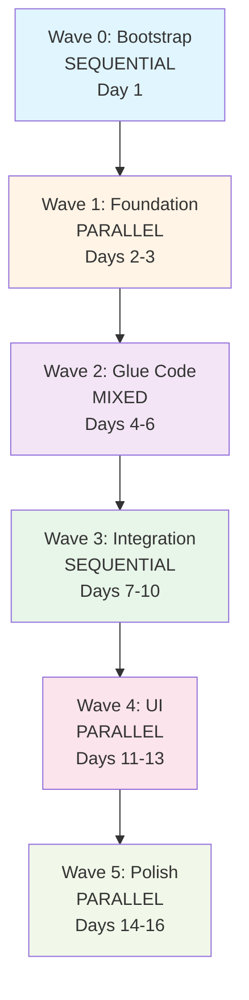

# Knosia Implementation - Master Orchestrator

**Date:** 2026-01-02
**Version:** 1.0
**Purpose:** Control plane for wave-based parallel implementation

---

## Executive Summary

This orchestrator coordinates the implementation of Knosia's glue layer (~1,250 LOC) across 5 waves. Each wave has clear entry/exit criteria and parallel execution groups where possible.

**Total Timeline:** 18 days (+2 days from Wave 0 decisions)
**Total New Code:** ~2,866 LOC (+216 LOC from Wave 0 decisions)
**Core Glue Layer:** ~750 LOC

**⚠️ Updated:** Timeline and scope adjusted based on WAVE-0-DECISIONS-AND-CHANGES.md
- Wave 3 extended from 4 to 5.5 days (+1.5 days)
- Canvas editing scope expanded (full editor + RBAC, not view-only)
- Total project timeline: 16 → 18 days

---

## Wave Dependency Graph



---

## Wave Overview

| Wave | Mode | Days | LOC | Files | Depends On | Key Deliverable |
|------|------|------|-----|-------|------------|-----------------|
| **0: Bootstrap** | SEQUENTIAL | 1 | 196 | 3 | None | Type definitions, canvas schema |
| **1: Foundation** | PARALLEL | 2 | 550 | 8 | Wave 0 | Business type detection + templates |
| **2: Glue Code** | MIXED | 3 | 700 | 5 | Wave 1 | 4 glue functions |
| **3: Integration** | SEQUENTIAL | **5.5** | **1,020** | **10** | Wave 2 | Pipeline + Canvas editor + RBAC |
| **4: UI** | PARALLEL | 3 | 400 | 4 | Wave 3 | Thread interface |
| **5: Polish** | PARALLEL | 3 | - | Throughout | Wave 4 | Error handling, tests |
| **Total** | - | **18** | **~2,866** | **30+** | - | - |

**Changes from original plan:**
- Wave 3: +1.5 days, +420 LOC, +4 files (canvas editor + RBAC)
- Total: +2 days, +466 LOC, +4 files

---

## Global Prerequisites

Before starting Wave 0, ensure:

1. ✅ **Database schema exists** - `packages/db/src/schema/knosia.ts` (26 tables)
2. ✅ **LiquidConnect built** - `packages/liquid-connect/` with UVB, compiler, resolver
3. ✅ **LiquidRender built** - `packages/liquid-render/` with 77 components
4. ✅ **Knosia API exists** - `packages/api/src/modules/knosia/` with connections, analysis, vocabulary APIs
5. ✅ **Onboarding flow exists** - `apps/web/src/modules/onboarding/` (Connect → Analysis → Review)

**Verification:**
```bash
# Check packages exist
ls packages/liquid-connect/src/uvb/
ls packages/liquid-render/src/renderer/
ls packages/api/src/modules/knosia/vocabulary/

# Check database schema
grep "knosiaVocabularyItem" packages/db/src/schema/knosia.ts

# Check onboarding
ls apps/web/src/modules/onboarding/components/
```

---

## Wave Execution Strategy

### Sequential Waves
Execute tasks one by one, blocking until each completes.

### Parallel Waves
Spawn multiple agents simultaneously for independent groups.

### Mixed Waves
Sequential phases containing parallel groups.

---

## Rollback Strategy

Each wave creates a clean Git commit boundary:

1. **Before Wave Start:** Commit current state
2. **During Wave:** Work in feature branch
3. **Wave Complete:** Merge to main, tag release
4. **Wave Failed:** Revert to pre-wave commit

**Commit Pattern:**
```
feat(knosia): wave-{N} - {description}

Wave {N}: {Name}
- Task 1
- Task 2
- Task 3

Closes: #{issue-ids}
```

---

## Progress Tracking

### CSV Tracker
Located at: `.artifacts/working/implementation/progress.csv`

Format:
```csv
Wave,Task,Status,Agent,StartTime,EndTime,LOC,Files,Issues
0,types,completed,agent-1,2026-01-02T10:00,2026-01-02T10:30,50,1,TYPE-001
1-A,detector,in_progress,agent-2,2026-01-02T11:00,,,150,1,BIZ-001
```

### Status Values
- `pending` - Not started
- `in_progress` - Currently executing
- `completed` - Done, tests passing
- `blocked` - Waiting on dependency
- `failed` - Error, needs intervention

---

## Wave Documents

Each wave has a dedicated document:

1. **wave-0-bootstrap.md** - Type definitions, schemas
2. **wave-1-foundation.md** - Business type detection + templates
3. **wave-2-glue-code.md** - 4 glue functions
4. **wave-3-integration.md** - Pipeline + HOME page
5. **wave-4-ui.md** - Thread interface
6. **wave-5-polish.md** - Error handling, tests, responsive CSS

---

## Agent Instructions

### For Master Orchestrator (You)

1. Read MASTER-ORCHESTRATOR.md (this file)
2. For each wave:
   - Verify entry criteria met
   - If SEQUENTIAL: Execute tasks one by one
   - If PARALLEL: Spawn agents for each group in single message
   - If MIXED: Follow wave's internal sequencing
3. After each wave:
   - Verify exit criteria
   - Update progress.csv
   - Commit to git
   - Proceed to next wave

### For Wave Agents

1. Read assigned wave document ONLY (e.g., `wave-1-foundation.md`)
2. Execute assigned group/task
3. Write code, tests, documentation
4. Update progress.csv with completion status
5. Report back with:
   - Files created/modified
   - LOC written
   - Tests passing
   - Any blockers

---

## Exit Criteria Per Wave

### Wave 0: Bootstrap
- ✅ All type definitions compile
- ✅ No TypeScript errors
- ✅ Interfaces exported correctly

### Wave 1: Foundation
- ✅ Business type detector works for SaaS + E-commerce
- ✅ Templates load and validate
- ✅ Unit tests passing

### Wave 2: Glue Code
- ✅ All 4 glue functions implemented
- ✅ saveDetectedVocabulary() writes to DB
- ✅ generateSemanticLayer() produces valid output
- ✅ Dashboard spec generation works

### Wave 3: Integration
- ✅ Full pipeline runs end-to-end
- ✅ Canvas loads with auto-generated dashboard
- ✅ Canvas editing works (add/remove blocks)
- ✅ RBAC enforced (API + UI)
- ✅ Canvas saves and persists
- ✅ Database migration applied (new canvas schema)

### Wave 4: UI
- ✅ Thread interface functional
- ✅ Query execution working
- ✅ Results display correctly

### Wave 5: Polish
- ✅ Error states handled
- ✅ Loading states implemented
- ✅ E2E tests passing
- ✅ Responsive CSS working

---

## Conflict Resolution

If two agents modify the same file:

1. **Prevention:** Wave groupings avoid file conflicts
2. **Detection:** Git will show merge conflicts
3. **Resolution:**
   - Last agent to finish reviews diff
   - Manually merges changes
   - Re-runs tests
   - Reports merge to orchestrator

---

## Documentation Updates

As waves complete, update:

1. **NEXT-STEPS.md** - Mark completed, add new discoveries
2. **CLAUDE.md** - Add new patterns, gotchas
3. **README** - Update feature status
4. **`.cognitive/capabilities.yaml`** - Add new modules

---

## Success Metrics

### Code Quality
- All TypeScript compiles with no errors
- All tests passing (unit + integration)
- No eslint warnings

### Functionality
- Full pipeline: Database → Dashboard works
- Business type detection: >80% accuracy on test schemas
- Vocabulary resolution: All 3 levels work
- Dashboard generation: All templates supported

### Performance
- Schema analysis: <30s for typical database
- Vocabulary resolution: <100ms
- Dashboard render: <500ms

---

## Next Steps

After reading this document:

1. ✅ Verify global prerequisites
2. ✅ Create `.artifacts/working/implementation/progress.csv`
3. ✅ Start Wave 0 by reading `wave-0-bootstrap.md`
4. Execute waves in sequence
5. Update progress tracker after each task

---

*Ready to begin implementation. Start with Wave 0.*
