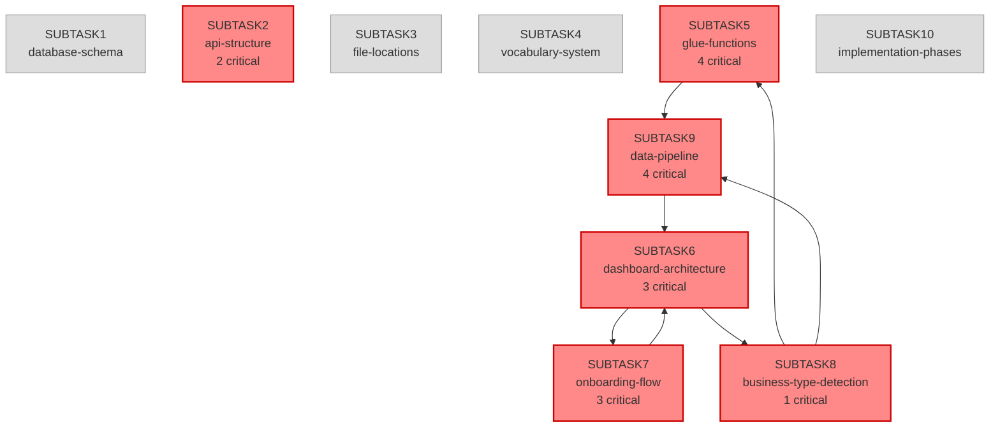

# Dependency Graph

```mermaid
graph TD
    SUBTASK1["SUBTASK1<br/>database-schema"]:::normal
    SUBTASK2["SUBTASK2<br/>api-structure<br/>2 critical"]:::critical
    SUBTASK3["SUBTASK3<br/>file-locations"]:::normal
    SUBTASK4["SUBTASK4<br/>vocabulary-system"]:::normal
    SUBTASK5["SUBTASK5<br/>glue-functions<br/>4 critical"]:::critical
    SUBTASK6["SUBTASK6<br/>dashboard-architecture<br/>3 critical"]:::critical
    SUBTASK7["SUBTASK7<br/>onboarding-flow<br/>3 critical"]:::critical
    SUBTASK8["SUBTASK8<br/>business-type-detection<br/>1 critical"]:::critical
    SUBTASK9["SUBTASK9<br/>data-pipeline<br/>4 critical"]:::critical
    SUBTASK10["SUBTASK10<br/>implementation-phases"]:::normal
    SUBTASK5 --> SUBTASK9
    SUBTASK6 --> SUBTASK7
    SUBTASK6 --> SUBTASK8
    SUBTASK7 --> SUBTASK6
    SUBTASK8 --> SUBTASK5
    SUBTASK8 --> SUBTASK9
    SUBTASK9 --> SUBTASK6

    classDef critical fill:#f88,stroke:#c00,stroke-width:2px
    classDef normal fill:#ddd,stroke:#999,stroke-width:1px
```

## Legend

- **Red nodes**: Contains critical issues
- **Arrows**: Dependency direction (A → B means A blocks B)
