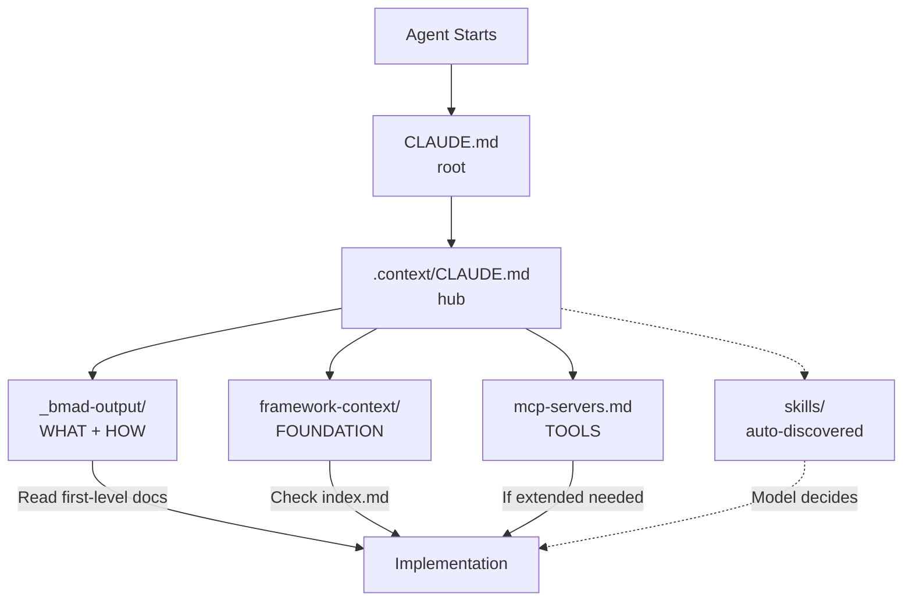

# .context/CLAUDE.md - Context Hub

This is the central hub for all project context.

## Context Orchestration



**Flow:** Root → Hub → Sources (BMAD + Framework + MCP) → Implementation

## Context Structure

```
.context/
├── CLAUDE.md                          ← You are here (hub)
├── foundation-datamodel.md            ← Core database schema (user, org, billing)
├── mcp-servers.md                     ← MCP vs TurboStarter decision guide
├── skills/                            ← Project-specific Agent Skills
│   └── [skill-name]/SKILL.md          ← Model-invoked capabilities
├── workflows/                         ← Development workflow templates
│   └── MASTER-WORKFLOW-GENERATOR.md   ← How to create dev workflows
└── turbostarter-framework-context/    ← Framework we build on top of
    ├── CLAUDE.md                      ← Navigation guide
    ├── framework.md                   ← Commands & patterns
    ├── index.md                       ← Keyword search (222 pages)
    └── sections/                      ← Detailed docs

_bmad-output/                          ← Project decisions (WHAT + HOW)
└── [documents]                        ← PRD, architecture, epics, stories
```

## Three Complementary Sources

| Purpose | Location |
|---------|----------|
| **WHAT + HOW** (project) | `_bmad-output/` |
| **FOUNDATION** (framework) | `turbostarter-framework-context/` |
| **TOOLS** (extended capabilities) | `mcp-servers.md` |
| **DEV WORKFLOWS** (task orchestration) | `workflows/` |

### `_bmad-output/` - Project Decisions
Contains BMAD workflow outputs: requirements, architecture, implementation scope.

**Mandatory:** Read folder structure and first-level documents when starting tasks. Read deeper documents as needed.

### `turbostarter-framework-context/` - Foundation
TurboStarter APIs, commands, and conventions we build on top of.

**Mandatory:** Before implementing any feature, check `index.md` to see if similar functionality already exists. Reuse or extend existing framework features instead of building from scratch.

### `mcp-servers.md` - Extended Tools
MCP servers available for extended capabilities (charts, AI agents, testing, etc.).

**Read when:** Need capabilities beyond TurboStarter foundation. Cross-references when to use MCP vs built-in features.

### `workflows/` - Development Workflows
Templates and generators for structured development tasks.

**Read when:** User requests a workflow, asks to create a batch development process, or needs orchestrated multi-step implementation. The `MASTER-WORKFLOW-GENERATOR.md` contains the complete template for generating new workflows.

## Conflict Resolution

When documents conflict:
1. User's explicit instruction (highest)
2. Root `CLAUDE.md`
3. This file (`.context/CLAUDE.md`)
4. BMAD output (`_bmad-output/`)
5. Framework docs (lowest)
