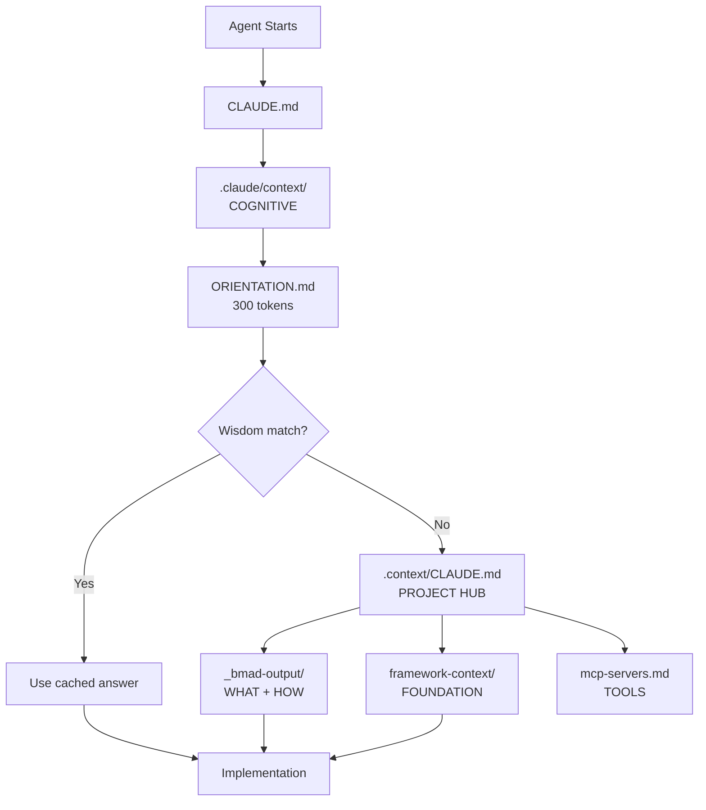

# .context/CLAUDE.md - Context Hub

This is the central hub for all project context.

## Two Context Layers

| Layer | Location | Purpose |
|-------|----------|---------|
| **Cognitive** | `.claude/context/` | HOW to think (patterns, wisdom, indices) |
| **Project** | `.context/` + `_bmad-output/` | WHAT to build (specs, framework, skills) |

**Read cognitive first, then project context as needed.**

## Context Flow



**Flow:** Root → Cognitive (ORIENTATION → wisdom) → Project Hub → Implementation

## Cognitive Context (Read First)

```
.claude/context/
├── ORIENTATION.md              ← Always read (cognitive reload)
├── wisdom/                     ← Cached answers (check for matches)
│   ├── how-to-create-component.md
│   └── chart-patterns.md
├── indices/                    ← Pre-computed indices
│   ├── entities.json           ← 42 components indexed
│   └── concepts.json           ← 10 concepts mapped
└── COGNITIVE-CONTEXT-FRAMEWORK.md ← Framework philosophy
```

**Reading order:**
1. `ORIENTATION.md` - Identity, structure, constraints (~300 tokens)
2. Check `wisdom/` for cached answers matching your task
3. Consult `indices/` for entity/concept lookup
4. Come here for project-specific context

## Project Context Structure

```
.context/
├── CLAUDE.md                          ← You are here (hub)
├── foundation-datamodel.md            ← Core database schema
├── mcp-servers.md                     ← MCP vs TurboStarter guide
├── skills/                            ← Project-specific Agent Skills
├── workflows/                         ← Development workflow templates
│   └── MASTER-WORKFLOW-GENERATOR.md
└── turbostarter-framework-context/    ← Framework we build on
    ├── CLAUDE.md                      ← Navigation guide
    ├── framework.md                   ← Commands & patterns
    ├── index.md                       ← Keyword search (222 pages)
    └── sections/                      ← Detailed docs

_bmad-output/                          ← Project decisions
└── [documents]                        ← PRD, architecture, epics
```

## Four Complementary Sources

| Purpose | Location | When to Read |
|---------|----------|--------------|
| **COGNITION** (patterns) | `.claude/context/` | Always first |
| **WHAT + HOW** (project) | `_bmad-output/` | Implementing features |
| **FOUNDATION** (framework) | `turbostarter-framework-context/` | Before building new |
| **TOOLS** (extended) | `mcp-servers.md` | Need external capabilities |

### `.claude/context/` - Cognitive Framework
Crystallized patterns, cached answers, pre-computed indices.

**Mandatory:** Read `ORIENTATION.md` at session start. Check `wisdom/` before deep-diving into code.

### `_bmad-output/` - Project Decisions
BMAD workflow outputs: requirements, architecture, implementation scope.

**Mandatory:** Read folder structure and first-level documents when starting tasks.

### `turbostarter-framework-context/` - Foundation
TurboStarter APIs, commands, and conventions we build on.

**Mandatory:** Check `index.md` before implementing features. Reuse existing framework.

### `mcp-servers.md` - Extended Tools
MCP servers for extended capabilities (charts, AI agents, testing).

**Read when:** Need capabilities beyond TurboStarter foundation.

### `workflows/` - Development Workflows
Templates for structured development tasks.

**Read when:** User requests workflow or multi-step implementation.

## Conflict Resolution

When documents conflict:
1. User's explicit instruction (highest)
2. Root `CLAUDE.md`
3. `.claude/context/ORIENTATION.md` (cognitive constraints)
4. This file (`.context/CLAUDE.md`)
5. BMAD output (`_bmad-output/`)
6. Framework docs (lowest)

## Quick Reference

| Task | First Read |
|------|------------|
| Creating component | `wisdom/how-to-create-component.md` |
| Creating chart | `wisdom/chart-patterns.md` |
| Finding entity | `indices/entities.json` |
| Understanding concept | `indices/concepts.json` |
| Project requirements | `_bmad-output/` |
| Framework capability | `turbostarter-framework-context/index.md` |
