# Context Loading Workflow

This diagram shows how an AI agent builds context when starting a task.

## Reading Order Summary

## Conflict Resolution

```mermaid
flowchart TD
    U["👤 User instruction"] --> R["CLAUDE.md (root)"]
    R --> H[".context/CLAUDE.md (hub)"]
    H --> B["_bmad-output/"]
    B --> F["Framework docs"]

    U ---|"Highest priority"| U
    F ---|"Lowest priority"| F

    style U fill:#ffcdd2
    style R fill:#fff3e0
    style H fill:#fff3e0
    style B fill:#e8f5e9
    style F fill:#fce4ec
```

## Key Directives

| Location | Directive |
|----------|-----------|
| Root CLAUDE.md | "After reading this file, read `.context/CLAUDE.md`" |
| .context/CLAUDE.md | "Read `_bmad-output/` folder structure + first-level docs" |
| .context/CLAUDE.md | "Check `index.md` before implementing - reuse or extend" |
| _bmad-output/CLAUDE.md | "For full context, read `.context/CLAUDE.md`" |
