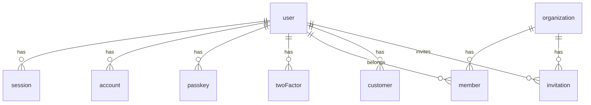

# Foundation Data Model

TurboStarter provides these core tables. Extend them, don't recreate.

## Entity Relationship



## Core Tables

| Table | Purpose | Key Fields |
|-------|---------|------------|
| `user` | User accounts | id, email, name, role, banned |
| `session` | Active sessions | userId, token, activeOrganizationId |
| `account` | OAuth/password auth | userId, providerId, accessToken |
| `organization` | Multi-tenant orgs | id, name, slug |
| `member` | Org membership | userId, organizationId, role |
| `invitation` | Org invites | email, organizationId, status |
| `customer` | Billing info | userId, customerId, status, plan |

## Key Patterns

**User roles:** Stored in `user.role` (app-wide) and `member.role` (per-org: owner/admin/member)

**Multi-tenancy:** `session.activeOrganizationId` tracks current org context

**Billing plans:** `customer.plan` enum: free | premium | enterprise

**Billing status:** `customer.status` enum: active | canceled | trialing | past_due | ...

## Extending the Schema

Add new tables in `packages/db/src/schema/`:

```typescript
// packages/db/src/schema/dashboard.ts
export const dashboard = pgTable("dashboard", {
  id: text("id").primaryKey(),
  userId: text("user_id").references(() => user.id),
  organizationId: text("organization_id").references(() => organization.id),
  // ... your fields
});
```

Then export from `packages/db/src/schema/index.ts`.
