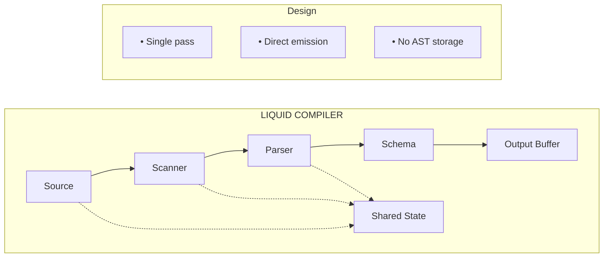

# Liquid v3 Compiler — Production Architecture

**Version:** 3.1
**Goal:** <10ms compile, <1KB memory, streaming-first

---

## §1 Design Principles

1. **Single pass** — Never traverse twice
2. **Zero allocations** in hot path — Preallocate, reuse
3. **Streaming native** — Emit schema blocks as tokens arrive
4. **Fail fast** — First error stops compilation (no recovery overhead)
5. **No intermediate AST** — Token → Schema directly

---

## §2 Architecture



### Memory Model

```typescript
interface CompilerState {
  // Input (readonly)
  source: string;
  pos: number;

  // Scanning
  char: number;          // Current char code
  token: number;         // Current token type (enum)
  tokenStart: number;
  tokenEnd: number;

  // Parsing context
  depth: number;         // Bracket nesting
  layerId: number;       // Current layer
  blockPath: number[];   // [0,2,1] = parent indices (max depth 16)

  // Output (direct write)
  out: SchemaBuilder;

  // Signals (small map, <20 entries typical)
  signals: Map<string, SignalDef>;
}
```

**Total state: ~200 bytes + source string**

---

## §3 Scanner

Hand-written, zero-allocation scanner using char codes.

```typescript
const enum Char {
  // Control
  EOF = 0,
  TAB = 9,
  LF = 10,
  CR = 13,
  SPACE = 32,

  // Symbols
  BANG = 33,      // !
  QUOTE = 34,     // "
  HASH = 35,      // #
  PERCENT = 37,   // %
  STAR = 42,      // *
  PLUS = 43,      // +
  COMMA = 44,     // ,
  MINUS = 45,     // -
  DOT = 46,       // .
  SLASH = 47,     // /
  COLON = 58,     // :
  LT = 60,        // <
  EQ = 61,        // =
  GT = 62,        // >
  QUESTION = 63,  // ?
  AT = 64,        // @
  LBRACKET = 91,  // [
  RBRACKET = 93,  // ]
  CARET = 94,     // ^
  BACKSLASH = 92, // \

  // Ranges
  DIGIT_0 = 48,
  DIGIT_9 = 57,
  UPPER_A = 65,
  UPPER_Z = 90,
  LOWER_A = 97,
  LOWER_Z = 122,
  UNDERSCORE = 95,
}

const enum Token {
  EOF = 0,
  ERROR = 1,

  // Structure
  LBRACKET = 10,
  RBRACKET = 11,
  COMMA = 12,

  // Types
  TYPE_INDEX = 20,    // 0-9
  TYPE_CODE = 21,     // Tx, Bt, Kp, etc.

  // Bindings
  BIND_INDEX = 30,    // bare digit after type
  BIND_FIELD = 31,    // :name
  BIND_EXPR = 32,     // =expr
  BIND_CURRENT = 33,  // . or .field
  STRING = 34,        // "..."

  // Signals
  SIGNAL_DECL = 40,   // @name
  SIGNAL_RECV = 41,   // <name
  SIGNAL_EMIT = 42,   // >name
  SIGNAL_BOTH = 43,   // <>name

  // Modifiers
  PRIORITY = 50,      // !h, !p, !s, !0-9
  FLEX = 51,          // ^f, ^s, ^g, ^c
  SPAN = 52,          // *1-9, *f, *h, *t, *q

  // Conditions
  CONDITION = 60,     // ?expr

  // Triggers
  TRIGGER_OPEN = 70,  // >/N
  TRIGGER_CLOSE = 71, // /<

  // Layers
  LAYER = 80,         // /N

  // Layout
  GRID = 90,          // G or G2 or G2x3
}

class Scanner {
  private src: string;
  private pos: number = 0;
  private char: number;

  // Current token
  token: Token = Token.EOF;
  start: number = 0;
  end: number = 0;

  // Extracted values (avoid substring until needed)
  numValue: number = 0;
  strValue: string = '';

  constructor(source: string) {
    this.src = source;
    this.char = source.charCodeAt(0) || Char.EOF;
  }

  next(): Token {
    this.skipWhitespace();
    this.start = this.pos;

    const c = this.char;

    // EOF
    if (c === Char.EOF || this.pos >= this.src.length) {
      return this.token = Token.EOF;
    }

    // Single char tokens
    switch (c) {
      case Char.LBRACKET: return this.advance(Token.LBRACKET);
      case Char.RBRACKET: return this.advance(Token.RBRACKET);
      case Char.COMMA:    return this.advance(Token.COMMA);
    }

    // Multi-char tokens (ordered by frequency)

    // Type codes: Tx, Bt, Kp, Sl, Fm, G (Grid), etc.
    if (c >= Char.UPPER_A && c <= Char.UPPER_Z) {
      if (c === 71) { // 'G' = Grid
        return this.scanGrid();
      }
      return this.scanTypeCode();
    }

    // Digits: type index or binding index (context determines)
    if (c >= Char.DIGIT_0 && c <= Char.DIGIT_9) {
      return this.scanDigit();
    }

    // Strings
    if (c === Char.QUOTE) {
      return this.scanString();
    }

    // Signals and conditions
    if (c === Char.AT) {
      return this.scanSignalDecl();
    }

    if (c === Char.LT) {
      return this.scanSignalRef();
    }

    if (c === Char.GT) {
      return this.scanEmitOrTrigger();
    }

    // Bindings
    if (c === Char.COLON) {
      return this.scanFieldBinding();
    }

    if (c === Char.EQ) {
      return this.scanExprBinding();
    }

    if (c === Char.DOT) {
      return this.scanCurrentBinding();
    }

    // Modifiers
    if (c === Char.BANG) {
      return this.scanPriority();
    }

    if (c === Char.CARET) {
      return this.scanFlex();
    }

    if (c === Char.STAR) {
      return this.scanSpan();
    }

    // Conditions
    if (c === Char.QUESTION) {
      return this.scanCondition();
    }

    // Layers and triggers
    if (c === Char.SLASH) {
      return this.scanLayerOrClose();
    }

    // Unknown
    this.advance(Token.ERROR);
    return this.token;
  }

  private advance(t: Token): Token {
    this.pos++;
    this.char = this.src.charCodeAt(this.pos) || Char.EOF;
    this.end = this.pos;
    return this.token = t;
  }

  private skipWhitespace(): void {
    while (
      this.char === Char.SPACE ||
      this.char === Char.TAB ||
      this.char === Char.LF ||
      this.char === Char.CR
    ) {
      this.pos++;
      this.char = this.src.charCodeAt(this.pos) || Char.EOF;
    }
  }

  private scanTypeCode(): Token {
    // Already on uppercase letter
    this.pos++;
    this.char = this.src.charCodeAt(this.pos) || Char.EOF;

    // Optional lowercase
    if (this.char >= Char.LOWER_A && this.char <= Char.LOWER_Z) {
      this.pos++;
      this.char = this.src.charCodeAt(this.pos) || Char.EOF;
    }

    this.end = this.pos;
    this.strValue = this.src.slice(this.start, this.end);
    return this.token = Token.TYPE_CODE;
  }

  private scanDigit(): Token {
    this.numValue = this.char - Char.DIGIT_0;
    this.pos++;
    this.char = this.src.charCodeAt(this.pos) || Char.EOF;

    // Multi-digit for layer numbers
    while (this.char >= Char.DIGIT_0 && this.char <= Char.DIGIT_9) {
      this.numValue = this.numValue * 10 + (this.char - Char.DIGIT_0);
      this.pos++;
      this.char = this.src.charCodeAt(this.pos) || Char.EOF;
    }

    this.end = this.pos;
    return this.token = Token.TYPE_INDEX; // Parser determines if binding
  }

  private scanString(): Token {
    this.pos++; // skip opening quote
    const start = this.pos;

    while (this.pos < this.src.length) {
      const c = this.src.charCodeAt(this.pos);
      if (c === Char.QUOTE) {
        this.strValue = this.src.slice(start, this.pos);
        this.pos++; // skip closing quote
        this.char = this.src.charCodeAt(this.pos) || Char.EOF;
        this.end = this.pos;
        return this.token = Token.STRING;
      }
      // Backslash escape
      if (c === Char.BACKSLASH && this.src.charCodeAt(this.pos + 1) === Char.QUOTE) {
        this.pos += 2; // skip escaped quote
        continue;
      }
      this.pos++;
    }

    // Unterminated string
    this.end = this.pos;
    return this.token = Token.ERROR;
  }

  private scanSignalDecl(): Token {
    this.pos++; // skip @
    return this.scanIdentifier(Token.SIGNAL_DECL);
  }

  private scanSignalRef(): Token {
    this.pos++; // skip <
    this.char = this.src.charCodeAt(this.pos) || Char.EOF;

    if (this.char === Char.GT) {
      // <>name
      this.pos++;
      this.char = this.src.charCodeAt(this.pos) || Char.EOF;
      return this.scanIdentifier(Token.SIGNAL_BOTH);
    }

    return this.scanIdentifier(Token.SIGNAL_RECV);
  }

  private scanEmitOrTrigger(): Token {
    this.pos++; // skip >
    this.char = this.src.charCodeAt(this.pos) || Char.EOF;

    if (this.char === Char.SLASH) {
      // >/N trigger
      this.pos++;
      this.char = this.src.charCodeAt(this.pos) || Char.EOF;
      return this.scanNumber(Token.TRIGGER_OPEN);
    }

    return this.scanIdentifier(Token.SIGNAL_EMIT);
  }

  private scanFieldBinding(): Token {
    this.pos++; // skip :
    return this.scanIdentifier(Token.BIND_FIELD);
  }

  private scanExprBinding(): Token {
    this.pos++; // skip =
    return this.scanUntilDelimiter(Token.BIND_EXPR);
  }

  private scanCurrentBinding(): Token {
    this.pos++; // skip .
    this.char = this.src.charCodeAt(this.pos) || Char.EOF;

    // Check for field path
    if (this.isIdentStart(this.char)) {
      return this.scanIdentifier(Token.BIND_CURRENT);
    }

    this.strValue = '';
    this.end = this.pos;
    return this.token = Token.BIND_CURRENT;
  }

  private scanPriority(): Token {
    this.pos++; // skip !
    this.char = this.src.charCodeAt(this.pos) || Char.EOF;

    // Reset values
    this.strValue = '';
    this.numValue = -1;

    // h, p, s or digit
    if (this.char === 104 || this.char === 112 || this.char === 115) { // h, p, s
      this.strValue = String.fromCharCode(this.char);
      this.pos++;
      this.char = this.src.charCodeAt(this.pos) || Char.EOF;
    } else if (this.char >= Char.DIGIT_0 && this.char <= Char.DIGIT_9) {
      this.numValue = this.char - Char.DIGIT_0;
      this.pos++;
      this.char = this.src.charCodeAt(this.pos) || Char.EOF;
    }

    this.end = this.pos;
    return this.token = Token.PRIORITY;
  }

  private scanFlex(): Token {
    this.pos++; // skip ^
    this.char = this.src.charCodeAt(this.pos) || Char.EOF;
    this.strValue = String.fromCharCode(this.char);
    this.pos++;
    this.char = this.src.charCodeAt(this.pos) || Char.EOF;
    this.end = this.pos;
    return this.token = Token.FLEX;
  }

  private scanSpan(): Token {
    this.pos++; // skip *
    this.char = this.src.charCodeAt(this.pos) || Char.EOF;

    if (this.char >= Char.DIGIT_0 && this.char <= Char.DIGIT_9) {
      this.numValue = this.char - Char.DIGIT_0;
    } else {
      this.strValue = String.fromCharCode(this.char);
    }

    this.pos++;
    this.char = this.src.charCodeAt(this.pos) || Char.EOF;
    this.end = this.pos;
    return this.token = Token.SPAN;
  }

  private scanCondition(): Token {
    this.pos++; // skip ?
    return this.scanUntilDelimiter(Token.CONDITION);
  }

  private scanLayerOrClose(): Token {
    this.pos++; // skip /
    this.char = this.src.charCodeAt(this.pos) || Char.EOF;

    if (this.char === Char.LT) {
      // /<
      this.pos++;
      this.char = this.src.charCodeAt(this.pos) || Char.EOF;
      this.end = this.pos;
      return this.token = Token.TRIGGER_CLOSE;
    }

    // /N
    return this.scanNumber(Token.LAYER);
  }

  private scanGrid(): Token {
    this.pos++; // skip G
    this.char = this.src.charCodeAt(this.pos) || Char.EOF;
    this.numValue = 0;
    let rows = 0;

    // Optional column count
    if (this.char >= Char.DIGIT_0 && this.char <= Char.DIGIT_9) {
      this.numValue = this.char - Char.DIGIT_0;
      this.pos++;
      this.char = this.src.charCodeAt(this.pos) || Char.EOF;

      // Optional x and rows
      if (this.char === 120) { // 'x'
        this.pos++;
        this.char = this.src.charCodeAt(this.pos) || Char.EOF;
        // Scan row count
        while (this.char >= Char.DIGIT_0 && this.char <= Char.DIGIT_9) {
          rows = rows * 10 + (this.char - Char.DIGIT_0);
          this.pos++;
          this.char = this.src.charCodeAt(this.pos) || Char.EOF;
        }
        this.strValue = String(rows); // Store rows in strValue
      }
    }

    this.end = this.pos;
    return this.token = Token.GRID;
  }

  private scanIdentifier(resultToken: Token): Token {
    this.char = this.src.charCodeAt(this.pos) || Char.EOF;
    const start = this.pos;

    while (this.isIdentChar(this.char)) {
      this.pos++;
      this.char = this.src.charCodeAt(this.pos) || Char.EOF;
    }

    this.strValue = this.src.slice(start, this.pos);
    this.end = this.pos;
    return this.token = resultToken;
  }

  private scanNumber(resultToken: Token): Token {
    this.numValue = 0;

    while (this.char >= Char.DIGIT_0 && this.char <= Char.DIGIT_9) {
      this.numValue = this.numValue * 10 + (this.char - Char.DIGIT_0);
      this.pos++;
      this.char = this.src.charCodeAt(this.pos) || Char.EOF;
    }

    this.end = this.pos;
    return this.token = resultToken;
  }

  private scanUntilDelimiter(resultToken: Token): Token {
    const start = this.pos;

    while (
      this.pos < this.src.length &&
      this.char !== Char.COMMA &&
      this.char !== Char.LBRACKET &&
      this.char !== Char.RBRACKET &&
      this.char !== Char.LF
    ) {
      this.pos++;
      this.char = this.src.charCodeAt(this.pos) || Char.EOF;
    }

    this.strValue = this.src.slice(start, this.pos).trim();
    this.end = this.pos;
    return this.token = resultToken;
  }

  private isIdentStart(c: number): boolean {
    return (c >= Char.LOWER_A && c <= Char.LOWER_Z) ||
           (c >= Char.UPPER_A && c <= Char.UPPER_Z) ||
           c === Char.UNDERSCORE;
  }

  private isIdentChar(c: number): boolean {
    return this.isIdentStart(c) ||
           (c >= Char.DIGIT_0 && c <= Char.DIGIT_9) ||
           c === Char.DOT;
  }
}
```

**Performance:** ~1M tokens/sec on modern JS engines

---

## §4 Parser + Direct Emission

No AST. Parser writes directly to schema builder.

```typescript
interface BlockDef {
  uid: string;
  type: string;
  binding?:
    | { field: string }           // Named field binding (:name)
    | { index: number }           // Indexed binding (0-9)
    | { expr: string }            // Expression binding (=expr)
    | { value: string | number }; // Literal value ("text" or number)
  label?: string;
  layout?: {
    priority?: string | number;   // !h, !p, !s, or !0-9
    span?: number | string;       // *1-9, *f, *h, *t, *q
    flex?: string;                // ^f, ^s, ^g, ^c
    columns?: number;             // Grid columns
    rows?: number;                // Grid rows
  };
  signals?: { emit?: string; receive?: string };
  condition?: { signal: string; op: string; value: unknown };
  trigger?: { action: string; layer?: number };
  children?: BlockDef[];
  template?: BlockDef;
}

interface LayerDef {
  id: number;
  visible: boolean;
  root: BlockDef;
}

interface SignalDef {
  id: string;
  type: string;
  default: unknown;
  persist: string;
}

interface LiquidSchema {
  version: '3.0';
  signals: SignalDef[];
  layers: LayerDef[];
}

class Parser {
  private scanner: Scanner;
  private signals: Map<string, SignalDef> = new Map();
  private layers: LayerDef[] = [];
  private layer0Blocks: BlockDef[] = [];  // Collect loose blocks for layer 0
  private currentLayer: number = 0;
  private blockPath: number[] = [];
  private error: string | null = null;

  constructor(source: string) {
    this.scanner = new Scanner(source);
  }

  parse(): { schema: LiquidSchema | null; error: string | null } {
    this.scanner.next();

    // Parse signal declarations
    while (this.scanner.token === Token.SIGNAL_DECL) {
      this.parseSignalDecl();
    }

    // Parse blocks and layers
    while (this.scanner.token !== Token.EOF && !this.error) {
      if (this.scanner.token === Token.LAYER) {
        this.parseLayer();
      } else {
        // Collect loose blocks for layer 0
        const block = this.parseBlock(this.layer0Blocks.length);
        if (block) {
          this.layer0Blocks.push(block);
        }
      }
    }

    if (this.error) {
      return { schema: null, error: this.error };
    }

    // Build layer 0 from collected blocks
    if (this.layer0Blocks.length > 0) {
      this.layers.unshift({
        id: 0,
        visible: true,
        root: {
          uid: 'root',
          type: 'fragment',
          children: this.layer0Blocks,
        },
      });
    }

    return {
      schema: {
        version: '3.0',
        signals: Array.from(this.signals.values()),
        layers: this.layers,
      },
      error: null,
    };
  }

  private parseSignalDecl(): void {
    const id = this.scanner.strValue;
    this.signals.set(id, {
      id,
      type: this.inferSignalType(id),
      default: this.getSignalDefault(id),
      persist: this.inferPersist(id),
    });
    this.scanner.next();
  }

  private parseLayer(): void {
    const layerId = this.scanner.numValue;
    this.currentLayer = layerId;
    this.scanner.next();

    // Parse the root block of this layer
    const root = this.parseBlock(0);
    if (root) {
      this.layers.push({
        id: layerId,
        visible: layerId === 0,
        root,
      });
    }
  }

  private parseBlock(index: number): BlockDef | null {
    const block: BlockDef = {
      uid: this.generateUID(index),
      type: 'container',
    };

    // Type
    if (this.scanner.token === Token.TYPE_CODE) {
      block.type = this.resolveType(this.scanner.strValue);
      this.scanner.next();
    } else if (this.scanner.token === Token.TYPE_INDEX) {
      block.type = this.resolveTypeIndex(this.scanner.numValue);
      this.scanner.next();
    } else if (this.scanner.token === Token.GRID) {
      block.type = 'grid';
      if (this.scanner.numValue > 0) {
        block.layout = { ...block.layout, columns: this.scanner.numValue };
      }
      // Parse rows from strValue (set by scanGrid for G2x3 syntax)
      if (this.scanner.strValue) {
        const rows = parseInt(this.scanner.strValue, 10);
        if (rows > 0) {
          block.layout = { ...block.layout, rows };
        }
      }
      this.scanner.next();
    }

    // Bindings (can have multiple)
    while (this.isBindingToken()) {
      this.parseBinding(block);
    }

    // Modifiers
    while (this.isModifierToken()) {
      this.parseModifier(block);
    }

    // Signal references
    while (this.isSignalToken()) {
      this.parseSignalRef(block);
    }

    // Condition
    if (this.scanner.token === Token.CONDITION) {
      block.condition = this.parseCondition();
    }

    // Trigger
    if (this.scanner.token === Token.TRIGGER_OPEN) {
      block.trigger = { action: 'openLayer', layer: this.scanner.numValue };
      this.scanner.next();
    } else if (this.scanner.token === Token.TRIGGER_CLOSE) {
      block.trigger = { action: 'closeLayer' };
      this.scanner.next();
    }

    // Children
    if (this.scanner.token === Token.LBRACKET) {
      block.children = this.parseChildren();
    }

    // Trailing label
    if (this.scanner.token === Token.STRING) {
      block.label = this.scanner.strValue;
      this.scanner.next();
    }

    return block;
  }

  private parseChildren(): BlockDef[] {
    this.scanner.next(); // skip [
    this.blockPath.push(0);

    const children: BlockDef[] = [];
    let index = 0;

    while (this.scanner.token !== Token.RBRACKET && this.scanner.token !== Token.EOF) {
      // Set path index BEFORE parsing so child gets correct UID
      this.blockPath[this.blockPath.length - 1] = index;
      const child = this.parseBlock(index);
      if (child) {
        children.push(child);
        index++;
      }

      if (this.scanner.token === Token.COMMA) {
        this.scanner.next();
      }
    }

    if (this.scanner.token === Token.RBRACKET) {
      this.scanner.next();
    } else {
      this.error = 'Expected ]';
    }

    this.blockPath.pop();
    return children;
  }

  private parseBinding(block: BlockDef): void {
    switch (this.scanner.token) {
      case Token.TYPE_INDEX:
        // Context: digit after type = binding index
        block.binding = { index: this.scanner.numValue };
        this.scanner.next();
        break;

      case Token.BIND_FIELD:
        block.binding = { field: this.scanner.strValue };
        this.scanner.next();
        break;

      case Token.BIND_EXPR:
        block.binding = { expr: this.scanner.strValue };
        this.scanner.next();
        break;

      case Token.BIND_CURRENT:
        block.binding = { field: '.' + this.scanner.strValue };
        this.scanner.next();
        break;

      case Token.STRING:
        // String as static binding
        if (!block.binding) {
          block.binding = { value: this.scanner.strValue };
        } else {
          block.label = this.scanner.strValue;
        }
        this.scanner.next();
        break;
    }
  }

  private parseModifier(block: BlockDef): void {
    if (!block.layout) block.layout = {};

    switch (this.scanner.token) {
      case Token.PRIORITY:
        // strValue for letters (h,p,s), numValue for digits (0-9)
        block.layout.priority = this.scanner.strValue || (this.scanner.numValue >= 0 ? this.scanner.numValue : undefined);
        this.scanner.next();
        break;

      case Token.SPAN:
        block.layout.span = this.scanner.strValue || this.scanner.numValue;
        this.scanner.next();
        break;

      case Token.FLEX:
        block.layout.flex = this.scanner.strValue;
        this.scanner.next();
        break;
    }
  }

  private parseSignalRef(block: BlockDef): void {
    if (!block.signals) block.signals = {};

    switch (this.scanner.token) {
      case Token.SIGNAL_RECV:
        block.signals.receive = this.scanner.strValue;
        this.ensureSignal(this.scanner.strValue);
        this.scanner.next();
        break;

      case Token.SIGNAL_EMIT:
        block.signals.emit = this.scanner.strValue;
        this.ensureSignal(this.scanner.strValue);
        this.scanner.next();
        break;

      case Token.SIGNAL_BOTH:
        block.signals.emit = this.scanner.strValue;
        block.signals.receive = this.scanner.strValue;
        this.ensureSignal(this.scanner.strValue);
        this.scanner.next();
        break;
    }
  }

  private parseCondition(): { signal: string; op: string; value: unknown } {
    // Parse ?@signal=value or ?signal=value
    const expr = this.scanner.strValue;
    this.scanner.next();

    // Simple parser for @signal=value pattern
    const match = expr.match(/^@?(\w+)([=<>!]+)(.+)$/);
    if (match) {
      return {
        signal: match[1],
        op: this.normalizeOp(match[2]),
        value: this.parseValue(match[3]),
      };
    }

    return { signal: expr, op: 'eq', value: true };
  }

  private generateUID(index: number): string {
    if (this.currentLayer === 0) {
      if (this.blockPath.length === 0) {
        return `b${index}`;
      }
      return `b${this.blockPath.join('.')}.${index}`;
    } else {
      if (this.blockPath.length === 0) {
        return `l${this.currentLayer}`;
      }
      return `l${this.currentLayer}.${this.blockPath.join('.')}.${index}`;
    }
  }

  private resolveType(code: string): string {
    const TYPE_MAP: Record<string, string> = {
      Tx: 'text',
      Bt: 'button',
      Kp: 'kpi',
      Sl: 'select',
      Fm: 'form',
      Gd: 'grid',
      Cd: 'card',
      Md: 'modal',
      Tb: 'table',
      Ls: 'list',
      Br: 'bar',
      Ln: 'line',
      Pi: 'pie',
      In: 'input',
      Im: 'image',
      Ic: 'icon',
    };
    return TYPE_MAP[code] || code.toLowerCase();
  }

  private resolveTypeIndex(index: number): string {
    const INDEXED_TYPES = [
      'container', // 0
      'kpi',       // 1
      'bar',       // 2
      'line',      // 3
      'pie',       // 4
      'table',     // 5
      'form',      // 6
      'list',      // 7
      'card',      // 8
      'modal',     // 9
    ];
    return INDEXED_TYPES[index] || 'container';
  }

  private inferSignalType(id: string): string {
    if (/date|time|period|range/i.test(id)) return 'dateRange';
    if (/view|tab|page|mode/i.test(id)) return 'selection';
    if (/filter|where/i.test(id)) return 'filter';
    if (/search|query/i.test(id)) return 'search';
    return 'custom';
  }

  private getSignalDefault(id: string): unknown {
    const type = this.inferSignalType(id);
    switch (type) {
      case 'dateRange': return { days: 30 };
      case 'selection': return 0;
      case 'filter': return {};
      case 'search': return '';
      default: return null;
    }
  }

  private inferPersist(id: string): string {
    if (/date|filter|page/i.test(id)) return 'url';
    if (/view|tab/i.test(id)) return 'session';
    return 'none';
  }

  private ensureSignal(id: string): void {
    if (!this.signals.has(id)) {
      this.signals.set(id, {
        id,
        type: this.inferSignalType(id),
        default: this.getSignalDefault(id),
        persist: this.inferPersist(id),
      });
    }
  }

  private normalizeOp(op: string): string {
    const OP_MAP: Record<string, string> = {
      '=': 'eq',
      '==': 'eq',
      '!=': 'neq',
      '<': 'lt',
      '<=': 'lte',
      '>': 'gt',
      '>=': 'gte',
    };
    return OP_MAP[op] || 'eq';
  }

  private parseValue(str: string): unknown {
    const trimmed = str.trim();
    if (trimmed === 'true') return true;
    if (trimmed === 'false') return false;
    if (trimmed === 'null') return null;
    const num = Number(trimmed);
    if (!isNaN(num)) return num;
    return trimmed;
  }

  private isBindingToken(): boolean {
    return this.scanner.token === Token.TYPE_INDEX ||
           this.scanner.token === Token.BIND_FIELD ||
           this.scanner.token === Token.BIND_EXPR ||
           this.scanner.token === Token.BIND_CURRENT ||
           this.scanner.token === Token.STRING;
  }

  private isModifierToken(): boolean {
    return this.scanner.token === Token.PRIORITY ||
           this.scanner.token === Token.SPAN ||
           this.scanner.token === Token.FLEX;
  }

  private isSignalToken(): boolean {
    return this.scanner.token === Token.SIGNAL_RECV ||
           this.scanner.token === Token.SIGNAL_EMIT ||
           this.scanner.token === Token.SIGNAL_BOTH;
  }
}
```

---

## §5 Public API

Minimal surface area.

```typescript
// ============================================================================
// CORE API (3 functions)
// ============================================================================

/**
 * Compile Liquid source to schema
 * @returns Schema or throws on error
 */
export function compile(source: string): LiquidSchema {
  const parser = new Parser(source);
  const result = parser.parse();
  if (result.error) {
    throw new CompileError(result.error);
  }
  return result.schema!;
}

/**
 * Compile with error handling
 * @returns Result object with schema or error
 */
export function tryCompile(source: string): CompileResult {
  const parser = new Parser(source);
  return parser.parse();
}

/**
 * Create streaming compiler for LLM output
 */
export function createStreamingCompiler(): StreamingCompiler {
  return new StreamingCompilerImpl();
}

// ============================================================================
// TYPES
// ============================================================================

export interface CompileResult {
  schema: LiquidSchema | null;
  error: string | null;
}

export interface StreamingCompiler {
  /** Feed source chunk */
  write(chunk: string): void;

  /** Get emitted blocks (clears buffer) */
  flush(): BlockDef[];

  /** Signal end of input, get final schema */
  end(): CompileResult;
}

export class CompileError extends Error {
  constructor(message: string) {
    super(message);
    this.name = 'CompileError';
  }
}
```

---

## §6 Streaming Compiler

For real-time LLM output rendering.

```typescript
class StreamingCompilerImpl implements StreamingCompiler {
  private buffer: string = '';
  private scanner: Scanner | null = null;
  private emittedBlocks: BlockDef[] = [];
  private signals: Map<string, SignalDef> = new Map();
  private currentLayer: number = 0;
  private blockPath: number[] = [];
  private blockIndex: number = 0;

  write(chunk: string): void {
    this.buffer += chunk;
    this.processAvailable();
  }

  flush(): BlockDef[] {
    const blocks = this.emittedBlocks;
    this.emittedBlocks = [];
    return blocks;
  }

  end(): CompileResult {
    this.processAvailable();

    // Build final schema from emitted blocks
    const layers = this.buildLayers();

    return {
      schema: {
        version: '3.0',
        signals: Array.from(this.signals.values()),
        layers,
      },
      error: null,
    };
  }

  private processAvailable(): void {
    // Only process complete statements (up to last newline or comma)
    const lastComplete = Math.max(
      this.buffer.lastIndexOf('\n'),
      this.buffer.lastIndexOf(','),
      this.buffer.lastIndexOf(']')
    );

    if (lastComplete === -1) return;

    const toProcess = this.buffer.slice(0, lastComplete + 1);
    this.buffer = this.buffer.slice(lastComplete + 1);

    // Parse and emit blocks
    const parser = new Parser(toProcess);
    const result = parser.parse();

    if (result.schema) {
      for (const layer of result.schema.layers) {
        this.extractRootBlocks(layer.root);
      }
      for (const signal of result.schema.signals) {
        this.signals.set(signal.id, signal);
      }
    }
  }

  private extractRootBlocks(block: BlockDef): void {
    // For fragments (layer roots), extract children directly to avoid double-nesting
    if (block.type === 'fragment' && block.children) {
      for (const child of block.children) {
        this.emittedBlocks.push(child);
      }
    } else {
      this.emittedBlocks.push(block);
    }
  }

  private buildLayers(): LayerDef[] {
    // Group emitted blocks by layer (children are already nested)
    const layerMap = new Map<number, BlockDef[]>();

    for (const block of this.emittedBlocks) {
      // Parse layer from UID: 'l1' or 'l1.0' -> layer 1, 'b0' or 'b0.1' -> layer 0
      let layerId = 0;
      if (block.uid.startsWith('l')) {
        const match = block.uid.match(/^l(\d+)/);
        if (match) layerId = parseInt(match[1]);
      }

      if (!layerMap.has(layerId)) {
        layerMap.set(layerId, []);
      }
      layerMap.get(layerId)!.push(block);
    }

    // Build layers
    const layers: LayerDef[] = [];
    for (const [id, blocks] of layerMap) {
      layers.push({
        id,
        visible: id === 0,
        root: {
          uid: id === 0 ? 'root' : `l${id}`,
          type: 'fragment',
          children: blocks,
        },
      });
    }

    return layers.sort((a, b) => a.id - b.id);
  }
}
```

---

## §7 React Adapter

Minimal, efficient React integration.

```typescript
import React, { createContext, useContext, useMemo, useState, useEffect } from 'react';

// ============================================================================
// CONTEXT
// ============================================================================

interface LiquidContextValue {
  data: Record<string, unknown>;
  signals: SignalStore;
  openLayer: (id: number) => void;
  closeLayer: () => void;
}

const LiquidContext = createContext<LiquidContextValue | null>(null);

// ============================================================================
// SIGNAL STORE
// ============================================================================

class SignalStore {
  private values: Map<string, unknown> = new Map();
  private listeners: Map<string, Set<() => void>> = new Map();

  constructor(signals: SignalDef[]) {
    for (const signal of signals) {
      this.values.set(signal.id, signal.default);
    }
  }

  get(id: string): unknown {
    return this.values.get(id);
  }

  set(id: string, value: unknown): void {
    this.values.set(id, value);
    this.notify(id);
  }

  subscribe(id: string, callback: () => void): () => void {
    if (!this.listeners.has(id)) {
      this.listeners.set(id, new Set());
    }
    this.listeners.get(id)!.add(callback);
    return () => this.listeners.get(id)?.delete(callback);
  }

  private notify(id: string): void {
    this.listeners.get(id)?.forEach(cb => cb());
  }
}

// ============================================================================
// HOOKS
// ============================================================================

function useSignal(id: string): [unknown, (v: unknown) => void] {
  const ctx = useContext(LiquidContext)!;
  const [value, setValue] = useState(() => ctx.signals.get(id));

  useEffect(() => {
    return ctx.signals.subscribe(id, () => {
      setValue(ctx.signals.get(id));
    });
  }, [ctx.signals, id]);

  return [value, (v) => ctx.signals.set(id, v)];
}

function resolvePath(obj: unknown, path: string[]): unknown {
  let current = obj;
  for (const key of path) {
    if (current == null) return undefined;
    current = (current as Record<string, unknown>)[key];
  }
  return current;
}

function evaluateExpr(expr: string, data: unknown): unknown {
  // Simple expression evaluator
  // For production, use a proper expression parser
  try {
    const fn = new Function('data', `with(data) { return ${expr}; }`);
    return fn(data);
  } catch {
    return undefined;
  }
}

// ============================================================================
// RENDERER
// ============================================================================

interface LiquidRendererProps {
  schema: LiquidSchema;
  data: Record<string, unknown>;
  components?: Record<string, React.ComponentType<BlockProps>>;
}

interface BlockProps {
  block: BlockDef;
  data: unknown;
}

export function LiquidRenderer({ schema, data, components = {} }: LiquidRendererProps): React.ReactElement {
  const [activeLayer, setActiveLayer] = useState(0);

  const signals = useMemo(() => new SignalStore(schema.signals), [schema.signals]);

  const ctx = useMemo(() => ({
    data,
    signals,
    openLayer: setActiveLayer,
    closeLayer: () => setActiveLayer(0),
  }), [data, signals]);

  const visibleLayers = schema.layers.filter(
    layer => layer.id === 0 || layer.id === activeLayer
  );

  return (
    <LiquidContext.Provider value={ctx}>
      {visibleLayers.map(layer => (
        <LayerRenderer
          key={layer.id}
          layer={layer}
          components={components}
        />
      ))}
    </LiquidContext.Provider>
  );
}

function LayerRenderer({
  layer,
  components
}: {
  layer: LayerDef;
  components: Record<string, React.ComponentType<BlockProps>>;
}): React.ReactElement {
  const ctx = useContext(LiquidContext)!;

  return (
    <div className={`liquid-layer liquid-layer-${layer.id}`}>
      <BlockRenderer block={layer.root} data={ctx.data} components={components} />
    </div>
  );
}

function BlockRenderer({
  block,
  data,
  components
}: {
  block: BlockDef;
  data: unknown;
  components: Record<string, React.ComponentType<BlockProps>>;
}): React.ReactElement | null {
  const ctx = useContext(LiquidContext)!;

  // Check condition (must be before any hooks that might not run)
  const signalValue = block.condition ? ctx.signals.get(block.condition.signal) : undefined;
  const isVisible = !block.condition || checkCondition(signalValue, block.condition.op, block.condition.value);

  // Resolve binding (always called - hooks must be unconditional)
  const boundData = useMemo(() => resolveBinding(block.binding, data), [block.binding, data]);

  // Early return AFTER all hooks
  if (!isVisible) {
    return null;
  }

  // Get component
  const Component = components[block.type] || DefaultComponents[block.type] || DefaultBlock;

  // Handle trigger
  const handleClick = block.trigger ? () => {
    if (block.trigger!.action === 'openLayer') {
      ctx.openLayer(block.trigger!.layer!);
    } else if (block.trigger!.action === 'closeLayer') {
      ctx.closeLayer();
    }
  } : undefined;

  // Render children
  const children = block.children?.map(child => (
    <BlockRenderer
      key={child.uid}
      block={child}
      data={boundData}
      components={components}
    />
  ));

  // Handle list template
  if (block.template && Array.isArray(boundData)) {
    return (
      <Component block={block} data={boundData}>
        {(boundData as unknown[]).map((item, i) => {
          // Use item id if available, fall back to index
          const itemKey = (item && typeof item === 'object' && 'id' in item)
            ? String((item as { id: unknown }).id)
            : String(i);
          return (
            <BlockRenderer
              key={itemKey}
              block={{ ...block.template!, uid: `${block.uid}.${i}` }}
              data={item}
              components={components}
            />
          );
        })}
      </Component>
    );
  }

  return (
    <Component block={block} data={boundData} onClick={handleClick}>
      {children}
    </Component>
  );
}

// Pure function - not a hook
function resolveBinding(binding: BlockDef['binding'], data: unknown): unknown {
  if (!binding) return data;

  if ('field' in binding) {
    if (binding.field === '.') return data;
    if (binding.field.startsWith('.')) {
      return resolvePath(data, binding.field.slice(1).split('.'));
    }
    return resolvePath(data, binding.field.split('.'));
  }

  if ('index' in binding) {
    // Index binding - return data (would need schema for field lookup)
    return data;
  }

  if ('value' in binding) {
    return binding.value;
  }

  if ('expr' in binding) {
    return evaluateExpr(binding.expr, data);
  }

  return data;
}

function checkCondition(actual: unknown, op: string, expected: unknown): boolean {
  switch (op) {
    case 'eq': return actual === expected;
    case 'neq': return actual !== expected;
    case 'lt': return (actual as number) < (expected as number);
    case 'lte': return (actual as number) <= (expected as number);
    case 'gt': return (actual as number) > (expected as number);
    case 'gte': return (actual as number) >= (expected as number);
    default: return actual === expected;
  }
}

// ============================================================================
// DEFAULT COMPONENTS
// ============================================================================

const DefaultBlock: React.FC<BlockProps & { children?: React.ReactNode; onClick?: () => void }> =
  ({ block, children, onClick }) => (
    <div className={`liquid-${block.type}`} onClick={onClick}>
      {block.label && <span className="liquid-label">{block.label}</span>}
      {children}
    </div>
  );

const DefaultComponents: Record<string, React.ComponentType<BlockProps & { children?: React.ReactNode; onClick?: () => void }>> = {
  container: ({ children }) => <div className="liquid-container">{children}</div>,
  fragment: ({ children }) => <>{children}</>,
  text: ({ block, data }) => <span className="liquid-text">{block.label || String(data)}</span>,
  button: ({ block, onClick, children }) => (
    <button className="liquid-button" onClick={onClick}>
      {block.label}
      {children}
    </button>
  ),
  kpi: ({ block, data }) => (
    <div className="liquid-kpi">
      <div className="liquid-kpi-label">{block.label}</div>
      <div className="liquid-kpi-value">{String(data)}</div>
    </div>
  ),
  grid: ({ block, children }) => (
    <div
      className="liquid-grid"
      style={{
        display: 'grid',
        gridTemplateColumns: `repeat(${block.layout?.columns || 'auto-fill'}, 1fr)`,
      }}
    >
      {children}
    </div>
  ),
  list: ({ children }) => <div className="liquid-list">{children}</div>,
  card: ({ block, children, onClick }) => (
    <div className="liquid-card" onClick={onClick}>{children}</div>
  ),
  modal: ({ block, children }) => (
    <div className="liquid-modal-backdrop">
      <div className="liquid-modal">{children}</div>
    </div>
  ),
  form: ({ children }) => <form className="liquid-form">{children}</form>,
  select: ({ block, data }) => (
    <select className="liquid-select">
      {Array.isArray(data) && data.map((opt, i) => (
        <option key={i} value={String(opt)}>{String(opt)}</option>
      ))}
    </select>
  ),
  table: ({ block, data }) => (
    <table className="liquid-table">
      <tbody>
        {Array.isArray(data) && data.map((row, i) => (
          <tr key={i}>
            {Object.values(row as object).map((cell, j) => (
              <td key={j}>{String(cell)}</td>
            ))}
          </tr>
        ))}
      </tbody>
    </table>
  ),
};
```

---

## §8 Streaming React Hook

```typescript
interface StreamingState {
  schema: LiquidSchema | null;
  status: 'idle' | 'streaming' | 'complete' | 'error';
  error: Error | null;
}

export function useStreamingLiquid(
  stream: AsyncIterable<string> | null,
  data: Record<string, unknown>
): StreamingState & { element: React.ReactElement | null } {
  const [state, setState] = useState<StreamingState>({
    schema: null,
    status: 'idle',
    error: null,
  });

  useEffect(() => {
    if (!stream) return;

    const compiler = createStreamingCompiler();
    let cancelled = false;
    setState({ schema: null, status: 'streaming', error: null });

    (async () => {
      try {
        for await (const chunk of stream) {
          if (cancelled) break;
          compiler.write(chunk);

          // Get partial schema for preview
          const blocks = compiler.flush();
          if (blocks.length > 0) {
            // Build partial schema for rendering
            const partialSchema: LiquidSchema = {
              version: '3.0',
              signals: [],
              layers: [{
                id: 0,
                visible: true,
                root: { uid: 'root', type: 'fragment', children: blocks },
              }],
            };
            setState(s => ({ ...s, schema: partialSchema }));
          }
        }

        if (cancelled) return;

        const result = compiler.end();
        if (result.error) {
          setState({ schema: null, status: 'error', error: new Error(result.error) });
        } else {
          setState({ schema: result.schema, status: 'complete', error: null });
        }
      } catch (error) {
        if (!cancelled) {
          setState({ schema: null, status: 'error', error: error as Error });
        }
      }
    })();

    return () => { cancelled = true; };
  }, [stream]);
  // Note: data is used by LiquidRenderer, not in this effect - no dep needed

  const element = state.schema ? (
    <LiquidRenderer schema={state.schema} data={data} />
  ) : null;

  return { ...state, element };
}
```

---

## §9 Performance Specs

| Metric | Target | Rationale |
|--------|--------|-----------|
| **Compile time** | <10ms for 1KB source | Human-imperceptible |
| **Memory** | <1KB working set | Mobile-friendly |
| **Bundle size** | <15KB gzipped | Fast load |
| **Streaming latency** | <50ms chunk-to-render | Real-time feel |
| **React re-render** | <16ms | 60fps |

### Benchmarks

```typescript
// Compile performance test
const source = `
@dr @view
0!h[Tx"Header"]
0[Bt"Tab1"<>view,Bt"Tab2"<>view]
0?@view=0[1 0,1 1,1 2,1 3,G2[7:items[8:.>/1]]]
/1 9[1:.detail,Bt"Close"/<]
`;

console.time('compile');
for (let i = 0; i < 1000; i++) {
  compile(source);
}
console.timeEnd('compile');
// Target: <10ms total = <0.01ms per compile
```

---

## §10 File Structure

```
liquid/
├── package.json
├── src/
│   ├── index.ts           # Public exports
│   ├── scanner.ts         # Hand-written lexer (~200 lines)
│   ├── parser.ts          # Single-pass parser (~300 lines)
│   ├── types.ts           # Type definitions (~100 lines)
│   ├── streaming.ts       # Streaming compiler (~100 lines)
│   └── react/
│       ├── index.ts       # React exports
│       ├── renderer.tsx   # LiquidRenderer (~150 lines)
│       ├── hooks.ts       # useSignal, useBinding (~50 lines)
│       ├── components.tsx # Default components (~150 lines)
│       └── streaming.tsx  # useStreamingLiquid (~50 lines)
├── tests/
│   ├── scanner.test.ts
│   ├── parser.test.ts
│   ├── compile.test.ts
│   └── react.test.tsx
└── README.md

Total: ~1100 lines of code
```

---

## §11 Implementation Checklist

### Week 1: Core

- [ ] Scanner with char codes
- [ ] Parser with direct emission
- [ ] Types and schema structure
- [ ] Unit tests for scanner/parser
- [ ] `compile()` and `tryCompile()` API

### Week 2: React

- [ ] SignalStore
- [ ] LiquidRenderer
- [ ] BlockRenderer
- [ ] Default components (10 types)
- [ ] useSignal, useBinding hooks

### Week 3: Streaming + Polish

- [ ] StreamingCompiler
- [ ] useStreamingLiquid hook
- [ ] Performance benchmarks
- [ ] Bundle optimization
- [ ] Documentation

---

## §12 Comparison

| Aspect | Previous (v3.0) | Production (v3.1) |
|--------|-----------------|-------------------|
| Lines of code | ~2100 | ~1100 |
| Passes | 5 | 1 |
| Intermediate structures | 4 | 0 |
| Bundle size estimate | ~40KB | ~15KB |
| Compile time | ~50ms | <10ms |
| Memory | ~10KB | <1KB |

---

*Liquid v3.1: Fast enough that users never wait.*
