# LIQUIDRENDER — Complete Technical & Conceptual Context

> **Product:** LiquidRender — Drop any file. Get a dashboard in 3 seconds.
> **Domain:** liquidrender.com
> **Engine:** Liquid UI — The runtime that renders interfaces from intent
> **Method:** BMAD-compatible, designed for AI-driven development

---

## 1. THE THESIS

### The World Before

```
Developer writes code → Deploys → User sees static UI → User adapts to UI
```

### The World After

```
User provides data/intent → System understands → UI materializes → UI adapts to user
```

### The Core Insight

> **The last static interface has already been built. We just don't know it yet.**

Every interface you see today was designed by someone who didn't know you, for a use case they imagined, at a point in time that has passed. **You adapt to the UI. It never adapts to you.**

Liquid UI inverts this. The interface emerges from:
- **Who you are** (context)
- **What you need** (intent)  
- **What's possible** (constraints)
- **Right now** (time)

### The Synthesis

**Schema is the contract. AI generates. Zod validates. React renders. Never broken code.**

Traditional AI tools generate code you must maintain. LiquidRender generates validated JSON schemas at runtime that render through a curated component catalog. 

The difference: *"give me code"* vs *"give me the right UI for this data, right now."*

### Why Now?

| Enabler | Status |
|---------|--------|
| LLMs that understand intent | ✅ Available (Claude, GPT-4) |
| Sub-second generation | ✅ Achievable (Haiku ~100ms) |
| Structured output from AI | ✅ Reliable (JSON mode, Zod) |
| Component libraries | ✅ Mature (Radix, shadcn) |
| Edge computing | ✅ Commoditized (Vercel, Cloudflare) |

**The primitives exist. The synthesis doesn't. We build the synthesis.**

---

## 2. THE PARADIGM SHIFT

### From Templates to Schemas

| Before | After |
|--------|-------|
| Design a page | Define a zone |
| Build components | Catalog components |
| Write conditionals | Declare constraints |
| Deploy and pray | Generate and validate |

### The Three Axes Framework

Any UI system can be described by three dimensions:

#### Axis A — Degree of Liquidity

```
0%                     50%                    100%
│                       │                       │
▼                       ▼                       ▼
STATIC               HYBRID                FULLY LIQUID
│                       │                       │
│ What exists today     │ Where to start        │ The end state
│ React, Vue, Angular   │ Maximum control       │ Maximum power
│ No innovation here    │ Progressive adoption  │ Requires guardrails
```

**Key Insight:** There is only ONE architecture — Hybrid. Static and Fully Liquid are configurations, not separate systems.

```typescript
// Same system, different configuration
zones: {
  header:    { liquid: false },  // → Static behavior
  dashboard: { liquid: true },   // → Liquid behavior  
  footer:    { liquid: false }   // → Static behavior
}
```

#### Axis B — Intent Source

| Mode | Description | LiquidRender Application |
|------|-------------|--------------------------|
| **B1: System-defined** | Intent hardcoded | Pre-built dashboard templates |
| **B2: Data-derived** ✓ | Intent emerges from data structure | **Auto-analyze uploaded file** |
| **B3: External/Agent** | Intent from other systems | API/MCP connections |
| **B4: User-explicit** ✓ | User describes what they want | **"Show me trends by region"** |

#### Axis C — Resolution Mode

| Mode | Description | Safety | LiquidRender Choice |
|------|-------------|--------|---------------------|
| **C1: Template-bound** | AI selects existing components | Maximum | For simple files |
| **C2: Schema-generated** ✓ | AI produces JSON, renderer materializes | **Optimal** | **Primary mode** |
| **C3: Code-generated** | AI writes actual code | Minimum | Never |

### The Golden Path for LiquidRender

```
Recommended: Hybrid (A) + Data-derived (B2) + Schema-generated (C2)
```

### The Core Definition

> **A Liquid Component is a component whose form, structure, or behavior is not fixed at design time, but resolved at runtime based on intent and context.**

**Critical distinction:** The AI does NOT define the component. The AI RESOLVES its indeterminacy.

---

## 3. WHAT LIQUIDRENDER DOES


**That's it.** No signup for first use. No configuration. No learning curve.

### The Primitive

```tsx
<LiquidZone
  data={uploadedFile}
  intent="auto"  // or "Show me trends over time"
  fallback={<Skeleton />}
/>
```

---

## 4. PRODUCT DEFINITION

### The Full Vision

LiquidRender is not just a file → dashboard tool. It's a **personal data assistant** with:

1. **Document Library** — Cloud storage for all your data files
2. **Voice Interaction** — Talk to your data naturally
3. **Cross-Document Intelligence** — AI understands relationships across files
4. **Instant Visualization** — Any question becomes a dashboard
5. **Mermaid Rendering** — Diagrams, flowcharts, and graphs

```mermaid
flowchart TB
    subgraph USER["User Interaction"]
        VOICE["🎤 Voice: 'Compare Q3 vs Q4 sales'"]
        CHAT["💬 Chat: Type questions"]
        DROP["📁 Drop: Upload new files"]
    end

    subgraph LIBRARY["Document Library (Cloud)"]
        DOC1["sales-q3.xlsx"]
        DOC2["sales-q4.xlsx"]
        DOC3["customers.csv"]
        DOC4["inventory.json"]
    end

    subgraph ENGINE["Liquid UI Engine"]
        UNDERSTAND["Understand Intent"]
        SELECT["Select Relevant Docs"]
        ANALYZE["Cross-Document Analysis"]
        GENERATE["Generate Schema"]
    end

    subgraph OUTPUT["Output"]
        DASH["📊 Data Charts"]
        MERMAID["📈 Mermaid Diagrams"]
        VOICE_OUT["🔊 Voice Response"]
    end

    VOICE --> UNDERSTAND
    CHAT --> UNDERSTAND
    DROP --> LIBRARY
    UNDERSTAND --> SELECT
    SELECT --> LIBRARY
    LIBRARY --> ANALYZE
    ANALYZE --> GENERATE
    GENERATE --> DASH
    GENERATE --> MERMAID
    GENERATE --> VOICE_OUT
```



### Two Modes

| Mode | Purpose | Friction |
|------|---------|----------|
| **Demo Mode** | Drag & drop, instant test | Zero (no signup) |
| **Full Mode** | Document library + voice + history | Account required |

### Demo Mode (Landing Page)

The hook. Zero friction. Proves the value instantly.

```
┌─────────────────────────────────────────────────────────────────┐
│                                                                 │
│              Drop any file. See the magic.                      │
│                                                                 │
│         ┌─────────────────────────────────────┐                 │
│         │                                     │                 │
│         │     📁 Drop Excel, CSV, or JSON     │                 │
│         │                                     │                 │
│         └─────────────────────────────────────┘                 │
│                                                                 │
│              No signup. No credit card.                         │
│              Just proof.                                        │
│                                                                 │
└─────────────────────────────────────────────────────────────────┘
```

### Full Mode (After Signup)

The real product. Your personal data assistant.

```
┌─────────────────────────────────────────────────────────────────┐
│  🎤 "Show me revenue trend across all my sales files"           │
├─────────────────────────────────────────────────────────────────┤
│                                                                 │
│  📁 My Documents                    📊 Generated Dashboard      │
│  ├── 📄 sales-q1.xlsx              ┌─────────────────────────┐ │
│  ├── 📄 sales-q2.xlsx              │  Revenue Trend 2024     │ │
│  ├── 📄 sales-q3.xlsx              │  ═══════════════════    │ │
│  ├── 📄 sales-q4.xlsx              │  📈 [Line Chart]        │ │
│  ├── 📄 customers.csv              │                         │ │
│  └── 📄 inventory.json             │  Q1: $2.1M → Q4: $3.4M  │ │
│                                     │  +62% YoY Growth        │ │
│  [+ Upload More]                   └─────────────────────────┘ │
│                                                                 │
└─────────────────────────────────────────────────────────────────┘
```

### Target Users

**B2C (Document Library + Voice):**
- Small business owners tracking finances across spreadsheets
- Freelancers managing project data
- Analysts who want to "talk to their data"
- Anyone tired of Excel charts

**B2D (Developers):**
- Embed LiquidRender in their apps
- API access for programmatic rendering
- White-label opportunities

**B2B (Platform with Connections):**
- Teams who need dashboards from live data
- Operations tracking metrics across tools
- Replacing expensive BI tools

### Value Proposition

| Pain Point | LiquidRender Solution |
|------------|----------------------|
| Excel charts are ugly and limited | Beautiful, modern dashboards in seconds |
| Data scattered across many files | Document library with cross-file intelligence |
| Tableau is expensive and complex | Free tier + natural language |
| ChatGPT can't save or share | Persistent library + shareable links |
| No time to learn new tools | Just talk to it |

### Pricing Tiers

#### B2C (Document Library + Voice)

| Tier | Price | Storage | Features |
|------|-------|---------|----------|
| **Free** | $0 | 100MB, 10 docs | Demo mode, 5 queries/day |
| **Pro** | $12/mo | 5GB, unlimited docs | Full voice, history, export, Mermaid |
| **Power** | $29/mo | 25GB, priority AI | Advanced charts, API access, team sharing |

#### B2B (Platform with Connections)

| Tier | Price | Connections | Features |
|------|-------|-------------|----------|
| **Team** | $49/mo | 3 sources | Stripe, Sheets, PostgreSQL |
| **Business** | $199/mo | 10 sources | All connectors, API, SSO |
| **Enterprise** | Custom | Unlimited | Self-hosted, SLA, custom MCPs |

---

## 5. SYSTEM ARCHITECTURE

### High-Level Overview


### The Five Stages

| Stage | Component | Model | Latency | Purpose |
|-------|-----------|-------|---------|---------|
| 1 | Router | Haiku | ~100ms | Parse intent, collect context, generate IRO |
| 2 | Cache | Redis | ~5ms | Semantic lookup by cache key |
| 3 | Generator | Sonnet | ~1500ms | Produce LiquidSchema from IRO |
| 4 | Compiler | None | ~50ms | Map schema to React components |
| 5 | Renderer | React | ~100ms | Progressive render with Suspense |

**Total cold:** < 2500ms | **Total cached:** < 200ms

---

## 6. INTENT RESOLUTION OBJECT (IRO)

The IRO is the **contract between Router and Generator**. It's not just a routing decision — it's a rich structured object that carries everything needed for precise UI generation.

### Why IRO Matters

| Without IRO | With IRO |
|-------------|----------|
| Generator interprets raw text | Generator receives structured intent |
| No context about data structure | Knows columns, types, relationships |
| Unbounded generation | Constrained by allowed/forbidden rules |
| Cache by text similarity | Cache by semantic fingerprint |
| Hard to audit | Full trace of decisions |

### IRO Specification

```typescript
interface IntentResolutionObject {
  // What kind of request
  type: 'auto' | 'explicit'
  
  // Parsed intent — WHAT the user wants
  intent: {
    action: 'visualize' | 'summarize' | 'compare' | 'trend' | 'breakdown'
    subject: string | null           // e.g., "revenue", "sales"
    dimensions: string[]             // e.g., ["region", "quarter"]
    metrics: string[]                // e.g., ["sum", "average"]
    format_hint: 'chart' | 'table' | 'kpi' | 'mixed' | null
  }
  
  // Data context — WHAT we're working with
  dataContext: {
    columns: ColumnMeta[]
    rowCount: number
    detectedTypes: Record<string, DataType>
    relationships: ColumnRelationship[]
    suggestedVisualizations: string[]
  }
  
  // Generation boundaries — WHAT'S allowed
  constraints: {
    allowed_types: BlockType[]
    max_blocks: number
    max_complexity: 1 | 2 | 3 | 4 | 5
    must_include: string[]
    forbidden: string[]
  }
  
  // Performance hints — HOW to optimize
  hints: {
    priority: 'speed' | 'quality' | 'balanced'
    cache_key: string
    ttl: number
    prefer_cached: boolean
  }
}

interface ColumnMeta {
  name: string
  type: 'string' | 'number' | 'date' | 'boolean' | 'currency' | 'percentage'
  sample: unknown[]
  nullCount: number
  uniqueCount: number
  isLikelyDimension: boolean
  isLikelyMetric: boolean
}

interface ColumnRelationship {
  column1: string
  column2: string
  type: 'temporal' | 'categorical' | 'hierarchical' | 'correlation'
  strength: number
}
```

### IRO Example

```json
{
  "type": "explicit",
  "intent": {
    "action": "visualize",
    "subject": "revenue",
    "dimensions": ["region", "quarter"],
    "metrics": ["sum"],
    "format_hint": "chart"
  },
  "dataContext": {
    "columns": [
      { "name": "region", "type": "string", "isLikelyDimension": true },
      { "name": "quarter", "type": "string", "isLikelyDimension": true },
      { "name": "revenue", "type": "currency", "isLikelyMetric": true },
      { "name": "units", "type": "number", "isLikelyMetric": true }
    ],
    "rowCount": 1247,
    "suggestedVisualizations": ["bar.grouped", "line.multi", "table.pivot"]
  },
  "constraints": {
    "allowed_types": ["chart.*", "kpi.*", "data.table"],
    "max_blocks": 6,
    "max_complexity": 3
  },
  "hints": {
    "cache_key": "viz_revenue_region_quarter_sum_1247rows",
    "ttl": 3600
  }
}
```

---

## 7. LIQUIDSCHEMA SPECIFICATION

The schema is the contract between AI and renderer. The AI generates this. Zod validates it. React renders it.

```typescript
interface LiquidSchema {
  id?: string
  layout: 'dashboard' | 'report' | 'card' | 'full'
  title?: string
  description?: string
  
  blocks: Block[]
  
  meta?: {
    generatedAt: string
    dataSource: string
    rowCount: number
    generationTimeMs: number
    cacheHit: boolean
  }
}

interface Block {
  id: string
  type: BlockType
  variant?: string
  
  // For data visualization
  binding?: DataBinding
  
  // Display configuration
  props?: Record<string, unknown>
  
  // Conditional display
  visible?: Condition
  
  // Layout
  layout?: {
    width: 'full' | 'half' | 'third' | 'quarter'
    height?: 'auto' | 'fixed'
    order?: number
  }
  
  // Nested blocks
  children?: Block[]
}

interface DataBinding {
  source: 'uploaded' | 'connection' | 'static'
  
  // Column mapping
  columns?: string[]
  x?: string
  y?: string | string[]
  category?: string
  value?: string
  
  // Transformations
  aggregation?: 'sum' | 'avg' | 'count' | 'min' | 'max' | 'median'
  groupBy?: string | string[]
  sortBy?: { column: string; direction: 'asc' | 'desc' }
  limit?: number
  
  // Filters
  where?: Record<string, unknown>
}

type BlockType = 
  // Charts (8)
  | 'chart.bar' | 'chart.line' | 'chart.pie' | 'chart.area' 
  | 'chart.scatter' | 'chart.donut' | 'chart.radar' | 'chart.treemap'
  // KPI (4)
  | 'kpi.card' | 'kpi.metric' | 'kpi.trend' | 'kpi.gauge'
  // Data (4)
  | 'data.table' | 'data.list' | 'data.grid' | 'data.pivot'
  // Layout (5)
  | 'layout.row' | 'layout.column' | 'layout.grid' | 'layout.card' | 'layout.tabs'
  // Display (4)
  | 'display.heading' | 'display.text' | 'display.stat' | 'display.divider'
```

### Schema Example

```json
{
  "layout": "dashboard",
  "title": "Q4 Revenue by Region",
  "blocks": [
    {
      "id": "kpi-total",
      "type": "kpi.card",
      "binding": {
        "source": "uploaded",
        "value": "revenue",
        "aggregation": "sum"
      },
      "props": {
        "title": "Total Revenue",
        "format": "currency"
      },
      "layout": { "width": "quarter" }
    },
    {
      "id": "chart-by-region",
      "type": "chart.bar",
      "binding": {
        "source": "uploaded",
        "x": "region",
        "y": "revenue",
        "aggregation": "sum",
        "sortBy": { "column": "revenue", "direction": "desc" }
      },
      "layout": { "width": "half" }
    },
    {
      "id": "table-detail",
      "type": "data.table",
      "binding": {
        "source": "uploaded",
        "columns": ["region", "quarter", "revenue", "units"],
        "sortBy": { "column": "revenue", "direction": "desc" },
        "limit": 20
      },
      "layout": { "width": "full" }
    }
  ],
  "meta": {
    "generatedAt": "2024-12-21T10:30:00Z",
    "dataSource": "sales-q4.xlsx",
    "rowCount": 1247,
    "generationTimeMs": 1823,
    "cacheHit": false
  }
}
```

---

## 8. COMPONENT CATALOG

### MVP Components (30 components)

```typescript
export const catalog = {
  // Charts (8)
  'chart.bar': BarChart,
  'chart.line': LineChart,
  'chart.pie': PieChart,
  'chart.area': AreaChart,
  'chart.donut': DonutChart,
  'chart.scatter': ScatterChart,
  'chart.radar': RadarChart,
  'chart.treemap': TreemapChart,
  
  // KPI (4)
  'kpi.card': KPICard,
  'kpi.metric': Metric,
  'kpi.trend': TrendIndicator,
  'kpi.gauge': Gauge,
  
  // Data (4)
  'data.table': DataTable,
  'data.list': DataList,
  'data.grid': DataGrid,
  'data.pivot': PivotTable,
  
  // Mermaid Diagrams (5) — NEW
  'mermaid.flowchart': MermaidFlowchart,
  'mermaid.sequence': MermaidSequence,
  'mermaid.gantt': MermaidGantt,
  'mermaid.pie': MermaidPie,
  'mermaid.mindmap': MermaidMindmap,
  
  // Layout (5)
  'layout.row': Row,
  'layout.column': Column,
  'layout.grid': Grid,
  'layout.card': Card,
  'layout.tabs': Tabs,
  
  // Display (4)
  'display.heading': Heading,
  'display.text': Text,
  'display.stat': StatDisplay,
  'display.divider': Divider,
} as const;
```

### Mermaid Component Implementation

```typescript
// packages/liquid-ui/src/catalog/mermaid/MermaidRenderer.tsx
'use client';

import { useEffect, useRef } from 'react';
import mermaid from 'mermaid';

interface MermaidProps {
  block: Block;
  chart: string;  // Mermaid syntax
  className?: string;
}

// Initialize mermaid once
mermaid.initialize({
  startOnLoad: false,
  theme: 'dark',
  themeVariables: {
    primaryColor: '#00ff88',
    primaryTextColor: '#fff',
    primaryBorderColor: '#00ff88',
    lineColor: '#888',
    secondaryColor: '#1a1a2e',
    tertiaryColor: '#0a0a0a',
  },
});

export function MermaidRenderer({ block, chart, className }: MermaidProps) {
  const containerRef = useRef<HTMLDivElement>(null);
  const id = `mermaid-${block.id}`;

  useEffect(() => {
    if (containerRef.current && chart) {
      mermaid.render(id, chart).then(({ svg }) => {
        if (containerRef.current) {
          containerRef.current.innerHTML = svg;
        }
      });
    }
  }, [chart, id]);

  return (
    <div 
      ref={containerRef} 
      className={cn("mermaid-container", className)}
    />
  );
}

// Specific diagram types
export function MermaidFlowchart({ block, data }: CatalogComponentProps) {
  const chart = block.props?.chart as string || generateFlowchart(data);
  return <MermaidRenderer block={block} chart={chart} />;
}

export function MermaidSequence({ block, data }: CatalogComponentProps) {
  const chart = block.props?.chart as string || generateSequence(data);
  return <MermaidRenderer block={block} chart={chart} />;
}

export function MermaidGantt({ block, data }: CatalogComponentProps) {
  const chart = block.props?.chart as string || generateGantt(data);
  return <MermaidRenderer block={block} chart={chart} />;
}

export function MermaidPie({ block, data }: CatalogComponentProps) {
  const chart = block.props?.chart as string || generateMermaidPie(data);
  return <MermaidRenderer block={block} chart={chart} />;
}

export function MermaidMindmap({ block, data }: CatalogComponentProps) {
  const chart = block.props?.chart as string || generateMindmap(data);
  return <MermaidRenderer block={block} chart={chart} />;
}
```

### Mermaid Schema Extension

```typescript
// When AI generates Mermaid diagrams
interface MermaidBlock extends Block {
  type: 'mermaid.flowchart' | 'mermaid.sequence' | 'mermaid.gantt' | 'mermaid.pie' | 'mermaid.mindmap';
  props: {
    chart: string;  // Raw Mermaid syntax
    title?: string;
  };
}

// Example generated schema
{
  "id": "process-flow",
  "type": "mermaid.flowchart",
  "props": {
    "title": "Data Processing Pipeline",
    "chart": "flowchart LR\n    A[Upload] --> B[Parse]\n    B --> C[Analyze]\n    C --> D[Render]"
  },
  "layout": { "width": "full" }
}
```

### When to Use Mermaid vs Charts

| Use Case | Component |
|----------|-----------|
| Comparing numeric values | `chart.bar` |
| Trends over time | `chart.line` |
| Part of whole | `chart.pie` or `mermaid.pie` |
| Process/workflow | `mermaid.flowchart` |
| Timeline/schedule | `mermaid.gantt` |
| Hierarchical structure | `mermaid.mindmap` |
| API/system interactions | `mermaid.sequence` |

### Component Interface

Every catalog component implements the same interface:

```typescript
interface CatalogComponentProps<T = unknown> {
  block: Block
  data: T[]
  resolvedBinding?: ResolvedBinding
  className?: string
}

type CatalogComponent<T = any> = React.ComponentType<CatalogComponentProps<T>>
```

### Component Registry

```typescript
// packages/liquid-ui/src/catalog/registry.ts

import { Block } from '../core/schema'

const registry = new Map<string, CatalogComponent>()

export function registerComponent(type: string, component: CatalogComponent) {
  registry.set(type, component)
}

export function getComponent(type: string): CatalogComponent | null {
  return registry.get(type) ?? null
}

export function hasComponent(type: string): boolean {
  return registry.has(type)
}

// Bulk registration
export function registerCatalog(catalog: Record<string, CatalogComponent>) {
  Object.entries(catalog).forEach(([type, component]) => {
    registerComponent(type, component)
  })
}
```

---

## 9. AI ORCHESTRATION

### Monorepo Structure

```
liquidrender/
├── apps/
│   └── web/                          # Main LiquidRender application
│       ├── app/                      # Next.js App Router
│       │   ├── (marketing)/          # Landing, pricing pages
│       │   ├── (app)/                # Authenticated dashboard
│       │   │   ├── dashboard/        # User's saved dashboards
│       │   │   ├── render/[id]/      # View/share a dashboard
│       │   │   └── settings/         # Account settings
│       │   └── api/                  # API routes
│       └── components/
│           ├── drop-zone/            # File upload component
│           ├── dashboard-viewer/     # Rendered dashboard display
│           └── share-export/         # Share and export UI
│
├── packages/
│   └── liquid-ui/                    # The Engine (extractable)
│       ├── src/
│       │   ├── core/                 # Schemas, engine, types
│       │   │   ├── schema/
│       │   │   │   ├── liquid.ts     # LiquidSchema definition
│       │   │   │   ├── block.ts      # Block types
│       │   │   │   └── binding.ts    # Data binding types
│       │   │   ├── engine/
│       │   │   │   ├── LiquidEngine.ts
│       │   │   │   ├── SchemaCompiler.ts
│       │   │   │   └── DataResolver.ts
│       │   │   └── index.ts
│       │   │
│       │   ├── react/                # React bindings
│       │   │   ├── components/
│       │   │   │   ├── LiquidProvider.tsx
│       │   │   │   ├── LiquidZone.tsx
│       │   │   │   └── LiquidRenderer.tsx
│       │   │   ├── hooks/
│       │   │   │   └── useLiquid.ts
│       │   │   └── index.ts
│       │   │
│       │   ├── catalog/              # UI Components
│       │   │   ├── charts/
│       │   │   │   ├── BarChart.tsx
│       │   │   │   ├── LineChart.tsx
│       │   │   │   ├── PieChart.tsx
│       │   │   │   └── index.ts
│       │   │   ├── kpi/
│       │   │   │   ├── KPICard.tsx
│       │   │   │   ├── Metric.tsx
│       │   │   │   └── index.ts
│       │   │   ├── data/
│       │   │   │   ├── Table.tsx
│       │   │   │   ├── List.tsx
│       │   │   │   └── index.ts
│       │   │   ├── layout/
│       │   │   │   ├── Grid.tsx
│       │   │   │   ├── Card.tsx
│       │   │   │   └── index.ts
│       │   │   ├── display/
│       │   │   │   ├── Heading.tsx
│       │   │   │   ├── Stat.tsx
│       │   │   │   └── index.ts
│       │   │   ├── registry.ts
│       │   │   └── index.ts
│       │   │
│       │   ├── ai/                   # AI Layer (Mastra)
│       │   │   ├── agents/
│       │   │   │   ├── analyzer.ts   # Analyzes data structure
│       │   │   │   ├── generator.ts  # Generates LiquidSchema
│       │   │   │   └── optimizer.ts  # Optimizes for display
│       │   │   ├── workflows/
│       │   │   │   └── render.ts     # Full render workflow
│       │   │   ├── prompts/
│       │   │   │   ├── analyzer.md
│       │   │   │   └── generator.md
│       │   │   └── index.ts
│       │   │
│       │   ├── parsers/              # File Parsers
│       │   │   ├── excel.ts
│       │   │   ├── csv.ts
│       │   │   ├── json.ts
│       │   │   └── index.ts
│       │   │
│       │   └── index.ts              # Main exports
│       │
│       └── package.json
│
├── turbo.json
└── package.json
```

### Package Exports

```typescript
// @liquid-ui/core
export { liquidSchema, blockSchema, bindingSchema } from './core/schema'
export { LiquidEngine } from './core/engine/LiquidEngine'
export { SchemaCompiler } from './core/engine/SchemaCompiler'
export type { LiquidSchema, Block, Binding } from './core/schema'

// @liquid-ui/react
export { LiquidProvider } from './react/components/LiquidProvider'
export { LiquidZone } from './react/components/LiquidZone'
export { LiquidRenderer } from './react/components/LiquidRenderer'
export { useLiquid } from './react/hooks/useLiquid'

// @liquid-ui/catalog
export { catalog, registerComponent } from './catalog/registry'
export * from './catalog/charts'
export * from './catalog/kpi'
export * from './catalog/data'
export * from './catalog/layout'

// @liquid-ui/ai
export { renderWorkflow } from './ai/workflows/render'
export { analyzerAgent, generatorAgent } from './ai/agents'

// @liquid-ui/parsers
export { parseExcel, parseCSV, parseJSON, detectFileType } from './parsers'
```

---

## 9. AI ORCHESTRATION (Mastra)

### Framework Choice: Mastra

Using Mastra (@mastra/core) for agent orchestration:
- Apache 2.0 license (commercially safe)
- TypeScript native
- Uses Vercel AI SDK internally
- Workflow steps perfect for Router → Generator → Corrector
- Structured output with Zod native
- OpenTelemetry observability built-in

### Agent Definitions

```typescript
// packages/liquid-ui/src/ai/agents/analyzer.ts
import { Agent } from "@mastra/core/agent";
import { anthropic } from "@ai-sdk/anthropic";

export const analyzerAgent = new Agent({
  name: "data-analyzer",
  model: anthropic("claude-3-5-haiku-20241022"),
  instructions: `You are a data structure analyzer for dashboard generation.
    
Given parsed tabular data, you must:
1. Identify column types (string, number, date, currency, percentage, boolean)
2. Detect which columns are DIMENSIONS (categories, groups, time) vs METRICS (numbers to aggregate)
3. Find relationships between columns (temporal series, hierarchies, correlations)
4. Suggest the best visualization approaches based on the data structure

Output a structured analysis that enables precise UI generation.

Be concise. Focus on actionable insights for visualization.`,
});
```

```typescript
// packages/liquid-ui/src/ai/agents/generator.ts
import { Agent } from "@mastra/core/agent";
import { anthropic } from "@ai-sdk/anthropic";

export const generatorAgent = new Agent({
  name: "schema-generator",
  model: anthropic("claude-sonnet-4-20250514"),
  instructions: `You are a dashboard schema generator. You produce LiquidSchema JSON.

RULES:
1. ONLY use component types from the catalog: chart.bar, chart.line, chart.pie, chart.area, chart.donut, chart.scatter, kpi.card, kpi.metric, kpi.trend, data.table, data.list, layout.row, layout.column, layout.grid, layout.card, display.heading, display.text, display.stat
2. Every block MUST have a unique id
3. Data bindings MUST reference actual column names from the data
4. Layout should be scannable: KPIs first, then charts, then tables
5. Use appropriate chart types:
   - bar: comparing categories
   - line: trends over time
   - pie/donut: part of whole (max 6 segments)
   - scatter: correlations between metrics
6. Limit table rows to 20 unless explicitly requested otherwise

Output ONLY valid JSON conforming to LiquidSchema. No markdown, no explanation.`,
});
```

```typescript
// packages/liquid-ui/src/ai/agents/corrector.ts
import { Agent } from "@mastra/core/agent";
import { anthropic } from "@ai-sdk/anthropic";

export const correctorAgent = new Agent({
  name: "schema-corrector",
  model: anthropic("claude-3-5-haiku-20241022"),
  instructions: `You fix invalid LiquidSchema JSON.

You will receive:
1. The invalid schema
2. The Zod validation errors

Your job:
1. Identify exactly what's wrong
2. Fix ONLY the errors
3. Return valid JSON

Common fixes:
- Missing required fields (id, type)
- Invalid block types (use catalog only)
- Invalid binding references (must match actual columns)
- Layout width must be: 'full' | 'half' | 'third' | 'quarter'

Output ONLY the fixed JSON. No explanation.`,
});
```

### Render Workflow

```typescript
// packages/liquid-ui/src/ai/workflows/render.ts
import { createWorkflow, createStep } from "@mastra/core/workflows";
import { z } from "zod";
import { liquidSchema } from "../../core/schema";
import { analyzerAgent, generatorAgent, correctorAgent } from "../agents";

// Step 1: Analyze data structure
const analyzeStep = createStep({
  id: "analyze",
  inputSchema: z.object({
    columns: z.array(z.object({
      name: z.string(),
      type: z.string(),
      sample: z.array(z.unknown()),
      nullCount: z.number(),
      uniqueCount: z.number(),
    })),
    rowCount: z.number(),
    intent: z.string().optional(),
  }),
  outputSchema: z.object({
    dimensions: z.array(z.string()),
    metrics: z.array(z.string()),
    temporalColumn: z.string().nullable(),
    suggestedCharts: z.array(z.string()),
    keyInsights: z.array(z.string()),
  }),
  execute: async ({ inputData, mastra }) => {
    const analyzer = mastra.getAgent("data-analyzer");
    const response = await analyzer.generate(
      `Analyze this data structure for dashboard generation:
       
Columns: ${JSON.stringify(inputData.columns)}
Row count: ${inputData.rowCount}
User intent: ${inputData.intent || 'auto-detect best visualization'}`,
      { output: analysisOutputSchema }
    );
    return response.object;
  },
});

// Step 2: Generate schema
const generateStep = createStep({
  id: "generate",
  inputSchema: z.object({
    analysis: analysisOutputSchema,
    columns: z.array(z.object({ name: z.string(), type: z.string() })),
    intent: z.string().optional(),
  }),
  outputSchema: liquidSchema,
  execute: async ({ inputData, mastra }) => {
    const generator = mastra.getAgent("schema-generator");
    const response = await generator.generate(
      `Generate a dashboard schema.

Data Analysis:
${JSON.stringify(inputData.analysis, null, 2)}

Available Columns:
${inputData.columns.map(c => `- ${c.name} (${c.type})`).join('\n')}

User Intent: ${inputData.intent || 'Show the most insightful visualization of this data'}

Generate a LiquidSchema with appropriate charts, KPIs, and tables.`,
      { output: liquidSchema }
    );
    return response.object;
  },
});

// Step 3: Validate and correct
const validateStep = createStep({
  id: "validate",
  inputSchema: liquidSchema,
  outputSchema: liquidSchema,
  execute: async ({ inputData, mastra }) => {
    // Validate with Zod
    const result = liquidSchema.safeParse(inputData);
    
    if (result.success) {
      return result.data;
    }
    
    // Correction loop (max 3 attempts)
    let schema = inputData;
    let errors = result.error.errors;
    
    for (let attempt = 0; attempt < 3; attempt++) {
      const corrector = mastra.getAgent("schema-corrector");
      const response = await corrector.generate(
        `Fix this invalid schema:

Schema:
${JSON.stringify(schema, null, 2)}

Validation Errors:
${JSON.stringify(errors, null, 2)}`,
        { output: liquidSchema }
      );
      
      const corrected = liquidSchema.safeParse(response.object);
      if (corrected.success) {
        return corrected.data;
      }
      
      schema = response.object;
      errors = corrected.error.errors;
    }
    
    // Fallback: return minimal valid schema
    return {
      layout: 'dashboard',
      blocks: [{
        id: 'fallback-message',
        type: 'display.text',
        props: { content: 'Unable to generate dashboard. Please try a different file.' }
      }]
    };
  },
});

// Complete workflow
export const renderWorkflow = createWorkflow({
  id: "render-dashboard",
  inputSchema: z.object({
    columns: z.array(z.object({
      name: z.string(),
      type: z.string(),
      sample: z.array(z.unknown()),
      nullCount: z.number(),
      uniqueCount: z.number(),
    })),
    rowCount: z.number(),
    intent: z.string().optional(),
  }),
  outputSchema: liquidSchema,
})
  .then(analyzeStep)
  .then(generateStep)
  .then(validateStep)
  .commit();
```

### Semantic Cache

```typescript
// packages/liquid-ui/src/ai/cache/semantic-cache.ts
import { Redis } from "@upstash/redis";

export class SemanticCache {
  private redis: Redis;
  private defaultTTL = 3600; // 1 hour

  constructor(redis: Redis) {
    this.redis = redis;
  }

  generateCacheKey(iro: IntentResolutionObject): string {
    // Create deterministic key from semantic content
    const parts = [
      iro.intent.action,
      iro.intent.subject || 'auto',
      iro.intent.dimensions.sort().join(','),
      iro.intent.metrics.sort().join(','),
      iro.dataContext.columns.map(c => `${c.name}:${c.type}`).sort().join(','),
      iro.dataContext.rowCount.toString(),
    ];
    
    return `lr:schema:${hashString(parts.join('|'))}`;
  }

  async get(key: string): Promise<LiquidSchema | null> {
    const cached = await this.redis.get<LiquidSchema>(key);
    return cached;
  }

  async set(key: string, schema: LiquidSchema, ttl?: number): Promise<void> {
    await this.redis.set(key, schema, { ex: ttl ?? this.defaultTTL });
  }
}
```

---

## 10. PACKAGE ARCHITECTURE

### Supported Formats

```typescript
// packages/liquid-ui/src/parsers/index.ts

export async function parseFile(file: File): Promise<ParsedData> {
  const type = detectFileType(file);
  
  switch (type) {
    case 'excel':
      return parseExcel(file);
    case 'csv':
      return parseCSV(file);
    case 'json':
      return parseJSON(file);
    default:
      throw new Error(`Unsupported file type: ${file.type}`);
  }
}

interface ParsedData {
  columns: Column[]
  rows: Record<string, unknown>[]
  meta: {
    fileName: string
    rowCount: number
    fileSize: number
  }
}

interface Column {
  name: string
  type: 'string' | 'number' | 'date' | 'boolean' | 'unknown'
  sample: unknown[]
  nullCount: number
}
```

### Excel Parser

```typescript
// packages/liquid-ui/src/parsers/excel.ts
import * as XLSX from 'xlsx';

export async function parseExcel(file: File): Promise<ParsedData> {
  const buffer = await file.arrayBuffer();
  const workbook = XLSX.read(buffer, { type: 'array' });
  
  // Use first sheet
  const sheetName = workbook.SheetNames[0];
  const sheet = workbook.Sheets[sheetName];
  
  // Convert to JSON
  const rows = XLSX.utils.sheet_to_json(sheet);
  
  // Infer columns
  const columns = inferColumns(rows);
  
  return {
    columns,
    rows,
    meta: {
      fileName: file.name,
      rowCount: rows.length,
      fileSize: file.size,
    }
  };
}
```

---

## 8. FRONTEND APPLICATION

### Key Pages

```typescript
// apps/web/app/(marketing)/page.tsx — Landing Page
// Hero with drop zone, no auth required for first render

// apps/web/app/(app)/dashboard/page.tsx — User Dashboard
// List of saved dashboards, usage stats

// apps/web/app/(app)/render/[id]/page.tsx — Dashboard View
// View and share a rendered dashboard
```

### Drop Zone Component

```typescript
// apps/web/components/drop-zone/DropZone.tsx
'use client';

import { useCallback, useState } from 'react';
import { useDropzone } from 'react-dropzone';
import { parseFile } from '@liquid-ui/parsers';
import { renderWorkflow } from '@liquid-ui/ai';
import { LiquidRenderer } from '@liquid-ui/react';

export function DropZone() {
  const [schema, setSchema] = useState<LiquidSchema | null>(null);
  const [data, setData] = useState<Record<string, unknown>[] | null>(null);
  const [loading, setLoading] = useState(false);

  const onDrop = useCallback(async (files: File[]) => {
    const file = files[0];
    if (!file) return;
    
    setLoading(true);
    
    try {
      // Parse file
      const parsed = await parseFile(file);
      setData(parsed.rows);
      
      // Generate dashboard
      const run = await renderWorkflow.createRunAsync();
      const result = await run.start({
        inputData: {
          data: parsed.rows,
          columns: parsed.columns.map(c => c.name),
        }
      });
      
      setSchema(result.result);
    } catch (error) {
      console.error('Render failed:', error);
    } finally {
      setLoading(false);
    }
  }, []);

  const { getRootProps, getInputProps, isDragActive } = useDropzone({
    onDrop,
    accept: {
      'text/csv': ['.csv'],
      'application/vnd.openxmlformats-officedocument.spreadsheetml.sheet': ['.xlsx'],
      'application/vnd.ms-excel': ['.xls'],
      'application/json': ['.json'],
    },
    maxFiles: 1,
  });

  if (schema && data) {
    return <LiquidRenderer schema={schema} data={data} />;
  }

  return (
    <div {...getRootProps()} className="dropzone">
      <input {...getInputProps()} />
      {loading ? (
        <Skeleton />
      ) : isDragActive ? (
        <p>Drop your file here...</p>
      ) : (
        <p>Drop any Excel, CSV, or JSON file</p>
      )}
    </div>
  );
}
```

---

## 9. DATABASE SCHEMA

```typescript
// packages/db/schema/dashboards.ts

export const dashboards = pgTable('dashboards', {
  id: text('id').primaryKey().$defaultFn(() => createId()),
  userId: text('user_id').references(() => users.id),
  
  title: text('title').notNull(),
  description: text('description'),
  
  // The generated schema
  schema: jsonb('schema').$type<LiquidSchema>().notNull(),
  
  // Original data (encrypted at rest)
  dataHash: text('data_hash'),  // For cache invalidation
  
  // Sharing
  isPublic: boolean('is_public').default(false),
  shareToken: text('share_token').unique(),
  
  // Analytics
  viewCount: integer('view_count').default(0),
  
  createdAt: timestamp('created_at').defaultNow(),
  updatedAt: timestamp('updated_at').defaultNow(),
});

export const renderUsage = pgTable('render_usage', {
  id: text('id').primaryKey().$defaultFn(() => createId()),
  userId: text('user_id').references(() => users.id),
  
  renderedAt: timestamp('rendered_at').defaultNow(),
  
  // For billing
  billingPeriod: text('billing_period'),  // "2025-01"
  
  // Metadata
  fileType: text('file_type'),
  rowCount: integer('row_count'),
  generationTimeMs: integer('generation_time_ms'),
});
```

---

---

## 13. DEVELOPMENT PHASES

| Metric | Target | Notes |
|--------|--------|-------|
| File parse | < 500ms | For files up to 10MB |
| Data analysis | < 200ms | Haiku model |
| Schema generation | < 2000ms | Sonnet model |
| Render | < 100ms | React hydration |
| **Total (cold)** | **< 3000ms** | First render |
| **Total (cached)** | **< 200ms** | Same data hash |

---

## 11. DOCUMENT LIBRARY ARCHITECTURE

### Overview

The Document Library is the persistent layer that transforms LiquidRender from a tool into an assistant.


### Database Schema

```typescript
// packages/db/schema/documents.ts

export const documents = pgTable('documents', {
  id: text('id').primaryKey().$defaultFn(() => createId()),
  userId: text('user_id').references(() => users.id).notNull(),
  
  // File info
  fileName: text('file_name').notNull(),
  fileType: text('file_type').notNull(),  // 'xlsx', 'csv', 'json'
  fileSize: integer('file_size').notNull(),
  storageKey: text('storage_key').notNull(),  // R2/S3 key
  
  // Parsed metadata
  columns: jsonb('columns').$type<ColumnMeta[]>(),
  rowCount: integer('row_count'),
  
  // For semantic search
  summary: text('summary'),  // AI-generated summary
  embeddingId: text('embedding_id'),  // Vector store reference
  
  // Organization
  folderId: text('folder_id'),
  tags: jsonb('tags').$type<string[]>().default([]),
  
  // Status
  status: text('status').default('processing'),  // 'processing', 'ready', 'error'
  errorMessage: text('error_message'),
  
  createdAt: timestamp('created_at').defaultNow(),
  updatedAt: timestamp('updated_at').defaultNow(),
  lastAccessedAt: timestamp('last_accessed_at'),
});

export const folders = pgTable('folders', {
  id: text('id').primaryKey().$defaultFn(() => createId()),
  userId: text('user_id').references(() => users.id).notNull(),
  name: text('name').notNull(),
  parentId: text('parent_id'),
  color: text('color'),
  createdAt: timestamp('created_at').defaultNow(),
});

export const documentQueries = pgTable('document_queries', {
  id: text('id').primaryKey().$defaultFn(() => createId()),
  userId: text('user_id').references(() => users.id).notNull(),
  
  // Query
  query: text('query').notNull(),
  queryType: text('query_type').notNull(),  // 'voice', 'text'
  
  // Documents used
  documentIds: jsonb('document_ids').$type<string[]>(),
  
  // Result
  schemaGenerated: jsonb('schema_generated').$type<LiquidSchema>(),
  
  // Timing
  processingTimeMs: integer('processing_time_ms'),
  
  createdAt: timestamp('created_at').defaultNow(),
});
```

### Document Processing Pipeline

```typescript
// packages/liquid-ui/src/documents/processor.ts

export async function processDocument(file: File, userId: string): Promise<Document> {
  // 1. Upload to storage
  const storageKey = await uploadToStorage(file);
  
  // 2. Parse file
  const parsed = await parseFile(file);
  
  // 3. Generate summary for semantic search
  const summary = await generateSummary(parsed);
  
  // 4. Create embedding
  const embeddingId = await createEmbedding(summary, parsed.columns);
  
  // 5. Save to database
  const doc = await db.insert(documents).values({
    userId,
    fileName: file.name,
    fileType: detectFileType(file),
    fileSize: file.size,
    storageKey,
    columns: parsed.columns,
    rowCount: parsed.rows.length,
    summary,
    embeddingId,
    status: 'ready',
  }).returning();
  
  return doc;
}

async function generateSummary(parsed: ParsedData): Promise<string> {
  const response = await analyzerAgent.generate(`
    Summarize this dataset in 2-3 sentences for search indexing:
    
    Columns: ${parsed.columns.map(c => `${c.name} (${c.type})`).join(', ')}
    Row count: ${parsed.rows.length}
    Sample data: ${JSON.stringify(parsed.rows.slice(0, 3))}
  `);
  
  return response.text;
}
```

---

## 12. VOICE INTERACTION

### Architecture

```mermaid
flowchart LR
    subgraph INPUT["Voice Input"]
        MIC["🎤 Microphone"]
        STT["Speech-to-Text"]
    end

    subgraph PROCESS["Processing"]
        NLU["Intent Understanding"]
        DOC_SELECT["Document Selection"]
        SCHEMA_GEN["Schema Generation"]
    end

    subgraph OUTPUT["Voice Output"]
        TTS["Text-to-Speech"]
        SPEAKER["🔊 Speaker"]
    end

    subgraph VISUAL["Visual Output"]
        DASH["Dashboard"]
    end

    MIC --> STT
    STT --> NLU
    NLU --> DOC_SELECT
    DOC_SELECT --> SCHEMA_GEN
    SCHEMA_GEN --> DASH
    SCHEMA_GEN --> TTS
    TTS --> SPEAKER
```



### Voice Flow

```typescript
// packages/liquid-ui/src/voice/VoiceController.ts

export class VoiceController {
  private recognition: SpeechRecognition;
  private synthesis: SpeechSynthesis;
  
  async processVoiceQuery(transcript: string, userId: string): Promise<VoiceResponse> {
    // 1. Find relevant documents
    const relevantDocs = await findRelevantDocuments(transcript, userId);
    
    // 2. Load document data
    const data = await loadDocumentData(relevantDocs);
    
    // 3. Generate dashboard
    const schema = await renderWorkflow.execute({
      columns: mergeColumns(data),
      rowCount: totalRows(data),
      intent: transcript,
    });
    
    // 4. Generate voice response
    const voiceResponse = await generateVoiceResponse(schema, transcript);
    
    return {
      schema,
      voiceResponse,
      documentsUsed: relevantDocs.map(d => d.id),
    };
  }
}

async function generateVoiceResponse(schema: LiquidSchema, query: string): Promise<string> {
  // Generate a natural language summary of what was rendered
  const response = await analyzerAgent.generate(`
    The user asked: "${query}"
    
    A dashboard was generated with:
    ${schema.blocks.map(b => `- ${b.type}: ${b.props?.title || b.id}`).join('\n')}
    
    Generate a brief, natural voice response (1-2 sentences) summarizing what they're seeing.
    Be conversational. Don't list components.
  `);
  
  return response.text;
}
```

### Voice Commands

| Command Pattern | Action |
|-----------------|--------|
| "Show me [metric] from [file]" | Single document visualization |
| "Compare [file1] and [file2]" | Cross-document comparison |
| "What's the trend in [metric]" | Time series analysis |
| "Summarize my [category] files" | Multi-document summary |
| "Create a flowchart of [process]" | Mermaid diagram |
| "Export this as PDF" | Export current dashboard |

### Web Speech API Integration

```typescript
// apps/web/components/voice/VoiceButton.tsx
'use client';

import { useState, useEffect } from 'react';

export function VoiceButton({ onResult }: { onResult: (text: string) => void }) {
  const [isListening, setIsListening] = useState(false);
  const [recognition, setRecognition] = useState<SpeechRecognition | null>(null);

  useEffect(() => {
    if (typeof window !== 'undefined' && 'SpeechRecognition' in window || 'webkitSpeechRecognition' in window) {
      const SpeechRecognition = window.SpeechRecognition || window.webkitSpeechRecognition;
      const recognition = new SpeechRecognition();
      recognition.continuous = false;
      recognition.interimResults = false;
      recognition.lang = 'en-US';
      
      recognition.onresult = (event) => {
        const transcript = event.results[0][0].transcript;
        onResult(transcript);
        setIsListening(false);
      };
      
      recognition.onerror = () => setIsListening(false);
      recognition.onend = () => setIsListening(false);
      
      setRecognition(recognition);
    }
  }, [onResult]);

  const toggleListening = () => {
    if (!recognition) return;
    
    if (isListening) {
      recognition.stop();
    } else {
      recognition.start();
      setIsListening(true);
    }
  };

  return (
    <button
      onClick={toggleListening}
      className={cn(
        "voice-button",
        isListening && "listening"
      )}
    >
      {isListening ? '🔴 Listening...' : '🎤 Ask a question'}
    </button>
  );
}
```

### Phase 1: Core Engine (Week 1-2)
```
□ Set up monorepo with TurboStarter
□ Implement @liquid-ui/core schemas
□ Implement @liquid-ui/parsers (Excel, CSV, JSON)
□ Implement @liquid-ui/catalog (MVP 20 components)
□ Implement @liquid-ui/react (LiquidRenderer)
□ Unit tests for all packages
```

### Phase 2: AI Integration (Week 3-4)
```
□ Set up Mastra
□ Implement analyzer agent
□ Implement generator agent
□ Implement render workflow
□ Integration tests
□ Prompt optimization
```

### Phase 3: Frontend Application (Week 5-6)
```
□ Landing page with drop zone
□ Dashboard viewer
□ User authentication
□ Save/share functionality
□ Usage tracking
□ Stripe integration
```

### Phase 4: Polish & Launch (Week 7-8)
```
□ Error handling
□ Loading states
□ Mobile responsiveness
□ SEO optimization
□ Product Hunt preparation
□ Documentation
```

---

## 12. SUCCESS CRITERIA

### Technical
- Parse Excel/CSV/JSON under 500ms
- Generate schema under 2.5s
- 90%+ schema validity rate
- 80% test coverage
- Connection query under 1s

### Product — B2C (Month 3)
- 1,000 signups
- 50 paid users
- $500 MRR
- NPS > 40

### Product — B2B (Month 6)
- 20 teams connected
- 100 active connections
- $2,000 MRR from B2B alone
- 3%/mo churn

### Product — Combined (Month 12)
- 10,000 signups
- 500 B2C paid users ($5K MRR)
- 50 B2B teams ($10K MRR)
- Total: **$15K MRR**
- Featured on major tech blogs

---

## 13. CONSTRAINTS

### Must Do
- Zero signup for first render
- Mobile responsive
- Works offline after load
- GDPR compliant (data never stored without consent)
- Accessible (WCAG 2.1 AA)

### Must Not Do
- Store user data without explicit save action
- Require account for basic functionality
- Charge for features that should be free
- Break on edge cases (graceful degradation)

### Dependencies
- Next.js 15
- React 19
- Tailwind CSS
- shadcn/ui (Radix primitives)
- Recharts (charting)
- SheetJS (Excel parsing)
- Mastra (AI orchestration)
- Vercel AI SDK (model access)
- Drizzle (ORM)
- PostgreSQL
- Stripe

---

## 14. LIQUIDRENDER PLATFORM (B2B Model)

### The Big Idea

LiquidRender isn't just a file → dashboard tool. It's a **platform** where businesses connect their live data sources and get instant, AI-generated UIs.


### How It Works

1. **User connects data sources** — Stripe, PostgreSQL, Notion, any MCP server
2. **User describes what they want** — "Show me MRR trend with churn breakdown"
3. **Engine understands the intent** — Routes to correct data sources
4. **AI generates the schema** — Knows what data is available
5. **Dashboard renders instantly** — Live data, always current

### Connection Types

```typescript
// packages/liquid-ui/src/connections/types.ts

interface Connection {
  id: string
  name: string
  type: ConnectionType
  config: ConnectionConfig
  schema?: DataSchema  // Inferred or provided
  status: 'active' | 'error' | 'pending'
}

type ConnectionType = 
  | 'mcp'           // Model Context Protocol servers
  | 'database'      // PostgreSQL, MySQL, etc.
  | 'api'           // REST or GraphQL
  | 'file'          // Uploaded files
  | 'oauth'         // OAuth-connected services

interface MCPConnection {
  type: 'mcp'
  config: {
    serverUrl: string
    capabilities: string[]
  }
}

interface DatabaseConnection {
  type: 'database'
  config: {
    provider: 'postgresql' | 'mysql' | 'mongodb'
    connectionString: string  // Encrypted
    allowedTables?: string[]
  }
}

interface APIConnection {
  type: 'api'
  config: {
    baseUrl: string
    authType: 'none' | 'bearer' | 'apikey' | 'oauth'
    endpoints: APIEndpoint[]
  }
}
```

### MCP Integration

```typescript
// packages/liquid-ui/src/connections/mcp.ts

import { Client } from '@modelcontextprotocol/sdk/client'

export async function connectMCP(serverUrl: string): Promise<MCPConnection> {
  const client = new Client({ 
    name: 'liquidrender',
    version: '1.0.0'
  })
  
  await client.connect(serverUrl)
  
  // Discover available tools/resources
  const capabilities = await client.listTools()
  
  return {
    id: createId(),
    type: 'mcp',
    config: { serverUrl, capabilities },
    status: 'active'
  }
}

// Use MCP in generation
export async function queryMCP(
  connection: MCPConnection, 
  query: string
): Promise<unknown> {
  const client = await getClient(connection)
  return client.callTool({ name: 'query', arguments: { query } })
}
```

### Platform Pricing

| Tier | Price | Connections | Renders | Features |
|------|-------|-------------|---------|----------|
| **Starter** | $49/mo | 3 | 1,000/mo | Basic connectors |
| **Pro** | $199/mo | 10 | 10,000/mo | All connectors, API |
| **Business** | $499/mo | Unlimited | 50,000/mo | SSO, audit logs |
| **Enterprise** | Custom | Unlimited | Unlimited | Self-hosted, SLA |

### Why This Matters


| Metric | File Upload Only | With Connections |
|--------|------------------|------------------|
| **Stickiness** | Low (one-time use) | High (data is connected) |
| **ARPU** | $15/mo | $150/mo |
| **Churn** | 10%/mo | 3%/mo |
| **Expansion** | None | 40% of accounts upgrade |
| **Moat** | Weak | Strong (switching cost) |

### Architecture with Connections


### Database Schema for Connections

```typescript
// packages/db/schema/connections.ts

export const connections = pgTable('connections', {
  id: text('id').primaryKey().$defaultFn(() => createId()),
  organizationId: text('organization_id').references(() => organizations.id),
  
  name: text('name').notNull(),
  type: text('type').notNull(),  // 'mcp' | 'database' | 'api' | 'oauth'
  
  // Encrypted configuration
  configEncrypted: text('config_encrypted').notNull(),
  
  // Inferred schema (for query planning)
  schema: jsonb('schema').$type<DataSchema>(),
  
  status: text('status').default('pending'),
  lastSyncAt: timestamp('last_sync_at'),
  errorMessage: text('error_message'),
  
  createdAt: timestamp('created_at').defaultNow(),
  updatedAt: timestamp('updated_at').defaultNow(),
});

export const connectionUsage = pgTable('connection_usage', {
  id: text('id').primaryKey().$defaultFn(() => createId()),
  connectionId: text('connection_id').references(() => connections.id),
  
  queriedAt: timestamp('queried_at').defaultNow(),
  queryHash: text('query_hash'),
  responseTimeMs: integer('response_time_ms'),
  rowsReturned: integer('rows_returned'),
});
```

---

## 15. GROWTH FEATURES (Post-MVP)

### Connections (LiquidRender Platform)
Connect live data sources for dynamic dashboards:
- Stripe → Revenue dashboards
- Google Sheets → Live data sync
- Airtable → Database visualization
- REST APIs → Custom integrations
- PostgreSQL/MySQL → Direct database

### Embed
Embed dashboards anywhere:
- Notion
- Websites
- Slack
- Email (static snapshot)

### Templates
Pre-built dashboard templates:
- Sales report
- Marketing metrics
- Financial overview
- Survey results
- Inventory tracker

### Collaboration
Team features:
- Shared workspaces
- Comments
- Version history
- Role-based access

---

## 16. THE FUTURE IS LIQUID

### The Timeline

```mermaid
flowchart LR
    subgraph NOW["NOW"]
        A["LiquidRender<br/>File → Dashboard"]
    end
    
    subgraph Y2025["2025"]
        B["Platform<br/>Connections + API"]
    end
    
    subgraph Y2026["2026"]
        C["Protocol<br/>Multi-provider ecosystem"]
    end
    
    subgraph FUTURE["2027+"]
        D["Post-Static Web<br/>Every UI adapts"]
    end
    
    NOW --> Y2025 --> Y2026 --> FUTURE
```



| Phase | What | Moat |
|-------|------|------|
| **NOW** | LiquidRender B2C | First mover, great UX |
| **2025** | Platform + B2B | Connections = lock-in |
| **2026** | Liquid Protocol | Network effects |
| **2027+** | The Standard | Default way to build UI |

### The Endgame

```
┌─────────────────────────────────────────────────────────────────┐
│                                                                 │
│   Every interface is liquid.                                    │
│   Every interaction is personalized.                            │
│   Every user gets what they need.                               │
│   Every developer ships faster.                                 │
│                                                                 │
│   Not because AI replaces design.                               │
│   But because AI resolves the gap between                       │
│   what was designed and what you need.                          │
│                                                                 │
└─────────────────────────────────────────────────────────────────┘
```

### What We're Really Building

We're not building a framework. We're not building a SaaS tool.

We're building **the primitive that makes interfaces adaptive**.

The product (LiquidRender) is the delivery mechanism.
The engine (Liquid UI) is the lasting contribution.

### The Primitives

| Primitive | What It Enables |
|-----------|-----------------|
| **Intent Resolution (IRO)** | Computers understand what you want |
| **Schema Generation** | UI is described, not coded |
| **Deterministic Compilation** | AI creativity + engineering reliability |
| **Constraint-Based Boundaries** | AI cannot exceed defined limits |
| **Progressive Liquidity** | Gradual adoption, not revolution |

---

## 17. KEY PRINCIPLES

### Principle 1: Schema is the Contract

The AI generates JSON schemas. Never code. The schema is validated by Zod before rendering. If invalid, the corrector agent fixes it. If still invalid, we show a fallback UI.

**Result:** Reliability by construction.

### Principle 2: Deterministic Compilation

The compiler maps schemas to React components. No AI here. Pure mapping. This is where reliability comes from.

```
AI (creative, probabilistic) → Schema (validated, typed) → Compiler (deterministic) → UI (guaranteed)
```

### Principle 3: Catalog-Bounded Generation

The AI can only use components from the catalog. It cannot invent new components. It cannot generate raw HTML or CSS.

**If it's not in the catalog, it cannot be rendered.**

### Principle 4: Progressive Enhancement

Start static, add liquid zones incrementally. Never require a rewrite.

```tsx
// Start with one liquid zone
<App>
  <Header />  {/* Static */}
  <LiquidZone zone="dashboard" intent="auto" />  {/* Liquid */}
  <Footer />  {/* Static */}
</App>
```

### Principle 5: Security by Constraint

The Router applies role-based constraints to the IRO. The Generator cannot exceed these boundaries.

```typescript
// Even if AI tries to generate admin controls for a viewer...
const viewerConstraints = {
  allowed_types: ['chart.*', 'kpi.*', 'data.table'],
  forbidden: ['form.*', 'action.delete', 'admin.*'],
  max_complexity: 2
}
// ...the constraint layer blocks it.
```

---

## 18. MARKETING CHANNELS

Priority order:
1. **Twitter/X** — Build in public, viral demos
2. **Product Hunt** — Launch day spike
3. **SEO** — "Excel to dashboard", "CSV visualization"
4. **Show HN** — Developer audience
5. **Reddit** — r/dataisbeautiful, r/excel

Key message: "Drop any file. Get a dashboard in 3 seconds."

---

## 19. FOR AI AGENTS

When implementing LiquidRender:

1. **Start with parsers** — They don't need AI
2. **Build catalog components** — Pure React, no AI
3. **Implement core schemas** — Zod definitions first
4. **Add AI layer last** — Most complex, needs iteration
5. **Test with real files** — Edge cases matter

**The schema is the contract. Everything else is implementation detail.**

### Implementation Order


### Critical Decisions Made

| Decision | Choice | Rationale |
|----------|--------|-----------|
| AI Orchestration | Mastra | Apache 2.0, TypeScript native, Vercel AI SDK |
| Router Model | Haiku | Speed (~100ms), good enough for parsing |
| Generator Model | Sonnet | Quality, structured output |
| Validation | Zod | TypeScript-first, runtime validation |
| Charts | Recharts | React-native, lightweight |
| Tables | TanStack Table | Headless, powerful |
| Styling | Tailwind + shadcn | Portable, no vendor lock-in |
| Cache | Upstash Redis | Serverless, edge-ready |

---

**END OF CONTEXT FILE**

---

```
┌─────────────────────────────────────────────────────────────────┐
│                                                                 │
│   "The best way to predict the future is to build it."         │
│                                                                 │
│   — Alan Kay                                                    │
│                                                                 │
│   We're building the future of interfaces.                      │
│   One liquid zone at a time.                                    │
│                                                                 │
└─────────────────────────────────────────────────────────────────┘
```
