# Universal Organization Metamodel (UOM)

## A Technology-Agnostic Theoretical Specification

### Version 1.0 — First Principles Foundation

---

# Preamble

This document defines a **minimal complete metamodel** for representing any organization—past, present, or future—regardless of culture, scale, domain, or technological context.

The specification emerges from a single question: *What are the irreducible primitives required to fully describe coordinated human enterprise?*

We seek not the *average* of organizational models, but the **generative kernel** from which all organizational phenomena emerge.

---

# Part I: Philosophical Foundations

## 1.1 The Nature of Organization

**Definition:** An *organization* is a bounded system of coordinated agency pursuing coherent purposes through structured action over time.

**First Principle:** Organizations exist because:
1. Agents have purposes they cannot achieve alone
2. Coordination enables outcomes impossible for isolated agents
3. Persistent structures reduce the cost of repeated coordination

**Corollary:** Every organizational phenomenon is ultimately reducible to:
- **Agents** making **decisions** about **actions** on **objects** toward **purposes** under **constraints** through **time**.

## 1.2 Ontological Commitments

This metamodel commits to:

| Commitment | Implication |
|------------|-------------|
| **Realism** | Organizations have objective structure independent of any single observer |
| **Pluralism** | Multiple valid descriptions exist at different levels of abstraction |
| **Compositionality** | Complex structures arise from composition of simpler elements |
| **Temporal Primacy** | All organizational phenomena unfold through time; statics are limiting cases |
| **Relational Essence** | Entities are constituted by their relations as much as their intrinsic properties |

## 1.3 Design Principles

| Principle | Application |
|-----------|-------------|
| **Minimal Sufficiency** | Include only what is necessary; nothing more |
| **Maximal Generativity** | Primitives must compose to express any organizational phenomenon |
| **Orthogonality** | Each primitive captures a dimension no other captures |
| **Closure** | Composition of primitives yields valid organizational structures |
| **Duality** | Every structure has a complementary process; every process, a structure |

---

# Part II: Axiomatic Foundation

## 2.1 Primitive Notions (Undefined Terms)

The following concepts are taken as given and undefined within the system:

| Primitive Notion | Description |
|------------------|-------------|
| **Existence** | That something is |
| **Distinction** | That one thing is not another |
| **Succession** | That moments follow moments |
| **Possibility** | That states could be otherwise |

## 2.2 Axioms

**A1. Axiom of Entity**
> Anything that can be distinguished from its context is an entity.

**A2. Axiom of Relation**
> Any two entities may stand in relation; relations are themselves entities.

**A3. Axiom of Attribute**
> Entities may possess properties that characterize their state.

**A4. Axiom of Temporality**
> Every entity exists through an interval of time; attributes may change across time.

**A5. Axiom of Agency**
> Some entities can initiate change based on internal states (agents).

**A6. Axiom of Purpose**
> Agents act toward intended states (purposes guide action).

**A7. Axiom of Constraint**
> Not all conceivable states or transitions are possible; boundaries exist.

**A8. Axiom of Composition**
> Entities may compose to form higher-order entities while retaining identity.

**A9. Axiom of Information**
> Agents act based on representations of reality, not reality itself.

**A10. Axiom of Closure**
> Organizations are distinguished from their environment by a boundary that regulates exchange.

---

# Part III: Core Ontology — The Eleven Primitives

From the axioms, we derive exactly **eleven primitive categories**. Any organizational phenomenon can be expressed through instantiation and composition of these primitives.

## 3.0 Primitive Overview

```mermaid
graph TB
    subgraph Existential["EXISTENTIAL PRIMITIVES<br/>(what exists)"]
        AGENT["🧠 AGENT"]
        OBJECT["📦 OBJECT"]
        ARTIFACT["📜 ARTIFACT"]
    end
    
    subgraph Intentional["INTENTIONAL PRIMITIVES<br/>(what is sought)"]
        PURPOSE["🎯 PURPOSE"]
        RULE["⚖️ RULE"]
    end
    
    subgraph Dynamic["DYNAMIC PRIMITIVES<br/>(what happens)"]
        EVENT["⚡ EVENT"]
        ACTION["🔨 ACTION"]
        FLOW["🔄 FLOW"]
    end
    
    subgraph Structural["STRUCTURAL PRIMITIVES<br/>(what persists)"]
        CONTEXT["🌐 CONTEXT"]
        RELATION["🔗 RELATION"]
        STATE["📊 STATE"]
    end
    
    style Existential fill:#e1f5fe,stroke:#01579b
    style Intentional fill:#fff3e0,stroke:#e65100
    style Dynamic fill:#f3e5f5,stroke:#7b1fa2
    style Structural fill:#e8f5e9,stroke:#2e7d32
```

---

## 3.1 AGENT

**Definition:** An entity possessing the capacity for autonomous action based on internal state and purpose.

**Formal Structure:**
```
AGENT ≡ ⟨ identity, capabilities, beliefs, intentions, boundaries ⟩

Where:
  identity    : unique distinguisher within a context
  capabilities: set of possible actions the agent can perform
  beliefs     : representations of reality held by the agent
  intentions  : purposes currently active
  boundaries  : limits of the agent's sphere of action
```

**Properties:**
- Agents are **causally efficacious** — they initiate change
- Agents are **informationally bounded** — they act on beliefs, not omniscience
- Agents are **compositional** — agents may contain or comprise other agents
- Agents are **contextual** — agency is relative to a frame of reference

**Agent Taxonomy:**


**Invariant:** Every action has exactly one originating agent (though agents may be collective).

---

## 3.2 OBJECT

**Definition:** An entity without autonomous agency that can be perceived, referenced, transformed, or exchanged.

**Formal Structure:**
```
OBJECT ≡ ⟨ identity, type, state, location ⟩

Where:
  identity : unique distinguisher
  type     : classification within a taxonomy
  state    : current configuration of attributes
  location : position in space/context at a time
```

**Properties:**
- Objects are **passive** — they don't initiate change
- Objects are **transformable** — actions can alter their state
- Objects are **locatable** — they exist somewhere
- Objects are **typed** — they belong to categories

**Relationship to Other Primitives:**
- Objects become **Artifacts** when created by agents
- Objects can be **Resources** when consumed by actions
- Objects can carry **Information** when they encode meaning

---

## 3.3 ARTIFACT

**Definition:** An object that exists as the result of purposeful agent action.

**Formal Structure:**
```
ARTIFACT ≡ ⟨ object, creator, creation_event, purpose_served ⟩

Where:
  object         : the underlying object
  creator        : agent(s) responsible for creation
  creation_event : the action that brought it into being
  purpose_served : the intention it was created to fulfill
```

**Properties:**
- Artifacts **bear the trace of intention** — they embody purpose
- Artifacts are **interpretable** — their meaning depends on context
- Artifacts may **outlive their creators** — institutional persistence
- Artifacts can **encode rules, knowledge, or capability**

**Significance:** Artifacts are how organizations persist beyond individual agents. Documents, tools, buildings, software, contracts, symbols — all are artifacts.

---

## 3.4 PURPOSE

**Definition:** An intended state of affairs that guides agent action.

**Formal Structure:**
```
PURPOSE ≡ ⟨ description, holder, priority, time_horizon, success_criteria ⟩

Where:
  description      : characterization of the desired state
  holder           : agent(s) for whom this is a purpose
  priority         : relative importance among competing purposes
  time_horizon     : when achievement is sought
  success_criteria : conditions that constitute fulfillment
```

**Properties:**
- Purposes are **prospective** — they point to futures not yet actual
- Purposes are **normative** — they imply what should be
- Purposes **hierarchically compose** — purposes decompose to sub-purposes
- Purposes may **conflict** — within or between agents

**The Purpose Hierarchy:**

```mermaid
graph TD
    VISION["🌟 VISION<br/><i>Existential purpose — why the organization exists</i>"]
    MISSION["🧭 MISSION<br/><i>Operational purpose — what it does</i>"]
    GOAL["🎯 GOAL<br/><i>Measurable target — specific achievement</i>"]
    OBJECTIVE["📌 OBJECTIVE<br/><i>Actionable step — near-term aim</i>"]
    TASK["✅ TASK<br/><i>Executable unit — single action</i>"]
    
    VISION --> MISSION
    MISSION --> GOAL
    GOAL --> OBJECTIVE
    OBJECTIVE --> TASK
    
    style VISION fill:#fff9c4,stroke:#f57f17
    style MISSION fill:#ffe0b2,stroke:#e65100
    style GOAL fill:#ffccbc,stroke:#bf360c
    style OBJECTIVE fill:#f8bbd9,stroke:#880e4f
    style TASK fill:#e1bee7,stroke:#6a1b9a
```

**Invariant:** Every action is performed in service of at least one purpose (even if implicit or mistaken).

---

## 3.5 RULE

**Definition:** A constraint on possible states, transitions, or behaviors that has normative force within a context.

**Formal Structure:**
```
RULE ≡ ⟨ scope, condition, prescription, authority, consequence ⟩

Where:
  scope        : domain of applicability (which agents, objects, contexts)
  condition    : when the rule applies
  prescription : what is required, permitted, or forbidden
  authority    : source of the rule's legitimacy
  consequence  : result of compliance or violation
```

**Properties:**
- Rules **constrain the possibility space** — they eliminate options
- Rules **may be explicit or tacit** — formal policy or cultural norm
- Rules **require interpretation** — application to cases involves judgment
- Rules **form systems** — rules relate to and depend on other rules

**Rule Taxonomy:**

```mermaid
graph LR
    RULE["⚖️ RULE"]
    
    RULE --> CONSTITUTIVE["CONSTITUTIVE<br/><i>Define what something is</i><br/>e.g., 'A contract requires<br/>offer and acceptance'"]
    RULE --> REGULATIVE["REGULATIVE<br/><i>Govern behavior</i><br/>e.g., 'Expenses over $5000<br/>require approval'"]
    RULE --> PROCEDURAL["PROCEDURAL<br/><i>Specify how things are done</i><br/>e.g., 'Hiring follows<br/>these steps'"]
    RULE --> EVALUATIVE["EVALUATIVE<br/><i>Define what counts as good</i><br/>e.g., 'Performance is<br/>measured by...'"]
    
    style RULE fill:#ffecb3,stroke:#ff6f00,stroke-width:2px
    style CONSTITUTIVE fill:#fff3e0
    style REGULATIVE fill:#fff3e0
    style PROCEDURAL fill:#fff3e0
    style EVALUATIVE fill:#fff3e0
```

**Deep Insight:** Rules are crystallized purposes — they encode prior decisions about how purposes should be pursued, relieving agents of constant re-decision.

---

## 3.6 EVENT

**Definition:** A discrete occurrence marking a change in state at a point in time.

**Formal Structure:**
```
EVENT ≡ ⟨ timestamp, type, participants, before_state, after_state, cause ⟩

Where:
  timestamp     : when the event occurred
  type          : classification of the event
  participants  : entities involved in the event
  before_state  : state prior to the event
  after_state   : state after the event  
  cause         : what brought about the event (may be external or an action)
```

**Properties:**
- Events are **instantaneous** (in idealization) or **brief** (in practice)
- Events are **irreversible** — time moves forward only
- Events may be **observed or unobserved** — occurrence is independent of detection
- Events can **trigger other events** — causal chains

**Event Classification:**


---

## 3.7 ACTION

**Definition:** An event intentionally initiated by an agent to bring about a change in state.

**Formal Structure:**
```
ACTION ≡ ⟨ event, agent, purpose, inputs, outputs, method ⟩

Where:
  event   : the underlying event
  agent   : who performs the action
  purpose : the intention motivating the action
  inputs  : resources consumed or used
  outputs : results produced (including artifacts)
  method  : how the action is performed (may reference a process)
```

**Properties:**
- Actions are **purposeful events** — intentionality distinguishes them
- Actions **consume and produce** — they transform inputs to outputs
- Actions are **accountable** — they have responsible agents
- Actions may **succeed or fail** — relative to their purpose

**The Action Cycle:**

```mermaid
graph LR
    PERCEIVE["👁️ PERCEIVE"] --> INTERPRET["🧠 INTERPRET"]
    INTERPRET --> DECIDE["⚖️ DECIDE"]
    DECIDE --> ACT["🔨 ACT"]
    ACT --> OBSERVE["📊 OBSERVE<br/>RESULT"]
    OBSERVE --> |"FEEDBACK"| PERCEIVE
    
    style PERCEIVE fill:#e3f2fd,stroke:#1565c0
    style INTERPRET fill:#e8f5e9,stroke:#2e7d32
    style DECIDE fill:#fff3e0,stroke:#ef6c00
    style ACT fill:#fce4ec,stroke:#c2185b
    style OBSERVE fill:#f3e5f5,stroke:#7b1fa2
```

**Invariant:** Action is the *only* way agents change organizational reality. All else is consequence.

---

## 3.8 FLOW

**Definition:** Directed movement of objects, information, or control between contexts over time.

**Formal Structure:**
```
FLOW ≡ ⟨ what, from_context, to_context, channel, rate, trigger ⟩

Where:
  what         : what is flowing (objects, information, authority, value)
  from_context : origin
  to_context   : destination
  channel      : the medium or pathway of flow
  rate         : quantity per unit time (may be discrete or continuous)
  trigger      : what initiates or sustains the flow
```

**Properties:**
- Flows are **sustained processes** — they extend through time
- Flows **connect contexts** — they cross boundaries
- Flows have **direction** — from source to sink
- Flows may be **conserved** — what leaves one place enters another

**Fundamental Flow Types:**

```mermaid
graph LR
    subgraph FlowTypes["FLOW TYPES"]
        MATERIAL["📦 MATERIAL<br/><i>Physical objects move</i>"]
        INFORMATION["📡 INFORMATION<br/><i>Signals, data, knowledge</i>"]
        VALUE["💰 VALUE<br/><i>Economic value transfers</i>"]
        AUTHORITY["👑 AUTHORITY<br/><i>Decision rights propagate</i>"]
        WORK["⚙️ WORK<br/><i>Tasks move between agents</i>"]
    end
    
    style FlowTypes fill:#e0f7fa,stroke:#00838f
```

**Insight:** Organizations can be viewed entirely as patterns of flow. The structure exists to shape flows.

---

## 3.9 CONTEXT

**Definition:** A bounded region of space, time, or logical scope within which interpretation and action occur.

**Formal Structure:**
```
CONTEXT ≡ ⟨ boundary, interior, exterior, entry_rules, exit_rules, local_rules ⟩

Where:
  boundary    : what distinguishes inside from outside
  interior    : what is within the context
  exterior    : what is outside (environment)
  entry_rules : conditions for entering the context
  exit_rules  : conditions for leaving the context
  local_rules : rules that apply only within this context
```

**Properties:**
- Contexts are **nested** — contexts contain contexts
- Contexts are **interpretive frames** — meaning is context-relative
- Contexts have **boundaries** — crossing requires something (permission, transformation)
- Contexts can be **spatial, temporal, logical, social, or institutional**

**Context Types:**

```mermaid
graph TD
    CONTEXT["🌐 CONTEXT"]
    
    CONTEXT --> PHYSICAL["🏢 PHYSICAL<br/><i>Building, room, region</i>"]
    CONTEXT --> TEMPORAL["⏰ TEMPORAL<br/><i>Fiscal year, project phase, shift</i>"]
    CONTEXT --> ORGANIZATIONAL["🏛️ ORGANIZATIONAL<br/><i>Department, team, project</i>"]
    CONTEXT --> JURISDICTIONAL["⚖️ JURISDICTIONAL<br/><i>Legal territory, regulatory domain</i>"]
    CONTEXT --> INFORMATIONAL["🔐 INFORMATIONAL<br/><i>Classification level, access domain</i>"]
    CONTEXT --> PROCESSUAL["🔄 PROCESSUAL<br/><i>Stage in workflow, transaction scope</i>"]
    
    style CONTEXT fill:#c8e6c9,stroke:#2e7d32,stroke-width:2px
```

**The Nesting Principle:** Every element exists within at least one context. The "same" entity may have different properties in different contexts (a person is an employee in one context, a customer in another).

---

## 3.10 RELATION

**Definition:** A structured connection between entities that carries meaning and may constrain behavior.

**Formal Structure:**
```
RELATION ≡ ⟨ type, participants, direction, cardinality, attributes, validity ⟩

Where:
  type        : classification of the relation (see taxonomy)
  participants: ordered tuple of related entities
  direction   : whether relation is symmetric or directed
  cardinality : how many can participate (1:1, 1:n, m:n)
  attributes  : properties of the relation itself
  validity    : temporal interval during which relation holds
```

**Properties:**
- Relations are **entities themselves** — they can have attributes and relations
- Relations **constitute entities** — things are partly defined by their relations
- Relations **carry obligations** — they imply expectations and constraints
- Relations **exist through time** — they begin, persist, and end

**Fundamental Relation Types:**


---

## 3.11 STATE

**Definition:** The complete configuration of an entity's attributes at a point in time.

**Formal Structure:**
```
STATE ≡ ⟨ entity, timestamp, attribute_values, derivation ⟩

Where:
  entity          : what the state describes
  timestamp       : when the state holds
  attribute_values: mapping from attributes to values
  derivation      : how this state came to be (prior state + event)
```

**Properties:**
- States are **snapshots** — frozen moments
- States are **complete** — they specify all attributes
- States have **history** — they derive from prior states through events
- States are **conditional** — they enable or disable possibilities

**State Dynamics:**


**Organizational State Levels:**

```mermaid
graph TD
    ENTITY_STATE["📍 ENTITY STATE<br/><i>State of a single entity</i>"]
    AGGREGATE_STATE["📊 AGGREGATE STATE<br/><i>State of a collection</i>"]
    PROCESS_STATE["🔄 PROCESS STATE<br/><i>Position in a workflow</i>"]
    SYSTEM_STATE["🌐 SYSTEM STATE<br/><i>Overall organizational configuration</i>"]
    
    ENTITY_STATE --> AGGREGATE_STATE
    AGGREGATE_STATE --> PROCESS_STATE
    PROCESS_STATE --> SYSTEM_STATE
    
    style SYSTEM_STATE fill:#bbdefb,stroke:#1565c0,stroke-width:2px
```

---

# Part IV: Derived Concepts

The eleven primitives compose to form higher-order concepts. These are not primitive—they can be fully defined in terms of primitives—but are useful for practical discourse.

## 4.1 First-Order Derived Concepts

```mermaid
graph TD
    subgraph FirstOrder["FIRST-ORDER DERIVED CONCEPTS"]
        RESOURCE["RESOURCE<br/>Object ∩ {consumable by Action}"]
        CAPABILITY["CAPABILITY<br/>⟨Agent, possible Actions⟩"]
        RESPONSIBILITY["RESPONSIBILITY<br/>⟨Agent, Purpose, accountability⟩"]
        AUTHORITY["AUTHORITY<br/>⟨Agent, decision scope⟩"]
        KNOWLEDGE["KNOWLEDGE<br/>⟨Agent, justified beliefs⟩"]
        PROCESS["PROCESS<br/>ordered Actions + Flows + Rules"]
        ROLE["ROLE<br/>⟨Responsibilities, Capabilities, Rules⟩"]
        STRUCTURE["STRUCTURE<br/>persistent Relation patterns"]
        INSTITUTION["INSTITUTION<br/>⟨Structure, Rules, Purposes, Artifacts⟩"]
    end
    
    style FirstOrder fill:#f5f5f5,stroke:#424242
```

## 4.2 Second-Order Derived Concepts

```mermaid
graph TD
    subgraph SecondOrder["SECOND-ORDER DERIVED CONCEPTS"]
        ORGANIZATION["ORGANIZATION<br/>⟨Agents, Roles, Contexts, Processes,<br/>Rules, Purposes, boundary, Artifacts⟩"]
        GOVERNANCE["GOVERNANCE<br/>⟨meta-Rules, Authority distribution,<br/>Decision Processes, Accountability⟩"]
        STRATEGY["STRATEGY<br/>⟨Purpose hierarchy, Resource allocation,<br/>Action priorities, Adaptation Rules⟩"]
        CULTURE["CULTURE<br/>⟨tacit Rules, shared beliefs,<br/>interpretive frames, valued States⟩"]
        PERFORMANCE["PERFORMANCE<br/>⟨Action→Purpose mapping,<br/>measurement, evaluation⟩"]
    end
    
    ORGANIZATION --> GOVERNANCE
    ORGANIZATION --> STRATEGY
    ORGANIZATION --> CULTURE
    ORGANIZATION --> PERFORMANCE
    
    style SecondOrder fill:#e8eaf6,stroke:#3f51b5
    style ORGANIZATION fill:#c5cae9,stroke:#3f51b5,stroke-width:2px
```

---

# Part V: Composition Laws

## 5.1 How Primitives Compose

The primitives combine according to specific laws that preserve organizational coherence.

### Law of Agent Composition


### Law of Context Nesting


### Law of Purpose Decomposition

```mermaid
graph TD
    P["PURPOSE"]
    SP1["Sub-Purpose 1"]
    SP2["Sub-Purpose 2"]
    SP3["Sub-Purpose 3"]
    
    P --> SP1
    P --> SP2
    P --> SP3
    
    SP1 --> A1["Agent A"]
    SP2 --> A2["Agent B"]
    SP3 --> A1
    SP3 --> A2
    
    CONFLICT["⚠️ Potential Conflict"]
    SP2 -.- CONFLICT
    SP3 -.- CONFLICT
    
    style P fill:#fff9c4,stroke:#f57f17,stroke-width:2px
    style CONFLICT fill:#ffcdd2,stroke:#c62828
```

### Law of Rule Precedence


### Law of State Transition


### Law of Flow Conservation

```mermaid
graph LR
    subgraph Conservation["CONSERVATION LAW"]
        IN["∑ Inflows"]
        OUT["∑ Outflows"]
        STOCK["Δ Stock"]
        
        IN --> |"="| SUM["SUM"]
        OUT --> SUM
        STOCK --> SUM
    end
    
    NOTE["Note: Information flows<br/>need not be conserved<br/>(can be copied)"]
    
    style Conservation fill:#e0f7fa,stroke:#00838f
```

---

# Part VI: Fundamental Invariants

These invariants hold for all valid organizational configurations.

## 6.1 Structural Invariants


## 6.2 Dynamic Invariants

```mermaid
graph TD
    subgraph DynamicInvariants["DYNAMIC INVARIANTS"]
        I6["I6. ACTION-PURPOSE LINKAGE<br/>Every action links to<br/>at least one purpose"]
        I7["I7. STATE REACHABILITY<br/>Future states reachable only<br/>through event sequences"]
        I8["I8. INFORMATION DEPENDENCY<br/>Agent actions depend on<br/>beliefs, not objective reality"]
        I9["I9. RULE INTERPRETATION<br/>Rules don't self-execute;<br/>agents interpret"]
    end
    
    style DynamicInvariants fill:#fff3e0,stroke:#ef6c00
```

## 6.3 Conservation Invariants

```mermaid
graph TD
    subgraph ConservationInvariants["CONSERVATION INVARIANTS"]
        I10["I10. ACCOUNTABILITY CONSERVATION<br/>Every action has exactly one<br/>accountable agent"]
        I11["I11. AUTHORITY-RESPONSIBILITY<br/>ALIGNMENT<br/>Responsibility without authority<br/>is incoherent"]
    end
    
    style ConservationInvariants fill:#f3e5f5,stroke:#7b1fa2
```

---

# Part VII: The Organizational Perspective Framework

Any organization can be viewed from multiple perspectives, each emphasizing different aspects of the same underlying reality.

## 7.1 The Seven Canonical Perspectives

```mermaid
graph TD
    ORG["🏛️ ORGANIZATION"]
    
    ORG --> STRUCTURAL["📐 STRUCTURAL<br/><i>How is it arranged?</i><br/>Agent, Context, Relation"]
    ORG --> PROCESSUAL["⚙️ PROCESSUAL<br/><i>How does work flow?</i><br/>Action, Flow, Event"]
    ORG --> INTENTIONAL["🎯 INTENTIONAL<br/><i>What is it achieving?</i><br/>Purpose, Agent, Action"]
    ORG --> NORMATIVE["⚖️ NORMATIVE<br/><i>What governs behavior?</i><br/>Rule, Authority, Relation"]
    ORG --> INFORMATIONAL["📡 INFORMATIONAL<br/><i>What is known/shared?</i><br/>State, Flow, Artifact"]
    ORG --> RESOURCE["💎 RESOURCE<br/><i>What does it have/use?</i><br/>Object, Artifact, Action"]
    ORG --> TEMPORAL["⏳ TEMPORAL<br/><i>When do things happen?</i><br/>Event, State, Time"]
    
    style ORG fill:#1565c0,stroke:#0d47a1,stroke-width:2px,color:#fff
    style STRUCTURAL fill:#e3f2fd,stroke:#1565c0
    style PROCESSUAL fill:#f3e5f5,stroke:#7b1fa2
    style INTENTIONAL fill:#fff9c4,stroke:#f57f17
    style NORMATIVE fill:#ffecb3,stroke:#ff6f00
    style INFORMATIONAL fill:#e0f7fa,stroke:#00838f
    style RESOURCE fill:#fce4ec,stroke:#c2185b
    style TEMPORAL fill:#e8f5e9,stroke:#2e7d32
```

## 7.2 Perspective Completeness Theorem

**Theorem:** A complete organizational description requires specification from all seven perspectives. Any single perspective provides only partial understanding.

**Corollary:** Most organizational failures can be traced to neglecting one or more perspectives (e.g., process redesign that ignores culture/normative perspective).

```mermaid
pie title Perspective Completeness Required
    "Structural" : 14.3
    "Processual" : 14.3
    "Intentional" : 14.3
    "Normative" : 14.3
    "Informational" : 14.3
    "Resource" : 14.3
    "Temporal" : 14.2
```

---

# Part VIII: Mapping Methodology

## 8.1 The Mapping Process

To map any concrete organization to this metamodel:

```mermaid
graph TD
    subgraph Phase1["PHASE 1: BOUNDARY"]
        P1A["Define organizational boundary"]
        P1B["Identify boundary-crossing flows"]
        P1C["Specify entry/exit rules"]
    end
    
    subgraph Phase2["PHASE 2: AGENTS"]
        P2A["Identify all entities with agency"]
        P2B["Distinguish individual from collective"]
        P2C["Map capabilities and boundaries"]
    end
    
    subgraph Phase3["PHASE 3: STRUCTURE"]
        P3A["Identify all contexts (nested)"]
        P3B["Map relations between agents"]
        P3C["Document authority/accountability"]
    end
    
    subgraph Phase4["PHASE 4: INTENTION"]
        P4A["Identify organizational purposes"]
        P4B["Decompose into goal hierarchies"]
        P4C["Identify purpose conflicts"]
    end
    
    subgraph Phase5["PHASE 5: NORMS"]
        P5A["Document explicit rules"]
        P5B["Surface tacit rules"]
        P5C["Map rule authority and scope"]
    end
    
    subgraph Phase6["PHASE 6: PROCESS"]
        P6A["Identify core processes"]
        P6B["Map action sequences"]
        P6C["Document flows"]
    end
    
    subgraph Phase7["PHASE 7: ARTIFACTS"]
        P7A["Inventory persistent artifacts"]
        P7B["Map purposes and ownership"]
        P7C["Document dependencies"]
    end
    
    subgraph Phase8["PHASE 8: STATE"]
        P8A["Define key states"]
        P8B["Map state transitions"]
        P8C["Identify current state"]
    end
    
    subgraph Phase9["PHASE 9: VALIDATION"]
        P9A["Verify invariants hold"]
        P9B["Check composition laws"]
        P9C["Confirm completeness"]
    end
    
    Phase1 --> Phase2 --> Phase3 --> Phase4 --> Phase5
    Phase5 --> Phase6 --> Phase7 --> Phase8 --> Phase9
    
    style Phase1 fill:#e3f2fd,stroke:#1565c0
    style Phase2 fill:#e8f5e9,stroke:#2e7d32
    style Phase3 fill:#fff3e0,stroke:#ef6c00
    style Phase4 fill:#fff9c4,stroke:#f57f17
    style Phase5 fill:#ffecb3,stroke:#ff6f00
    style Phase6 fill:#f3e5f5,stroke:#7b1fa2
    style Phase7 fill:#fce4ec,stroke:#c2185b
    style Phase8 fill:#e0f7fa,stroke:#00838f
    style Phase9 fill:#dcedc8,stroke:#689f38
```

---

# Part IX: Formal Properties

## 9.1 Completeness

**Claim:** The eleven primitives are *complete* — any organizational phenomenon can be expressed as a composition of primitives.

```mermaid
graph LR
    subgraph Questions["ORGANIZATIONAL QUESTIONS"]
        WHO["WHO acts?"]
        WHAT_EXISTS["WHAT exists?"]
        WHY["WHY action occurs?"]
        HOW_CONSTRAINED["HOW constrained?"]
        WHAT_HAPPENS["WHAT happens?"]
        WHAT_MOVES["WHAT moves?"]
        WHERE["WHERE?"]
        HOW_CONNECTED["HOW connected?"]
        WHAT_CONDITION["WHAT condition?"]
    end
    
    subgraph Primitives["PRIMITIVES"]
        AGENT["AGENT"]
        OBJECT["OBJECT"]
        ARTIFACT["ARTIFACT"]
        PURPOSE["PURPOSE"]
        RULE["RULE"]
        EVENT["EVENT"]
        ACTION["ACTION"]
        FLOW["FLOW"]
        CONTEXT["CONTEXT"]
        RELATION["RELATION"]
        STATE["STATE"]
    end
    
    WHO --> AGENT
    WHAT_EXISTS --> OBJECT
    WHAT_EXISTS --> ARTIFACT
    WHY --> PURPOSE
    HOW_CONSTRAINED --> RULE
    WHAT_HAPPENS --> EVENT
    WHAT_HAPPENS --> ACTION
    WHAT_MOVES --> FLOW
    WHERE --> CONTEXT
    HOW_CONNECTED --> RELATION
    WHAT_CONDITION --> STATE
    
    style Questions fill:#fff3e0,stroke:#ef6c00
    style Primitives fill:#e8f5e9,stroke:#2e7d32
```

## 9.2 Minimality

**Claim:** The eleven primitives are *minimal* — removing any one leaves phenomena unexpressable.

```mermaid
graph TD
    subgraph Minimality["MINIMALITY PROOF"]
        T["If Removed → Unexpressable"]
        
        T --> A["AGENT → All intentional action"]
        T --> O["OBJECT → Resources, materials"]
        T --> AR["ARTIFACT → Created products"]
        T --> P["PURPOSE → Goals, strategies"]
        T --> R["RULE → Policies, norms"]
        T --> E["EVENT → History, causation"]
        T --> AC["ACTION → Work, decisions"]
        T --> F["FLOW → Communication, logistics"]
        T --> C["CONTEXT → Boundaries, scope"]
        T --> RE["RELATION → Structure, hierarchy"]
        T --> S["STATE → Current situation"]
    end
    
    style Minimality fill:#ffebee,stroke:#c62828
```

## 9.3 Orthogonality

**Claim:** Each primitive captures a dimension not captured by any other.

```mermaid
graph TD
    subgraph Orthogonality["ORTHOGONAL DIMENSIONS"]
        AGENT_DIM["AGENT<br/><i>autonomous causation</i>"]
        OBJECT_DIM["OBJECT<br/><i>passive existence</i>"]
        ARTIFACT_DIM["ARTIFACT<br/><i>intentional origin</i>"]
        PURPOSE_DIM["PURPOSE<br/><i>prospective normativity</i>"]
        RULE_DIM["RULE<br/><i>constraint with authority</i>"]
        EVENT_DIM["EVENT<br/><i>instantaneous change</i>"]
        ACTION_DIM["ACTION<br/><i>intentional event</i>"]
        FLOW_DIM["FLOW<br/><i>sustained directed movement</i>"]
        CONTEXT_DIM["CONTEXT<br/><i>bounded interpretive frame</i>"]
        RELATION_DIM["RELATION<br/><i>structured connection</i>"]
        STATE_DIM["STATE<br/><i>complete attribute snapshot</i>"]
    end
    
    style Orthogonality fill:#e8eaf6,stroke:#3f51b5
```

---

# Part X: Foundational Diagrams

## 10.1 The Primitive Relationship Map

```mermaid
graph TD
    PURPOSE["🎯 PURPOSE"]
    RULE["⚖️ RULE"]
    AGENT["🧠 AGENT"]
    ACTION["🔨 ACTION"]
    EVENT["⚡ EVENT"]
    STATE["📊 STATE"]
    OBJECT["📦 OBJECT"]
    ARTIFACT["📜 ARTIFACT"]
    CONTEXT["🌐 CONTEXT"]
    RELATION["🔗 RELATION"]
    FLOW["🔄 FLOW"]
    
    PURPOSE -->|"motivates"| ACTION
    RULE -->|"constrains"| ACTION
    RULE -->|"legitimized by"| PURPOSE
    AGENT -->|"performs"| ACTION
    AGENT -->|"has beliefs about"| STATE
    ACTION -->|"causes"| EVENT
    EVENT -->|"changes"| STATE
    STATE -->|"characterizes"| OBJECT
    STATE -->|"characterizes"| ARTIFACT
    STATE -->|"characterizes"| CONTEXT
    ARTIFACT -->|"created by"| AGENT
    RELATION -->|"connects"| AGENT
    RELATION -->|"connects"| OBJECT
    RELATION -->|"connects"| CONTEXT
    FLOW -->|"moves between"| CONTEXT
    
    style PURPOSE fill:#fff9c4,stroke:#f57f17
    style RULE fill:#ffecb3,stroke:#ff6f00
    style AGENT fill:#bbdefb,stroke:#1976d2
    style ACTION fill:#f8bbd9,stroke:#c2185b
    style EVENT fill:#e1bee7,stroke:#7b1fa2
    style STATE fill:#c8e6c9,stroke:#388e3c
    style OBJECT fill:#d7ccc8,stroke:#5d4037
    style ARTIFACT fill:#ffe0b2,stroke:#e65100
    style CONTEXT fill:#b2dfdb,stroke:#00796b
    style RELATION fill:#d1c4e9,stroke:#512da8
    style FLOW fill:#b3e5fc,stroke:#0288d1
```

## 10.2 The Organizational Closure Diagram

```mermaid
graph TD
    subgraph Environment["🌍 ENVIRONMENT"]
        EXT_AGENTS["External Agents"]
        EXT_OBJECTS["External Objects"]
        EXT_EVENTS["External Events"]
        EXT_FLOWS["External Flows"]
    end
    
    subgraph Boundary["─ ─ ORGANIZATIONAL BOUNDARY ─ ─"]
        subgraph Interior["🏛️ ORGANIZATION INTERIOR"]
            INT_AGENTS["AGENTS"]
            INT_PURPOSES["PURPOSES"]
            INT_RULES["RULES"]
            INT_ACTIONS["ACTIONS"]
            INT_ARTIFACTS["ARTIFACTS"]
            INT_FLOWS["FLOWS"]
            
            INT_AGENTS -->|"hold"| INT_PURPOSES
            INT_AGENTS -->|"perform"| INT_ACTIONS
            INT_ACTIONS -->|"produce"| INT_ARTIFACTS
            INT_ARTIFACTS -->|"encode"| INT_RULES
            INT_RULES -->|"govern"| INT_FLOWS
        end
    end
    
    EXT_FLOWS -->|"cross boundary"| INT_FLOWS
    EXT_EVENTS -->|"trigger"| INT_ACTIONS
    INT_FLOWS -->|"exit to"| EXT_FLOWS
    
    style Environment fill:#e0f2f1,stroke:#00695c
    style Boundary fill:#fafafa,stroke:#9e9e9e,stroke-dasharray: 5 5
    style Interior fill:#e3f2fd,stroke:#1565c0
```

## 10.3 The Temporal Dimension

```mermaid
graph LR
    subgraph Past["⏮️ PAST"]
        HISTORY["HISTORY<br/><i>Events that occurred</i>"]
    end
    
    subgraph Present["⏺️ PRESENT"]
        CURRENT_STATE["STATE<br/><i>Current configuration</i>"]
        CURRENT_ACTION["ACTION<br/><i>Change in progress</i>"]
        CURRENT_EVENT["EVENT<br/><i>Instant of change</i>"]
    end
    
    subgraph Future["⏭️ FUTURE"]
        FUTURE_PURPOSE["PURPOSE<br/><i>Intended future states</i>"]
        FUTURE_RULES["RULES<br/><i>Constrain future action</i>"]
    end
    
    HISTORY -->|"determines"| CURRENT_STATE
    CURRENT_STATE -->|"enables"| CURRENT_ACTION
    CURRENT_ACTION -->|"creates"| CURRENT_EVENT
    FUTURE_PURPOSE -->|"motivates"| CURRENT_ACTION
    FUTURE_RULES -->|"constrain"| CURRENT_ACTION
    CURRENT_EVENT -->|"becomes"| HISTORY
    
    style Past fill:#e0f7fa,stroke:#00838f
    style Present fill:#fff3e0,stroke:#ef6c00
    style Future fill:#f3e5f5,stroke:#7b1fa2
```

## 10.4 The Complete Primitive Interaction Matrix

```mermaid
graph TD
    subgraph Existence["EXISTENCE LAYER"]
        AGENT["AGENT"]
        OBJECT["OBJECT"]
        ARTIFACT["ARTIFACT"]
    end
    
    subgraph Intention["INTENTION LAYER"]
        PURPOSE["PURPOSE"]
        RULE["RULE"]
    end
    
    subgraph Dynamics["DYNAMICS LAYER"]
        EVENT["EVENT"]
        ACTION["ACTION"]
        FLOW["FLOW"]
    end
    
    subgraph Structure["STRUCTURE LAYER"]
        CONTEXT["CONTEXT"]
        RELATION["RELATION"]
        STATE["STATE"]
    end
    
    %% Cross-layer relationships
    AGENT --> ACTION
    AGENT --> PURPOSE
    PURPOSE --> ACTION
    RULE --> ACTION
    ACTION --> EVENT
    ACTION --> ARTIFACT
    EVENT --> STATE
    OBJECT --> STATE
    ARTIFACT --> STATE
    FLOW --> CONTEXT
    RELATION --> AGENT
    RELATION --> CONTEXT
    CONTEXT --> STATE
    
    style Existence fill:#e3f2fd,stroke:#1565c0
    style Intention fill:#fff9c4,stroke:#f57f17
    style Dynamics fill:#f3e5f5,stroke:#7b1fa2
    style Structure fill:#e8f5e9,stroke:#2e7d32
```

---

# Part XI: Meta-Theoretical Considerations

## 11.1 What This Metamodel Is Not

This metamodel is:
- **Not prescriptive** — it describes what organizations *are*, not what they *should be*
- **Not culturally specific** — it applies to any human organizational form
- **Not technologically bound** — it predates and transcends any implementation
- **Not domain-specific** — it applies to businesses, governments, NGOs, families, and informal groups alike
- **Not a design method** — it is a language for description, not a template for creation

## 11.2 Epistemological Status

The metamodel is a **theoretical framework**, not an empirical claim. Its validity is assessed by:
1. **Internal consistency** — no contradictions
2. **Expressiveness** — can describe any organizational phenomenon
3. **Parsimony** — minimal elements for maximal coverage
4. **Utility** — aids understanding and communication

## 11.3 Relationship to Existing Theories

```mermaid
graph TD
    UOM["UNIVERSAL ORGANIZATION<br/>METAMODEL"]
    
    UOM --> ST["Systems Theory<br/><i>UOM operationalizes for orgs</i>"]
    UOM --> IT["Institutional Theory<br/><i>Institutions are derived concepts</i>"]
    UOM --> AT["Agency Theory<br/><i>Agent-Purpose-Rule interactions</i>"]
    UOM --> TCE["Transaction Cost Economics<br/><i>Flows across boundaries</i>"]
    UOM --> OB["Organizational Behavior<br/><i>Agent beliefs and context</i>"]
    UOM --> BPM["Business Process Management<br/><i>Process = Action + Flow + Rule</i>"]
    UOM --> EA["Enterprise Architecture<br/><i>UOM provides ontological foundation</i>"]
    
    style UOM fill:#1565c0,stroke:#0d47a1,stroke-width:2px,color:#fff
```

---

# Conclusion

## Summary of the Universal Organization Metamodel

This specification defines a **minimal complete theory** of organizational structure and dynamics through:

- **11 Primitive Categories** — the irreducible building blocks
- **10 Foundational Axioms** — the logical foundation
- **Composition Laws** — how primitives combine
- **Invariants** — what must always hold
- **7 Perspectives** — complementary views of the same reality
- **Mapping Methodology** — how to apply the model

## The Core Insight

Every organization, from a two-person partnership to a multinational corporation to a nation-state, is expressible as:

```mermaid
graph LR
    A["AGENTS"] -->|"pursuing"| P["PURPOSES"]
    P -->|"through"| AC["ACTIONS"]
    AC -->|"on"| O["OBJECTS &<br/>ARTIFACTS"]
    O -->|"governed by"| R["RULES"]
    R -->|"within"| C["CONTEXTS"]
    C -->|"connected by"| RE["RELATIONS"]
    RE -->|"changed by"| E["EVENTS"]
    E -->|"evolving"| S["STATE"]
    S -->|"through"| F["FLOWS"]
    F -->|"over"| T["TIME"]
    T -->|"by"| A
    
    style A fill:#bbdefb,stroke:#1976d2
    style P fill:#fff9c4,stroke:#f57f17
    style AC fill:#f8bbd9,stroke:#c2185b
    style O fill:#d7ccc8,stroke:#5d4037
    style R fill:#ffecb3,stroke:#ff6f00
    style C fill:#b2dfdb,stroke:#00796b
    style RE fill:#d1c4e9,stroke:#512da8
    style E fill:#e1bee7,stroke:#7b1fa2
    style S fill:#c8e6c9,stroke:#388e3c
    style F fill:#b3e5fc,stroke:#0288d1
    style T fill:#ffe0b2,stroke:#e65100
```

**This is the generative grammar of organized human endeavor.**

---

## Document Metadata

| Property | Value |
|----------|-------|
| **Classification** | Theoretical Specification |
| **Version** | 1.0 |
| **Status** | Complete Foundation |
| **Primitives** | 11 |
| **Axioms** | 10 |
| **Invariants** | 11 |
| **Perspectives** | 7 |
| **Composition Laws** | 7 |

---

*The map is not the territory, but a good map reveals the territory's essential structure.*

---

*End of Specification*
