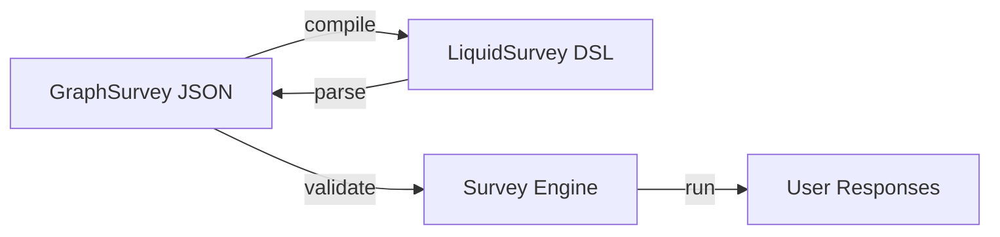
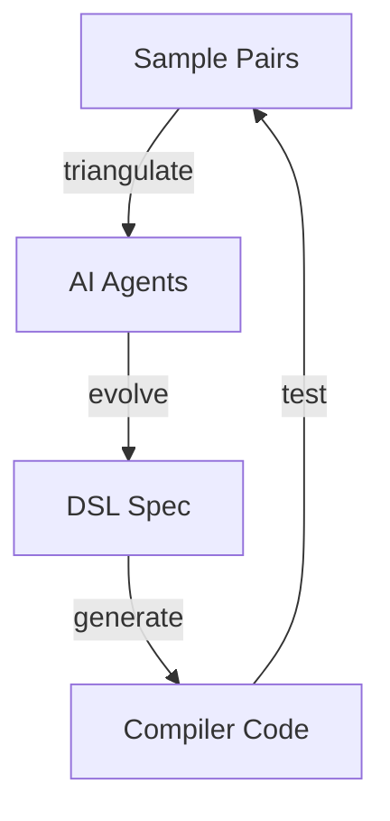

# Liquid Packages: Value Proposition

## What We Built



| Package | Purpose | Lines of Code |
|---------|---------|---------------|
| `liquid-survey` | Survey engine, validator, 41 question types | ~3,500 |
| `liquid-code` | DSL compiler (scanner → parser → emitter) | ~800 |

## Compression Benefit

```
JSON:  1,247 bytes  →  DSL: 445 bytes  (2.8x smaller)
```

```liquid
# LiquidSurvey DSL Example
> start
  -> q1

? q1 "How satisfied are you?" Rt[1-5]
  -> q2

? q2 "Would you recommend us?" Yn
  ?= yes -> thanks
  ?= no -> feedback

< thanks "Thank you!"
< feedback "How can we improve?"
```

## Is This Cutting-Edge?

**No.** The packages implement known patterns:

| Component | Industry Equivalent |
|-----------|---------------------|
| Survey engine | SurveyJS, Typeform SDK |
| Graph-based flow | State machines, BPM engines |
| DSL compiler | Standard compiler design |

## What IS Novel



**TCS (Triangulated Compiler Synthesis)** - The methodology used to BUILD these packages:
- AI agents compare input/output samples
- Automatically evolve DSL specification
- Generate compiler from semantic triangulation

This is in `.archived/` and `.mydocs/autodev/`.

## Practical Value

1. **Token Efficiency** - DSL is 2.8x smaller than JSON for AI-to-AI communication
2. **Human Readable** - Engineers can read/write survey logic directly
3. **Type-Safe** - Strict TypeScript, production-ready
4. **Reusable Foundation** - TCS methodology applies to other domains

## Recommendation

- **Keep packages** as internal tooling
- **Extract TCS** as the innovation worth developing further
- **Consider** using DSL format for AI agent instructions (cheaper API calls)
