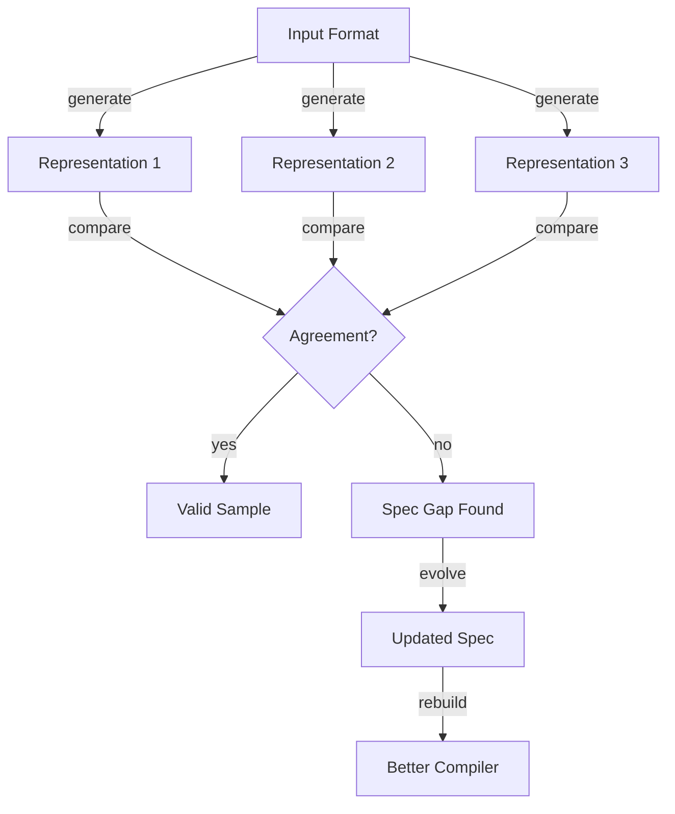
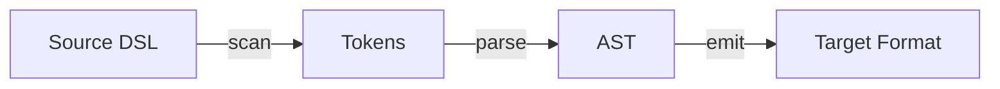
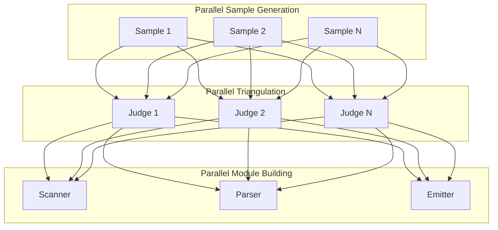

# TCS: AI Agent Methodology Guide

> **Purpose**: Enable AI agents to build any compiler/transformer using Triangulated Compiler Synthesis.

## Core Principle



**Key insight**: When 3 independent representations of the same semantic content disagree, at least one is wrong. This disagreement reveals specification gaps.

## The TCS Loop

```
FOR each iteration:
  1. GENERATE samples in parallel (input → 3 representations)
  2. TRIANGULATE to find disagreements
  3. EVOLVE spec based on findings
  4. BUILD/UPDATE compiler modules
  5. TEST compiler against validated samples
  6. FIX failures through diagnosis
  UNTIL convergence (all tests pass, target count reached)
```

## How to Apply TCS to Any Domain

### Step 1: Define Your Triangle

Choose 3 representations that encode the SAME semantic information differently:

| Domain | Rep 1 (Visual) | Rep 2 (Structured) | Rep 3 (Compact) |
|--------|----------------|-------------------|-----------------|
| UI Components | JSX/HTML | Component Schema | DSL |
| Surveys | Flow Diagram | GraphSurvey JSON | LiquidSurvey |
| APIs | OpenAPI Spec | TypeScript Types | Route DSL |
| Database | ERD | Prisma Schema | SQL DDL |
| Forms | Form Builder | JSON Schema | Form DSL |
| Charts | Chart Image | Chart Config | Chart DSL |

### Step 2: Create Initial Spec

Write a minimal DSL specification covering:

```markdown
# [Domain] DSL Spec v0.1

## Node Types
- List all semantic entities

## Syntax
- Define symbols and structure

## Examples
- 3-5 simple examples

## Edge Cases
- Known ambiguities (to be resolved)
```

### Step 3: Generate Sample Pairs

```typescript
// Pseudocode for sample generation
async function generateSample(prompt: string) {
  const [rep1, rep2, rep3] = await Promise.all([
    agent.generate('representation-1', prompt),
    agent.generate('representation-2', prompt),
    agent.generate('representation-3', prompt),
  ]);

  return { prompt, rep1, rep2, rep3 };
}
```

### Step 4: Triangulate

```typescript
async function triangulate(sample: Sample) {
  const findings = await judge.compare({
    rep1: sample.rep1,
    rep2: sample.rep2,
    rep3: sample.rep3,
  });

  return {
    isConsistent: findings.disagreements.length === 0,
    disagreements: findings.disagreements,
    specGaps: findings.suggestedSpecChanges,
  };
}
```

### Step 5: Evolve Spec

When disagreements found:

```markdown
## Spec Evolution Entry

### Finding
Rep1 used `onClick` but Rep3 used `@click` for the same action.

### Resolution
Standardize on `onClick` pattern. Update DSL:
- `@action` → `onClick={action}`

### Spec Change
Added to Section 4.2: "Actions use camelCase event handlers"
```

### Step 6: Build Compiler Modules

Standard compiler pipeline:



Build each module to handle the evolved spec:

| Module | Input | Output | Responsibility |
|--------|-------|--------|----------------|
| Scanner | Source string | Token[] | Lexical analysis |
| Parser | Token[] | AST | Syntax tree |
| Emitter | AST | Target | Code generation |

### Step 7: Test & Fix Loop

```typescript
for (const sample of validatedSamples) {
  const compiled = compiler.compile(sample.rep3);
  const expected = sample.rep2;

  if (!deepEqual(compiled, expected)) {
    const diagnosis = await reflector.diagnose({
      input: sample.rep3,
      expected: expected,
      actual: compiled,
    });

    await applyFix(diagnosis);
  }
}
```

## Parallel Execution Strategy

Maximize throughput by parallelizing independent operations:



## Convergence Criteria

TCS converges when:

1. **Test Coverage**: `validatedSamples >= targetCount`
2. **Pass Rate**: `failingTests === 0`
3. **Spec Stability**: `specChanges.lastN(5) === 0`

## Agent Roles

| Agent | Prompt Pattern |
|-------|----------------|
| Generator | "Given this prompt, generate [representation] that captures..." |
| Judge | "Compare these 3 representations. Are they semantically equivalent?" |
| Evolver | "Based on this disagreement, how should the spec change?" |
| Builder | "Implement this compiler module following the spec..." |
| Reflector | "This test failed. Diagnose the root cause..." |

## Example: Building a Chart DSL Compiler

```
Iteration 1:
  - Generate 10 chart samples (PNG description, ChartConfig, ChartDSL)
  - Find: Bar charts inconsistent on axis labeling
  - Evolve: Add "axis.label" to spec
  - Build: Scanner handles axis tokens

Iteration 2:
  - Generate 10 more samples
  - Find: Legends positioned differently
  - Evolve: Add "legend.position: top|bottom|left|right"
  - Build: Parser handles legend node

Iteration 3:
  - All 20 samples pass
  - Generate 30 more for coverage
  - Minor fixes to edge cases
  - CONVERGED at 50 samples
```

## Checkpointing

Save state after each iteration:

```json
{
  "iteration": 5,
  "spec_version": "0.5",
  "validated_samples": 47,
  "failing_tests": 2,
  "last_findings": ["..."],
  "compiler_hash": "abc123"
}
```

Resume with: `--resume` flag

## Anti-Patterns

| Don't | Do Instead |
|-------|------------|
| Skip triangulation | Always validate with 3 reps |
| Ignore small disagreements | Every disagreement reveals spec gap |
| Build entire compiler first | Build incrementally per finding |
| Manual spec editing | Let findings drive evolution |
| Sequential sample generation | Parallelize aggressively |

## Quality Principles (MANDATORY)

These principles ensure production-ready output:

### 1. No Bypassing Issues

```
❌ "Add try-catch to suppress error"
❌ "Use 'any' type to fix compilation"
❌ "Skip edge case for now"

✅ Trace error to spec gap → evolve spec
✅ Define proper types matching semantics
✅ Handle all cases in the grammar
```

**Errors are signals, not noise.** Every failure reveals something about the spec or architecture.

### 2. No Isolated Patches

```
❌ "Add special case for sample #47"
❌ "Hardcode value to pass test"

✅ Find pattern across samples → generalize
✅ Update grammar for all similar constructs
```

If you're adding an `if` statement for one case, you're doing it wrong.

### 3. Production-Ready Code Only

Every module must have:
- `strict: true` TypeScript (no `any`, no implicit)
- Complete error handling with descriptive messages
- Zero TODOs - every feature fully implemented
- Zero debug code - no console.log
- Clean public API with proper exports

### 4. Architecture Changes When Needed

Signs of bad architecture:
- Same bug reappearing in different forms
- Adding features requires many special cases
- Tests are brittle (small changes break many)

**Don't patch bad architecture. Redesign it.**

1. Design new structure
2. Rebuild from scratch
3. Migrate all tests
4. Verify all samples pass

## Success Metrics

Track these per iteration:

- `samples_generated`: Total samples this iteration
- `disagreement_rate`: % samples with inconsistencies
- `spec_changes`: Number of spec modifications
- `test_pass_rate`: % tests passing
- `compilation_time`: Avg compile time

Healthy TCS shows: disagreement_rate ↓, test_pass_rate ↑, spec_changes ↓
