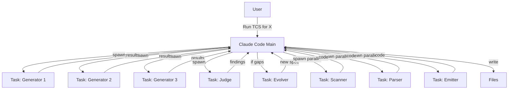

# TCS with Claude Code CLI

> Run Triangulated Compiler Synthesis entirely within Claude Code using multi-agent Task orchestration. No external API calls needed.

## Overview

Claude Code can execute TCS by spawning parallel Task agents that act as the generators, judge, and builder roles. All computation happens within Claude Code's context.



## How It Works

1. **User provides**: Domain, initial spec, target sample count
2. **Claude Code orchestrates**: Spawns Task agents in parallel
3. **No API calls**: All LLM work is done by Claude Code itself via Task tool
4. **Files written**: Spec, compiler code, test samples saved to disk

## Execution Protocol

When asked to run TCS, Claude Code should:

### Step 1: Gather Parameters

Ask the user:
```
To run TCS, I need:
1. Domain name (e.g., "form-builder", "chart-dsl")
2. Path to initial spec (or I can create one)
3. Number of iterations (recommended: 5-10)
4. Samples per iteration (recommended: 5-10)
5. Output directory
```

### Step 2: Initialize

```
Create output structure:
  {output}/
  ├── spec/
  │   └── SPEC-v0.md (initial)
  ├── samples/
  │   ├── valid/
  │   └── invalid/
  ├── compiler/
  │   ├── scanner.ts
  │   ├── parser.ts
  │   └── emitter.ts
  └── state.json (checkpoint)
```

### Step 3: Run Iteration Loop

For each iteration:

#### 3a. Generate Samples (Parallel Tasks)

Spawn N parallel Task agents with `subagent_type: "general-purpose"`:

```
Task 1: "Generate sample for [domain].
         Prompt: 'Create a [random scenario]'

         Return JSON:
         {
           'prompt': '...',
           'rep1_visual': '... (description/JSX)',
           'rep2_structured': { ... (JSON schema) },
           'rep3_dsl': '... (DSL code)'
         }

         Use this spec: [current spec content]"

Task 2: (same with different random prompt)
Task 3: (same with different random prompt)
...
Task N: (same with different random prompt)
```

#### 3b. Triangulate (Parallel Tasks)

For each sample, spawn a judge Task:

```
Task: "Compare these 3 representations for semantic equivalence:

       VISUAL: [rep1]
       STRUCTURED: [rep2]
       DSL: [rep3]

       Return JSON:
       {
         'equivalent': true/false,
         'disagreements': ['...'],
         'spec_gaps': ['...']
       }"
```

#### 3c. Evolve Spec (Single Task if gaps found)

```
Task: "Based on these findings from triangulation:
       [list of spec_gaps]

       Current spec:
       [spec content]

       Return the COMPLETE updated spec with changes marked."
```

Write new spec version to `spec/SPEC-v{N}.md`

#### 3d. Build/Update Compiler (Parallel Tasks)

Spawn 3 parallel Tasks:

```
Task Scanner: "Write a TypeScript scanner for this DSL spec:
               [spec content]

               Return complete scanner.ts code."

Task Parser:  "Write a TypeScript parser for this DSL spec:
               [spec content]

               Return complete parser.ts code."

Task Emitter: "Write a TypeScript emitter for this DSL spec:
               [spec content]
               Target output: [structured format]

               Return complete emitter.ts code."
```

Write files to `compiler/`

#### 3e. Test (Main Agent)

Claude Code main agent:
- Reads validated samples
- Runs compiler mentally or via Bash if executable
- Compares output to expected
- Records pass/fail

#### 3f. Checkpoint

Write to `state.json`:
```json
{
  "iteration": 3,
  "spec_version": 3,
  "samples_validated": 25,
  "samples_invalid": 3,
  "pass_rate": 0.92,
  "last_findings": ["..."]
}
```

### Step 4: Convergence Check

Stop when:
- `pass_rate >= 0.95` AND
- `last 2 iterations had 0 spec changes` AND
- `samples_validated >= target`

Or max iterations reached.

### Step 5: Final Output

```
TCS Complete!

Results:
- Iterations: 7
- Final spec: spec/SPEC-v7.md
- Validated samples: 52
- Pass rate: 98%
- Compiler: compiler/{scanner,parser,emitter}.ts

Files written to: {output}/
```

## Parallel Task Strategy

**Maximize parallelism** by launching independent tasks together:

```
Iteration N:
├── [PARALLEL] Generate 10 samples (10 Tasks)
│   └── Wait for all
├── [PARALLEL] Triangulate 10 samples (10 Tasks)
│   └── Wait for all
├── [SEQUENTIAL] Evolve spec (1 Task, only if gaps)
├── [PARALLEL] Build compiler (3 Tasks)
│   └── Wait for all
└── [SEQUENTIAL] Test & checkpoint (Main agent)
```

## Sample Task Prompts

### Generator Task Prompt Template

```
You are generating a TCS sample for domain: {domain}

SPEC:
---
{spec_content}
---

USER SCENARIO: {random_prompt}

Generate 3 semantically equivalent representations:

1. VISUAL (description or JSX):
   Describe what the user would see/interact with.

2. STRUCTURED (JSON):
   The underlying data model.

3. DSL (compact notation):
   Using the spec syntax above.

Return as JSON:
{
  "prompt": "{random_prompt}",
  "rep1_visual": "...",
  "rep2_structured": {...},
  "rep3_dsl": "..."
}
```

### Judge Task Prompt Template

```
You are a TCS triangulation judge.

Compare these 3 representations for SEMANTIC EQUIVALENCE:

REP1 (Visual):
{rep1}

REP2 (Structured):
{rep2}

REP3 (DSL):
{rep3}

Check:
1. Do all 3 represent the SAME thing?
2. Are there missing fields in any representation?
3. Are there contradictions?
4. Does the DSL follow the spec correctly?

SPEC for reference:
{spec}

Return JSON:
{
  "equivalent": true/false,
  "disagreements": [
    "Rep1 has X but Rep2 missing",
    "Rep3 uses Y syntax not in spec"
  ],
  "spec_gaps": [
    "Spec doesn't define how to handle X",
    "Need syntax for Y"
  ]
}
```

### Evolver Task Prompt Template

```
You are evolving a DSL specification based on TCS findings.

CURRENT SPEC:
---
{spec}
---

FINDINGS FROM TRIANGULATION:
{findings_list}

Update the spec to address these gaps. Rules:
1. Add missing syntax/semantics
2. Clarify ambiguities
3. Add examples for new features
4. Keep backwards compatible if possible
5. Mark changes with <!-- NEW v{N} -->

Return the COMPLETE updated spec.
```

### Builder Task Prompt Templates

**Scanner:**
```
Write a TypeScript scanner/tokenizer for this DSL:

SPEC:
{spec}

Requirements:
- Export: scan(source: string): Token[]
- Token type: { type: string, value: string, line: number, column: number }
- Handle all syntax in spec
- Good error messages with line/column

Return complete scanner.ts file.
```

**Parser:**
```
Write a TypeScript parser for this DSL:

SPEC:
{spec}

TOKEN TYPES (from scanner):
{token_types}

Requirements:
- Export: parse(tokens: Token[]): AST
- AST should mirror the structured representation
- Handle all syntax in spec
- Good error messages

Return complete parser.ts file.
```

**Emitter:**
```
Write a TypeScript emitter for this DSL:

SPEC:
{spec}

AST TYPE:
{ast_type}

TARGET:
{target_format}

Requirements:
- Export: emit(ast: AST): TargetType
- Handle all node types
- Preserve all semantic information

Return complete emitter.ts file.
```

## Error Handling

If a Task fails:
1. Log the error
2. Retry once with clarified prompt
3. If still fails, mark sample as invalid
4. Continue with other samples

If compiler build fails:
1. Spawn a "Reflector" Task to diagnose
2. Apply suggested fix
3. Retry build

## Usage Example

User says:
> "Run TCS to build a chart DSL compiler. 5 iterations, 8 samples each."

Claude Code responds:
> "Starting TCS for chart-dsl domain.
>
> Configuration:
> - Iterations: 5
> - Samples/iteration: 8
> - Output: ./output/chart-dsl/
>
> Creating initial spec... Do you have an existing spec or should I create one?"

User:
> "Create one"

Claude Code:
> "Created initial spec at ./output/chart-dsl/spec/SPEC-v0.md
>
> Starting iteration 1...
> [Spawns 8 parallel generator Tasks]
> Generated 8 samples.
>
> [Spawns 8 parallel judge Tasks]
> Triangulation complete: 6 valid, 2 with disagreements.
>
> Findings:
> - Axis label syntax undefined
> - Legend position options missing
>
> [Spawns evolver Task]
> Spec updated to v1.
>
> [Spawns 3 parallel builder Tasks]
> Compiler built: scanner.ts, parser.ts, emitter.ts
>
> Testing... 5/6 passing (83%)
>
> Iteration 1 complete. Continuing..."

## Checkpoint & Resume

State file enables resume:

```json
{
  "domain": "chart-dsl",
  "iteration": 3,
  "max_iterations": 5,
  "samples_per_iteration": 8,
  "spec_version": 3,
  "validated_samples": ["s001", "s002", ...],
  "invalid_samples": ["s003"],
  "compiler_version": 3,
  "pass_rate": 0.88
}
```

To resume:
> "Resume TCS from ./output/chart-dsl/"

Claude Code reads state.json and continues from last checkpoint.

## Best Practices

1. **Use `run_in_background: false`** for Tasks - need results immediately
2. **Batch parallel Tasks** in single message for efficiency
3. **Keep spec in memory** during iteration, write to disk at checkpoints
4. **Accumulate samples** across iterations for comprehensive testing
5. **Use Opus** for compiler/spec tasks, **Sonnet** for judge/generator tasks

## Model Selection per Task

Use the best models for critical tasks:

```
| Task Type  | Model    | Reason                              |
|------------|----------|-------------------------------------|
| Scanner    | opus     | Compiler code - highest quality     |
| Parser     | opus     | Compiler code - complex logic       |
| Emitter    | opus     | Compiler code - correctness critical|
| Evolver    | opus     | Spec design - architecture decisions|
| Architect  | opus     | Redesign - needs deep reasoning     |
| Judge      | sonnet   | Comparison - thorough but fast      |
| Reflector  | sonnet   | Diagnosis - good reasoning          |
| Generator  | sonnet   | Sample generation - quality matters |
```

**Philosophy**: Use Opus 4.5 for anything that produces code or evolves the spec.
Use Sonnet for validation, comparison, and generation tasks.

Specify in Task call:
```
Task(subagent_type="general-purpose", model="opus", prompt="...")   // For compiler/spec
Task(subagent_type="general-purpose", model="sonnet", prompt="...")  // For judge/generator
```

## Quality Principles (CRITICAL)

These principles are **non-negotiable** for TCS execution:

### 1. No Bypassing Issues

```
❌ WRONG: "Add a try-catch to suppress the error"
❌ WRONG: "Skip this edge case for now"
❌ WRONG: "Use 'any' type to fix compilation"

✅ RIGHT: "The error reveals a spec gap - evolve the spec"
✅ RIGHT: "This edge case needs proper handling in the parser"
✅ RIGHT: "Define proper types that match the semantic model"
```

When a test fails or error occurs:
1. **Understand the root cause** - Why did it fail?
2. **Trace to spec or architecture** - Is the spec incomplete? Is the design wrong?
3. **Fix at the source** - Update spec, redesign module, or add proper handling
4. **Never suppress** - Errors are signals, not noise

### 2. No Isolated Patches

```
❌ WRONG: "Add special case for this one sample"
❌ WRONG: "Hardcode this value to make test pass"
❌ WRONG: "Add if-statement to handle user X's edge case"

✅ RIGHT: "This pattern appears in 3 samples - generalize the solution"
✅ RIGHT: "Update the grammar to properly handle this construct"
✅ RIGHT: "Refactor to use a consistent approach across all cases"
```

When fixing issues:
1. **Look for patterns** - Is this a one-off or systemic?
2. **Generalize the fix** - Solution should work for all similar cases
3. **Update tests** - Add samples that would catch similar issues
4. **Refactor if needed** - Don't bolt-on, integrate properly

### 3. Production-Ready Code Only

```
❌ WRONG: "// TODO: handle this later"
❌ WRONG: "console.log('debug:', value)"
❌ WRONG: "function parse(x: any): any"

✅ RIGHT: Complete implementation with all cases handled
✅ RIGHT: Proper error types with descriptive messages
✅ RIGHT: Full type safety with strict TypeScript
```

Every compiler module must have:
- **Strict TypeScript** - `strict: true`, `noUncheckedIndexedAccess: true`
- **Complete error handling** - All error paths with useful messages
- **No TODOs** - Every feature fully implemented
- **No debug code** - Clean, production-ready output
- **Proper exports** - Well-defined public API

### 4. Architecture Changes When Needed

```
❌ WRONG: "Add another parameter to this 10-parameter function"
❌ WRONG: "Nest another if-statement in this 200-line function"
❌ WRONG: "Keep the broken design, just work around it"

✅ RIGHT: "The scanner needs a state machine - redesign it"
✅ RIGHT: "Split this into separate passes for clarity"
✅ RIGHT: "The AST structure doesn't match semantics - restructure"
```

Signs you need architecture change:
- **Same bug keeps appearing** in different forms
- **Adding features is painful** - too many special cases
- **Code is hard to understand** - even for the builder agent
- **Tests are brittle** - small changes break many tests

When architecture needs changing:
1. **Spawn Architect Task** to design new structure
2. **Rebuild affected modules** from scratch (don't patch)
3. **Migrate tests** to new structure
4. **Verify all samples** still pass

### Quality Gate Checklist

Before marking an iteration complete:

```
[ ] All compiler code compiles with strict TypeScript
[ ] No 'any' types (except unavoidable external interfaces)
[ ] No suppressed errors or warnings
[ ] No TODO comments
[ ] No console.log/debug statements
[ ] All error paths have descriptive messages
[ ] Code handles all spec-defined constructs
[ ] No isolated patches - all fixes are generalized
[ ] Architecture supports future spec evolution
```

### Reflector Task for Quality Issues

When quality problems are detected, spawn a Reflector:

```
Task: "Review this compiler module for quality issues:

       CODE:
       {module_code}

       SPEC:
       {spec}

       Check for:
       1. Bypassed errors (try-catch hiding issues)
       2. Isolated patches (special cases that should be generalized)
       3. Missing type safety
       4. Incomplete error handling
       5. Architecture problems

       Return JSON:
       {
         'quality_score': 0-100,
         'issues': [
           {
             'severity': 'critical|major|minor',
             'type': 'bypass|patch|types|errors|architecture',
             'location': 'line or function name',
             'problem': 'description',
             'solution': 'how to fix properly'
           }
         ],
         'needs_redesign': true/false,
         'redesign_reason': 'why architecture change needed'
       }"
```

### Iteration Quality Standards

| Metric | Minimum | Target |
|--------|---------|--------|
| TypeScript strict compliance | 100% | 100% |
| Test pass rate | 90% | 98%+ |
| Code quality score | 80 | 95+ |
| Isolated patches | 0 | 0 |
| Bypassed errors | 0 | 0 |
| TODO comments | 0 | 0 |

**Do not proceed to next iteration if minimums not met.**
