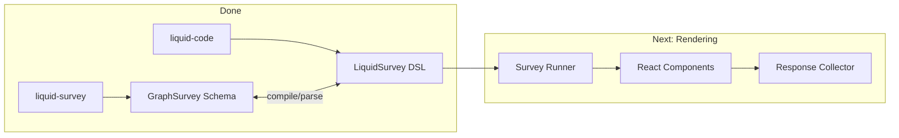
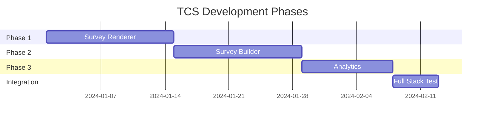

# TCS Roadmap: Liquid Package Development

> Using TCS to build all subcomponents for full rendering capability.

## Current State



## Phase 1: Survey Renderer

**Goal**: LiquidSurvey DSL → Interactive React UI

### Triangle Definition

| Rep 1 (Visual) | Rep 2 (Structured) | Rep 3 (Compact) |
|----------------|-------------------|-----------------|
| React JSX | GraphSurvey + Props | LiquidSurvey DSL |

### Subcomponents to Build

```
liquid-survey-renderer/
├── components/           # TCS-built
│   ├── QuestionText.tsx
│   ├── QuestionChoice.tsx
│   ├── QuestionRating.tsx
│   ├── QuestionMatrix.tsx
│   ├── QuestionNPS.tsx
│   ├── ... (41 types)
│   ├── Navigation.tsx
│   └── Progress.tsx
├── engine/               # TCS-built
│   ├── state-machine.ts  # Flow controller
│   ├── condition-eval.ts # Branching logic
│   └── response-store.ts # Answer collection
└── themes/               # TCS-built
    ├── default.css
    └── theme-compiler.ts
```

### TCS Iterations

| Iteration | Focus | Samples |
|-----------|-------|---------|
| 1-3 | Basic question types (text, choice, rating) | 30 |
| 4-6 | Advanced types (matrix, ranking, file) | 30 |
| 7-9 | Navigation & branching | 30 |
| 10-12 | Theming & styling | 20 |
| 13-15 | Edge cases & polish | 40 |

**Target**: 150 validated samples

---

## Phase 2: Survey Builder

**Goal**: Visual editor → LiquidSurvey DSL

### Triangle Definition

| Rep 1 (Visual) | Rep 2 (Structured) | Rep 3 (Compact) |
|----------------|-------------------|-----------------|
| Builder UI State | GraphSurvey JSON | LiquidSurvey DSL |

### Subcomponents to Build

```
liquid-survey-builder/
├── canvas/              # TCS-built
│   ├── DragDrop.tsx
│   ├── NodeEditor.tsx
│   └── ConnectionLine.tsx
├── panels/              # TCS-built
│   ├── QuestionPalette.tsx
│   ├── PropertyEditor.tsx
│   └── LogicBuilder.tsx
├── serializers/         # TCS-built
│   ├── to-graph.ts
│   ├── to-dsl.ts
│   └── from-dsl.ts
└── history/             # TCS-built
    ├── undo-redo.ts
    └── autosave.ts
```

### TCS Iterations

| Iteration | Focus | Samples |
|-----------|-------|---------|
| 1-3 | Basic node CRUD | 30 |
| 4-6 | Connections & flow | 30 |
| 7-9 | Property editing | 30 |
| 10-12 | Logic/condition builder | 30 |
| 13-15 | Import/export | 30 |

**Target**: 150 validated samples

---

## Phase 3: Response Analytics

**Goal**: Responses → Visualizations & Insights

### Triangle Definition

| Rep 1 (Visual) | Rep 2 (Structured) | Rep 3 (Compact) |
|----------------|-------------------|-----------------|
| Chart/Dashboard | Analytics JSON | AnalyticsDSL |

### Subcomponents to Build

```
liquid-survey-analytics/
├── aggregators/         # TCS-built
│   ├── count.ts
│   ├── average.ts
│   ├── distribution.ts
│   └── cross-tab.ts
├── visualizations/      # TCS-built
│   ├── BarChart.tsx
│   ├── PieChart.tsx
│   ├── HeatMap.tsx
│   └── WordCloud.tsx
├── exports/             # TCS-built
│   ├── to-csv.ts
│   ├── to-excel.ts
│   └── to-pdf.ts
└── insights/            # TCS-built
    ├── sentiment.ts
    └── trends.ts
```

---

## Implementation Order



## Per-Component TCS Config

```yaml
# tcs-config.yaml
renderer:
  triangle:
    visual: react-jsx
    structured: graph-survey-props
    compact: liquid-survey-dsl
  target_samples: 150
  parallel_batch: 10
  checkpoint_interval: 5

builder:
  triangle:
    visual: builder-state
    structured: graph-survey
    compact: liquid-survey-dsl
  target_samples: 150
  parallel_batch: 10

analytics:
  triangle:
    visual: chart-description
    structured: analytics-json
    compact: analytics-dsl
  target_samples: 100
  parallel_batch: 10
```

## Success Criteria

| Phase | Metric | Target |
|-------|--------|--------|
| 1 | All 41 question types render | 100% |
| 1 | Branching logic works | 100% |
| 2 | Round-trip: Builder → DSL → Builder | Lossless |
| 2 | Undo/redo works | 50 operations |
| 3 | Aggregations correct | 99.9% accuracy |
| 3 | Charts render all data types | 100% |

## Quality Standards (All Phases)

Every TCS-built component must follow:

### No Bypassing
- Errors reveal spec gaps → evolve spec
- Never suppress with try-catch
- Never use `any` types

### No Isolated Patches
- Special cases indicate missing grammar
- Generalize all fixes
- If adding `if` for one case, redesign

### Production Code Only
- `strict: true` TypeScript
- Complete error handling
- Zero TODOs
- Zero debug code

### Architecture Over Patches
- Recurring bugs = bad architecture
- Redesign don't patch
- Rebuild modules from scratch when needed

## Getting Started

```bash
# Phase 1: Start with renderer
cd packages/liquid-survey-renderer
pnpm tcs:init --config ../tcs-config.yaml --phase renderer
pnpm tcs:run --target 150

# After convergence
pnpm build
pnpm test
```

## Notes

- Each phase builds on previous
- Shared DSL ensures interoperability
- TCS catches integration bugs early via triangulation
- Parallel development possible after Phase 1 stabilizes
